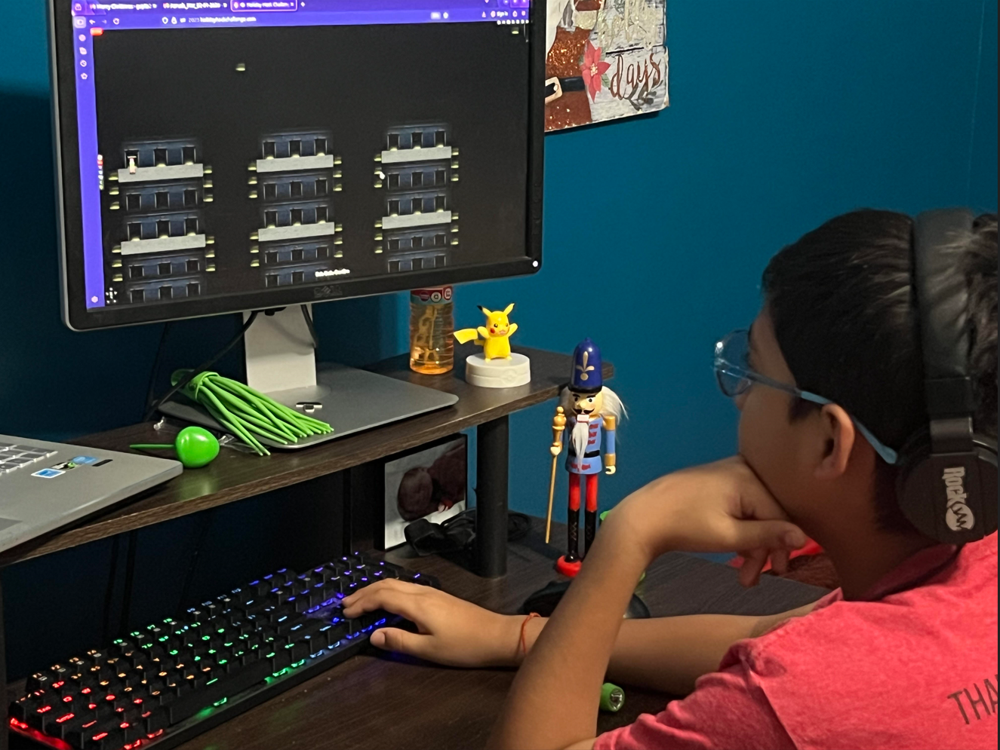

# Welcome

## Introduction
The [SANS Holiday Hack Challenge](https://www.sans.org/cyber-ranges/holiday-hack-challenge){:target="_blank" rel="noopener"}  is a free cybersecurity event I look forward to every year. It's fun, challenging, and consistently pushes me to learn concepts well outside my comfort zone. 

This write-up captures how I approached each challenge, the mistakes along the way, and the reasoning behind the solutions. It's not the only way to solve them—just the one that worked for me. 

My now 11 year old son Aarush, has been into the Holiday Hack Challenge since HHC 2020, and it's since become one of the most anticipated events of the year for both of us.

## Background
Frosty planned to refrigerate the entire neighborhood by using gnomes to collect coolant and refrigerator parts. 
This write-up shows how we uncovered and stopped that plan by solving the challenges.

## All Answers
The challenges are grouped into Act 1, Act 2, and Act 3.  
Each challenge includes a star rating, where a higher number of solid stars indicates greater difficulty. 
Click on each act to view the challenges and detailed solutions. 

=== "Act I"

    !!! success "Holiday Hack Orientation - :fontawesome-solid-star::fontawesome-regular-star::fontawesome-regular-star::fontawesome-regular-star::fontawesome-regular-star:"
        [Write "answer" in the upper pane of the terminal](objectives/orientation.md){:target="_blank" rel="noopener"}.

    !!! success "Its All About Defang - :fontawesome-solid-star::fontawesome-regular-star::fontawesome-regular-star::fontawesome-regular-star::fontawesome-regular-star:"
        [Solved in the game](./objectives/Its_All_About_Defang.md){:target="_blank" rel="noopener"}.

    !!! success "Neighborhood Watch Bypass - :fontawesome-solid-star::fontawesome-regular-star::fontawesome-regular-star::fontawesome-regular-star::fontawesome-regular-star:"
        [Solved in the game](./objectives/Neighborhood_Watch_Bypass.md){:target="_blank" rel="noopener"}.

    !!! success "Santa's Gift-Tracking Service Port Mystery - :fontawesome-solid-star::fontawesome-regular-star::fontawesome-regular-star::fontawesome-regular-star::fontawesome-regular-star:"
        [Solved in the game](./objectives/Santa_Gift-Tracking_Service_Port_Mystery.md){:target="_blank" rel="noopener"}.

    !!! success "Visual Networking Thinger - :fontawesome-solid-star::fontawesome-regular-star::fontawesome-regular-star::fontawesome-regular-star::fontawesome-regular-star:"
        [Solved in the game](./objectives/Visual_Networking_Thinger.md){:target="_blank" rel="noopener"}.

    !!! success "Visual Firewall Thinger - :fontawesome-solid-star::fontawesome-regular-star::fontawesome-regular-star::fontawesome-regular-star::fontawesome-regular-star:"
        [Solved in the game](./objectives/Visual_Firewall_Thinger.md){:target="_blank" rel="noopener"}.

    !!! success "Intro to Nmap - :fontawesome-solid-star::fontawesome-regular-star::fontawesome-regular-star::fontawesome-regular-star::fontawesome-regular-star::fontawesome-regular-star:"
        [Solved in the game](./objectives/Intro_to_Nmap.md){:target="_blank" rel="noopener"}.

    !!! success "Blob Storage Challenge in the Neighborhood - :fontawesome-solid-star::fontawesome-regular-star::fontawesome-regular-star::fontawesome-regular-star::fontawesome-regular-star:"
        [Solved in the game](./objectives/Blob_Storage_Challenge_in_the_Neighborhood.md){:target="_blank" rel="noopener"}.

    !!! success "Spare Key - :fontawesome-solid-star::fontawesome-regular-star::fontawesome-regular-star::fontawesome-regular-star::fontawesome-regular-star:"
        [Solved in the game](./objectives/Spare_Key.md){:target="_blank" rel="noopener"}.

    !!! success "The Open Door - :fontawesome-solid-star::fontawesome-regular-star::fontawesome-regular-star::fontawesome-regular-star::fontawesome-regular-star:"
        [Solved in the game](./objectives/The_Open_Door.md){:target="_blank" rel="noopener"}.

=== "Act II"
    !!! success "Retro Recovery - :fontawesome-solid-star::fontawesome-solid-star::fontawesome-regular-star::fontawesome-regular-star::fontawesome-regular-star:"
        [merry christmas to all and to all a good night](./objectives/Retro_Recovery.md){:target="_blank" rel="noopener"}.

    !!! success "Mail Detective - :fontawesome-solid-star::fontawesome-solid-star::fontawesome-regular-star::fontawesome-regular-star::fontawesome-regular-star:"
        [https://frostbin.atnas.mail/api/paste](./objectives/Mail_Detective.md){:target="_blank" rel="noopener"}.

    !!! success "IDORable Bistro - :fontawesome-solid-star::fontawesome-solid-star::fontawesome-regular-star::fontawesome-regular-star::fontawesome-regular-star:"
        [Bartholomew Quibblefrost](./objectives/IDORable_Bistro.md){:target="_blank" rel="noopener"}.

    !!! success "Dosis Network Down - :fontawesome-solid-star::fontawesome-solid-star::fontawesome-regular-star::fontawesome-regular-star::fontawesome-regular-star::fontawesome-regular-star:"
        [SprinklesAndPackets2025!](./objectives/IDORable_Bistro.md){:target="_blank" rel="noopener"}.

    !!! success "Rogue Gnome Identity Provider - :fontawesome-solid-star::fontawesome-solid-star::fontawesome-regular-star::fontawesome-regular-star::fontawesome-regular-star::fontawesome-regular-star:"
        [SprinklesAndPackets2025!](./objectives/Rogue_Gnome_Identity_Provider.md){:target="_blank" rel="noopener"}.

    !!! success "Quantgnome Leap - :fontawesome-solid-star::fontawesome-solid-star::fontawesome-regular-star::fontawesome-regular-star::fontawesome-regular-star:"
        [HHC{L3aping_0v3r_Quantum_Crypt0}](./objectives/Quantgnome_Leap.md){:target="_blank" rel="noopener"}.

=== "Act III"
    !!! success "Gnome Tea - :fontawesome-solid-star::fontawesome-solid-star::fontawesome-solid-star::fontawesome-regular-star::fontawesome-regular-star:"
        [GigGigglesGiggler](./objectives/Gnome_Tea.md){:target="_blank" rel="noopener"}.

    !!! success "Snowcat RCE & Priv Esc - :fontawesome-solid-star::fontawesome-solid-star::fontawesome-solid-star::fontawesome-regular-star::fontawesome-regular-star:"
        [8ade723d-9968-45c9-9c33-7606c49c2201](./objectives/Snowcat-RCE-%26-Priv-Esc.md){:target="_blank" rel="noopener"}.

    !!! success "Schrodingers Scope - :fontawesome-solid-star::fontawesome-solid-star::fontawesome-solid-star::fontawesome-regular-star::fontawesome-regular-star:"
        [Solved in the game](./objectives/Schrodingers_Scope.md){:target="_blank" rel="noopener"}.

    !!! success "On-the-Wire - :fontawesome-solid-star::fontawesome-solid-star::fontawesome-solid-star::fontawesome-solid-star::fontawesome-regular-star:"
        [32.84](./objectives/On-the-Wire.md){:target="_blank" rel="noopener"}.

    !!! success "Free Ski - :fontawesome-solid-star::fontawesome-solid-star::fontawesome-solid-star::fontawesome-solid-star::fontawesome-solid-star:"
        [frosty_yet_predictably_random](./objectives/Free_Ski.md){:target="_blank" rel="noopener"}.

    !!! success "Snowblind Ambush - :fontawesome-solid-star::fontawesome-solid-star::fontawesome-solid-star::fontawesome-solid-star::fontawesome-solid-star:"
        [hhc25{Frostify_The_World_c05730b46d0f30c9d068343e9d036f80}](./objectives/snowblind_ambush.md){:target="_blank" rel="noopener"}.

## Conclusion

!!! Abstract "Narrative"
    Frosty's plan was to turn the entire Dosis neighborhood into a giant refrigerator. To do this, he enlisted the gnomes to gather coolant, refrigeration components, and anything else required to bring the plan to life.

    By uncovering clues, solving each challenge, and piecing together how everything fit, we were ultimately able to uncover and foil his scheme before the neighborhood was left permanently frozen.
    
    - **ACT I**  
        The Counter Hack crew is in the Neighborhood festively preparing for the holidays when they are suddenly overrun by lively Gnomes in Your Home! There must have been some magic in those Gnomes, because, due to some unseen spark, some haunting hocus pocus, they have come to life and are now scurrying around the Neighborhood.

    - **ACT II** 
        The Gnomes' nefarious plot seems to involve stealing refrigerator parts. But why?

    - **ACT III** 
        The Gnomes want to transform the neighborhood so that it's frozen solid year-round, an environmental disaster. But who is the mastermind behind the Gnomes' wickedness?
        The Counter Hack crew discovers Frosty is behind the Gnome uprising and stops his freezing plot! Santa's compassionate offer to Frosty melts more than just snow, it melts hearts, saving the Neighborhood and proving that kindness conquers all.

??? Santa
    Magnificent work, my friends! You've saved the Dosis Neighborhood from an eternal winter and stopped those mischievous Gnomes from causing any more trouble. 

    But Frosty... oh, Frosty. I understand your fear of melting, truly I do. The pain of fading away each spring, knowing you'll disappear until the next winter snow falls - that must be terribly lonely. 

    If only you had come to me! The North Pole never melts, Frosty. The snow is eternal there, the cold is constant. You could have lived with us year-round, never worrying about spring's warm sun again. 

    There's always been a place for you at the North Pole, my friend. You never had to resort to all this - the Gnomes, the refrigerator parts, the coolants, trying to freeze an entire neighborhood. All you had to do was ask. 

    The invitation still stands, Frosty. Come home with me to the North Pole. You'll never melt again, and we could always use another jolly soul spreading winter cheer. 

    What do you say, my friend? 

    Ho! Ho! Ho!

My son Aarush navigating through the maze.  

