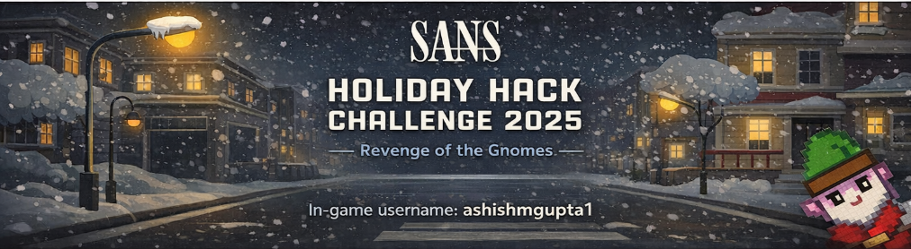

# Welcome

## Introduction
[SANS Holiday Hack Challenge](https://www.sans.org/cyber-ranges/holiday-hack-challenge){:target="_blank" rel="noopener"} is a free cybersecurity event I make a point to complete every year.  
It's real fun and consistently pushes me into uncomfortable and unfamiliar concepts I never expected to touch, let alone solve the related challenges.

Those long, frustrating hours are exactly what make the payoff worth it. 

This write-up walks through how I approached each challenge, the mistakes along the way, and the reasoning behind the solutions.  
It’s not the only way to solve them—just the path that worked for me. 

My son, Aarush has been interested in this since he was 6 years old, and since then the Holiday Hack Challenge has become one of the most eagerly anticipated events of the year for us.

??? tip "Navigation tip"
    Even with less than 50 pages, there's still quite a bit of information to read through. To make things a little easier, you can use ++"P"++ or ++","++ to go to the previous section, ++"N"++ or ++"."++ to navigate to the next section, and ++"S"++, ++"F"++, or ++"/"++ to open up the search dialog.

    **TL;DR** if you keep pressing ++"N"++ or ++"."++ from this point forward, you'll hit all the content in the right order! :smile:

## Answers
The challenges are grouped into Act 1, Act 2, and Act 3.  
Each challenge includes a star rating, where a higher number of solid stars indicates greater difficulty. 
Below are the answers for each challenge. 
Some of the challenges were interactive, solved in the game itself and therefore don't have any answer.
=== "Act I"

    !!! success "Holiday Hack Orientation - :fontawesome-solid-star::fontawesome-regular-star::fontawesome-regular-star::fontawesome-regular-star::fontawesome-regular-star:"
        [Write "answer" in the upper pane of the terminal](objectives/orientation.md).

    !!! success "Its All About Defang - :fontawesome-solid-star::fontawesome-regular-star::fontawesome-regular-star::fontawesome-regular-star::fontawesome-regular-star:"
        [Solved in the game](./objectives/Its_All_About_Defang.md).

    !!! success "Neighborhood Watch Bypass - :fontawesome-solid-star::fontawesome-regular-star::fontawesome-regular-star::fontawesome-regular-star::fontawesome-regular-star:"
        [Solved in the game](./objectives/Neighborhood_Watch_Bypass.md).

    !!! success "Santa's Gift-Tracking Service Port Mystery - :fontawesome-solid-star::fontawesome-regular-star::fontawesome-regular-star::fontawesome-regular-star::fontawesome-regular-star:"
        [Solved in the game](./objectives/Santa_Gift-Tracking_Service_Port_Mystery.md).

    !!! success "Visual Networking Thinger - :fontawesome-solid-star::fontawesome-regular-star::fontawesome-regular-star::fontawesome-regular-star::fontawesome-regular-star:"
        [Solved in the game](./objectives/Visual_Networking_Thinger.md).

    !!! success "Visual Firewall Thinger - :fontawesome-solid-star::fontawesome-regular-star::fontawesome-regular-star::fontawesome-regular-star::fontawesome-regular-star:"
        [Solved in the game](./objectives/Visual_Firewall_Thinger.md).

    !!! success "Intro to Nmap - :fontawesome-solid-star::fontawesome-regular-star::fontawesome-regular-star::fontawesome-regular-star::fontawesome-regular-star::fontawesome-regular-star:"
        [Solved in the game](./objectives/Intro_to_Nmap.md).

    !!! success "Blob Storage Challenge in the Neighborhood - :fontawesome-solid-star::fontawesome-regular-star::fontawesome-regular-star::fontawesome-regular-star::fontawesome-regular-star:"
        [Solved in the game](./objectives/Blob_Storage_Challenge_in_the_Neighborhood.md).

    !!! success "Spare Key - :fontawesome-solid-star::fontawesome-regular-star::fontawesome-regular-star::fontawesome-regular-star::fontawesome-regular-star:"
        [Solved in the game](./objectives/Spare_Key.md).

    !!! success "The Open Door - :fontawesome-solid-star::fontawesome-regular-star::fontawesome-regular-star::fontawesome-regular-star::fontawesome-regular-star:"
        [Solved in the game](./objectives/The_Open_Door.md).

=== "Act II"
    !!! success "Retro Recovery - :fontawesome-solid-star::fontawesome-solid-star::fontawesome-regular-star::fontawesome-regular-star::fontawesome-regular-star:"
        [merry christmas to all and to all a good night](./objectives/Retro_Recovery.md).

    !!! success "Mail Detective - :fontawesome-solid-star::fontawesome-solid-star::fontawesome-regular-star::fontawesome-regular-star::fontawesome-regular-star:"
        [https://frostbin.atnas.mail/api/paste](./objectives/Mail_Detective.md).

    !!! success "IDORable Bistro - :fontawesome-solid-star::fontawesome-solid-star::fontawesome-regular-star::fontawesome-regular-star::fontawesome-regular-star:"
        [Bartholomew Quibblefrost](./objectives/IDORable_Bistro.md).

    !!! success "Dosis Network Down - :fontawesome-solid-star::fontawesome-solid-star::fontawesome-regular-star::fontawesome-regular-star::fontawesome-regular-star::fontawesome-regular-star:"
        [SprinklesAndPackets2025!](./objectives/IDORable_Bistro.md).

    !!! success "Rogue Gnome Identity Provider - :fontawesome-solid-star::fontawesome-solid-star::fontawesome-regular-star::fontawesome-regular-star::fontawesome-regular-star::fontawesome-regular-star:"
        [SprinklesAndPackets2025!](./objectives/Rogue_Gnome_Identity_Provider.md).

    !!! success "Quantgnome Leap - :fontawesome-solid-star::fontawesome-solid-star::fontawesome-regular-star::fontawesome-regular-star::fontawesome-regular-star:"
        [HHC{L3aping_0v3r_Quantum_Crypt0}](./objectives/Quantgnome_Leap.md).

=== "Act III"
    !!! success "Gnome Tea - :fontawesome-solid-star::fontawesome-solid-star::fontawesome-solid-star::fontawesome-regular-star::fontawesome-regular-star:"
        [GigGigglesGiggler](./objectives/Gnome_Tea.md).

    !!! success "Snowcat RCE & Priv Esc - :fontawesome-solid-star::fontawesome-solid-star::fontawesome-solid-star::fontawesome-regular-star::fontawesome-regular-star:"
        [8ade723d-9968-45c9-9c33-7606c49c2201](./objectives/Snowcat-RCE-%26-Priv-Esc.md).

    !!! success "Schrodingers Scope - :fontawesome-solid-star::fontawesome-solid-star::fontawesome-solid-star::fontawesome-regular-star::fontawesome-regular-star:"
        [Solved in the game](./objectives/Schrodingers_Scope.md).

    !!! success "On-the-Wire - :fontawesome-solid-star::fontawesome-solid-star::fontawesome-solid-star::fontawesome-solid-star::fontawesome-regular-star:"
        [32.84](./objectives/On-the-Wire.md).

    !!! success "Free Ski - :fontawesome-solid-star::fontawesome-solid-star::fontawesome-solid-star::fontawesome-solid-star::fontawesome-solid-star:"
        [frosty_yet_predictably_random](./objectives/Free_Ski.md).

    !!! success "Snowblind Ambush - :fontawesome-solid-star::fontawesome-solid-star::fontawesome-solid-star::fontawesome-solid-star::fontawesome-solid-star:"
        [hhc25{Frostify_The_World_c05730b46d0f30c9d068343e9d036f80}](./objectives/snowblind_ambush.md).

## Conclusion

!!! Abstract "Narrative"
    - **ACT I**  
        The Counter Hack crew is in the Neighborhood festively preparing for the holidays when they are suddenly overrun by lively Gnomes in Your Home! There must have been some magic in those Gnomes, because, due to some unseen spark, some haunting hocus pocus, they have come to life and are now scurrying around the Neighborhood.

    - **ACT II** 
        The Gnomes’ nefarious plot seems to involve stealing refrigerator parts. But why?

    - **ACT III** 
        The Gnomes want to transform the neighborhood so that it’s frozen solid year-round, an environmental disaster. But who is the mastermind behind the Gnomes’ wickedness?
        The Counter Hack crew discovers Frosty is behind the Gnome uprising and stops his freezing plot! Santa's compassionate offer to Frosty melts more than just snow, it melts hearts, saving the Neighborhood and proving that kindness conquers all.

