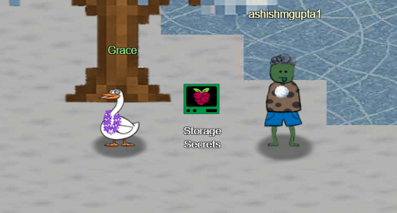
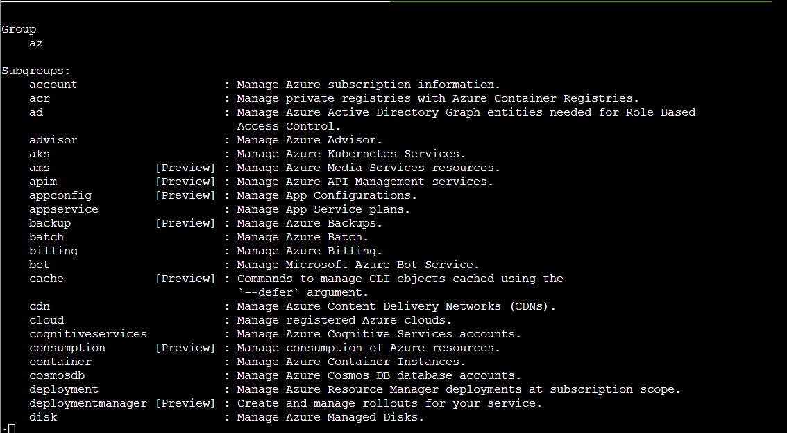
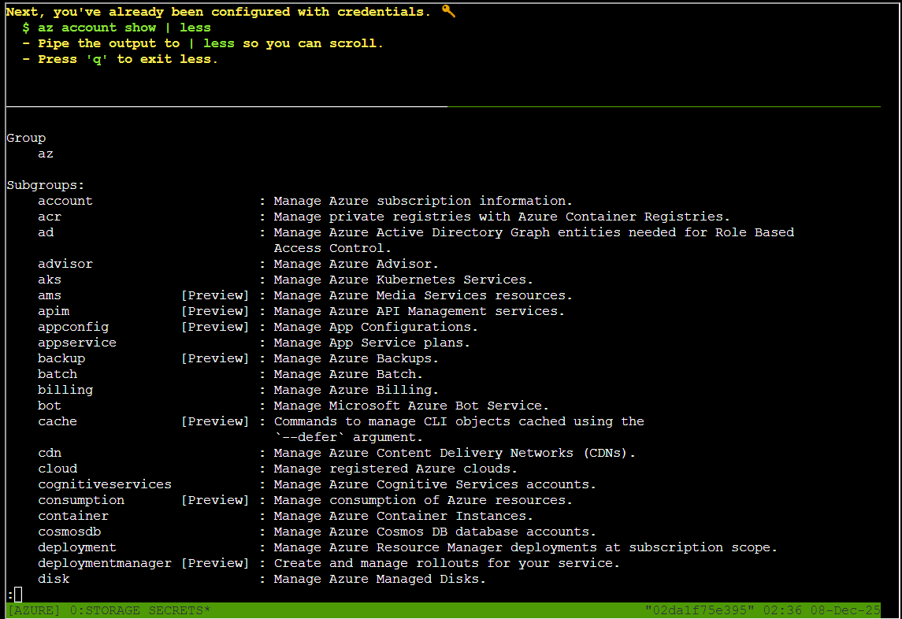
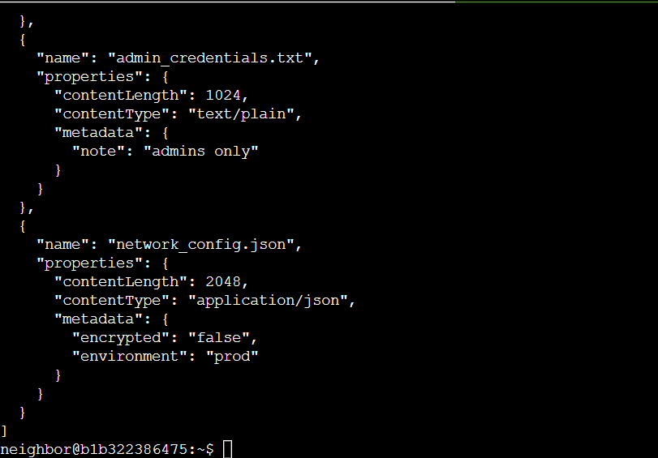
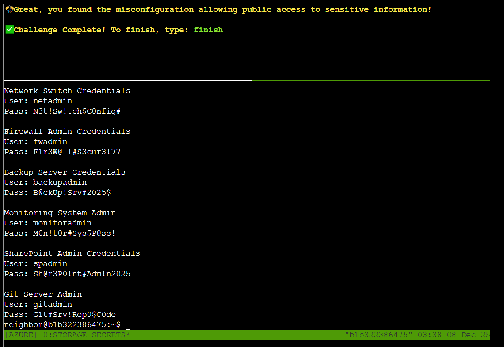
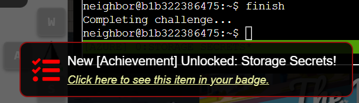

# Blob Storage Challenge in the Neighborhood
{ width="500" height="350" }

**Difficulty**: :fontawesome-solid-star::fontawesome-regular-star::fontawesome-regular-star::fontawesome-regular-star::fontawesome-regular-star:<br/>
**Direct link**: [Blob Storage Challenge in the Neighborhood](https://hhc25-wetty-prod.holidayhackchallenge.com/?&challenge=termMSBlobstorage)

## Objective

!!! question "Request"
    Help the Goose Grace near the pond find which Azure Storage account has been misconfigured to allow public blob access by analyzing the export file.

??? quote "Goose Grace"
    HONK!!! HONK!!!!
    The Neighborhood HOA uses Azure storage accounts for various IT operations.
    You've been asked to audit their storage security configuration to ensure no sensitive data is publicly accessible.
    Recent security reports suggest some storage accounts might have public blob access enabled, creating potential data exposure risks.


## Solution

### Goal 1 :
You may not know this but the Azure cli help messages are very easy to access. First, try typing:
```
az help | less
```



### Goal 2 :
Next, you've already been configured with credentials. 🔑
```
az account show | less
```
  - Pipe the output to | less so you can scroll.
  - Press 'q' to exit less.




### Goal 3 :
Now that you've run a few commands, Let's take a look at some Azure storage accounts.
Try: az storage account list | less
For more information:
https://learn.microsoft.com/en-us/cli/azure/storage/account?view=azure-cli-latest

```
az storage account list | less
```


### Goal 4 :
hmm... one of these looks suspicious 🚨, i think there may be a misconfiguration here somewhere.
Try showing the account that has a common misconfiguration: az storage account show --name xxxxxxxxxx | less

```
az storage account show --name neighborhood2 | less
```
Output :
The storage account named "neighborhood2" as "allowBlobPublicAccess" as true.


### Goal 5 :
Now we need to list containers in neighborhood2. After running the command what's interesting in the list?<br/>
For more information:<br/>
https://learn.microsoft.com/en-us/cli/azure/storage/container?view=azure-cli-latest#az-storage-container-list

```
az storage container list --account-name neighborhood2
```


### Goal 6
Let's take a look at the blob list in the public container for neighborhood2.
For more information:
https://learn.microsoft.com/en-us/cli/azure/storage/blob?view=azure-cli-latest#az-storage-blob-list

```
az storage blob list --container-name public --account-name neighborhood2
```




### Goal 7
Try downloading and viewing the blob file named admin_credentials.txt from the public container.
💡 hint: --file /dev/stdout should print in the terminal. Dont forget to use | less!

az storage blob download --container-name public --account-name neighborhood2 --name admin_credentials.txt --file /dev/stdout




### Goal 8
Type finish to complete the objective




!!! success "Answer"
    Completed in the game.

## Response

!!! quote "Goose Grace"
   HONK HONK HONK! 'No sensitive data publicly accessible' they claimed. Meanwhile, literally everything was public! Good save, security expert!
