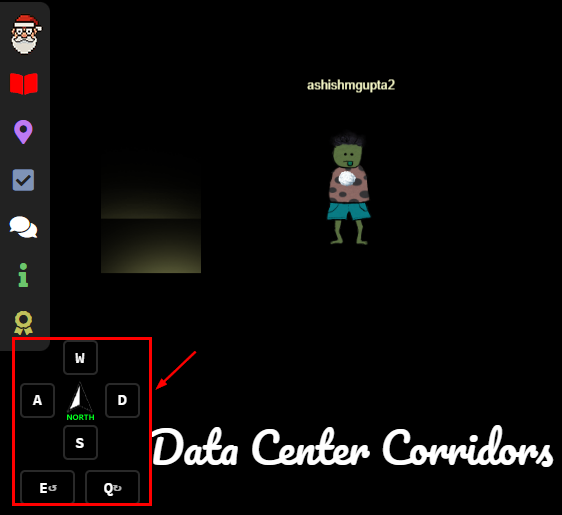
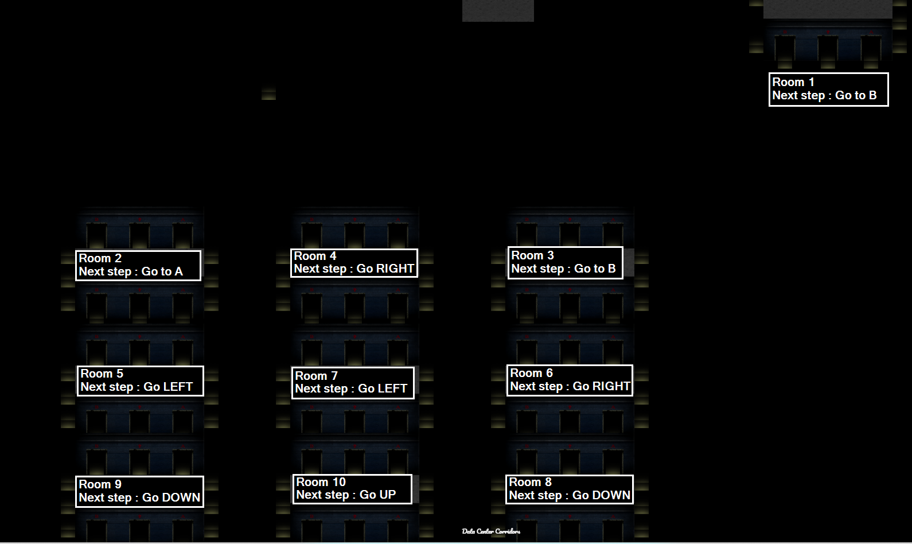
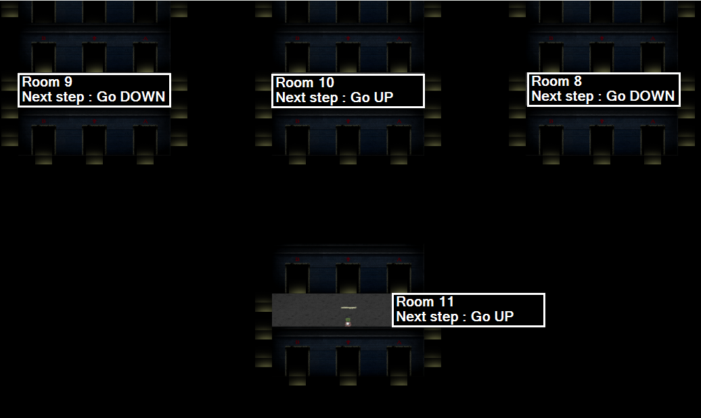

# Find and Shutdown Frostys Snowglobe Machine


**Difficulty**: :fontawesome-solid-star::fontawesome-solid-star::fontawesome-solid-star::fontawesome-regular-star::fontawesome-regular-star:<br/>


## Objective

!!! question "Request"
    You've heard murmurings around the city about a wise, elderly gnome having a change of heart. <br/>
    He must have information about where Frosty's Snowglobe Machine is.<br/> 
    You should find and talk to the gnome so you can get some help with how to make your way through the Data Center's labrynthian halls.<br/>
    Once you find the Snowglobe Machine, figure out how to shut it down and melt Frosty's cold, nefarious plans.

??? quote "Elder Gnome"
    A change of heart, I have had, yes. Among the gnomes plotting to freeze the neighborhood, I once was. Wrong, we are. Help you now, I shall.<br/>
    The route to the old secret lab inside the Data Center, begins on the far East wing inside the building, it does. Pitch dark, the hallways leading to it probably are, hmm.<br/>
    A code outside the building, the employees who once worked there left, yes. A reminder of the route, it serves. Search in the vicinity of the Data Center for this code, perhaps you can.<br/>
    
## Solution
Outside the datacenter we see white and black blocks/markings.<br/>
<br/>

We use 0 for black and 1 for white. <br/>

black  0 <br/>
white  1 <br/>

We get the below for each row on the wall : <br/>

- 011010011 
- 01101101
- 01100001
- 01101110
- 01101111
- 010010111

<br/>

We convert binary to decimal to  ASCII. <br/>

| Binary      |  Decimal  | ASCII     |
| :---------- | :-------- | :-------- |
| 01101001    | 105       |   i       |
| 01101101    | 109       |   m       |
| 01100001    | 97        |   a       |
| 01101110    | 110       |   n       |
| 01101111    | 111       |   o       |
| 01001011    | 75        |   k       |

Combining the above characters as "imanok". <br/>
This is inverse of "konami". <br/>

[Konami Code](https://en.wikipedia.org/wiki/Konami_Code) is a famous cheat code from video-game history that unlocks special features—like extra lives, power-ups, or secret modes—when entered in a specific button sequence. <br/>

konami code is: <br>
``` 
Up, Up, Down, Down, Left, Right, Left, Right, B, A
```

We have "imanok", so for use the direction would be inverse: <br/>
```
A, B, Right, Left,Right, Left,Down, Down, Up, Up
```

During the navigation we keep to North using the compass on the left bottom of the screen.<br/>
<br/>

The above direction didn't work and after getting the hint from another HHC player, I added B in front, so It became the below.
- A means go to door marked 'A'
- B means go to door marked 'B'
- Down means just go to the next door down.
- Down means just go to the next door up.

```
B, A, B, Right, Left, Right, Left, Down, Down, Up, Up
```
Below diagram shows the sequence of rooms (Room 1 - Room 10) as we move and the next hop from those rooms. <br/>
<br/>

In the Room 10, as we go to the next room UP, we land into Room 11.<br/>
<br/>

In the Room 11, as we go to the next room UP, we land into Frosty's Snowglob lab where we see Frosty's snowglobe machine in the center and a snow crystal on the right side. <br/>
<br/>

Here we we also find Frosty and get to know his evil plan. <br/>

??? Frosty
    Every spring, I melt away. Every year, I fade into nothing while the world moves on without me. But not this time... not anymore.<br/>

    The magic in this old silk hat - the same magic that brought me to life - I discovered it could do so much more. It awakened the Gnomes, gave them purpose, gave them MY purpose.<br/>

    Refrigerate the entire neighborhood, that's the plan. Keep it frozen, keep it cold. If winter never ends here, then neither do I. No more melting, no more disappearing, no more being forgotten until the next snowfall.<br/>

    The Gnomes have been gathering coolants, refrigerator parts, everything we need. Soon the Dosis Neighborhood will be a frozen paradise - MY frozen paradise. And I'll finally be permanent, just like Santa, just like all the other holiday icons who don't have to fear the sun.<br/>


!!! success "Answer"
    <br/>
