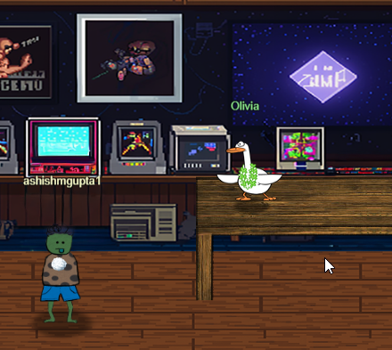
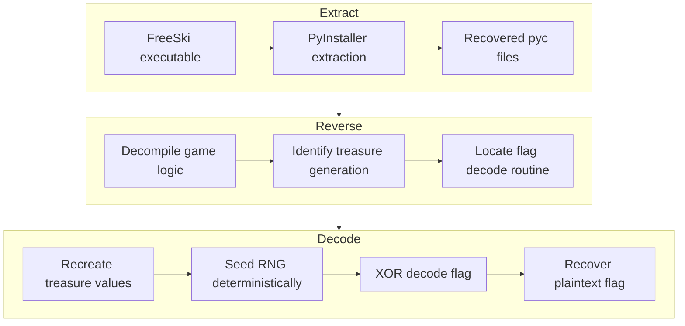
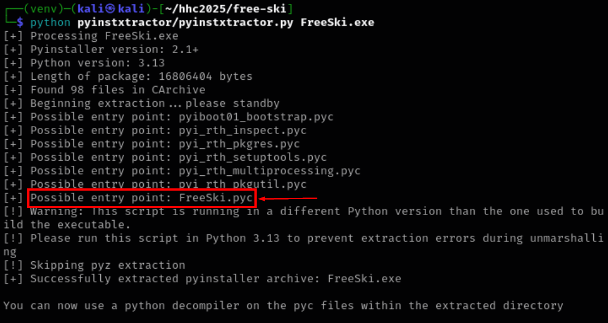
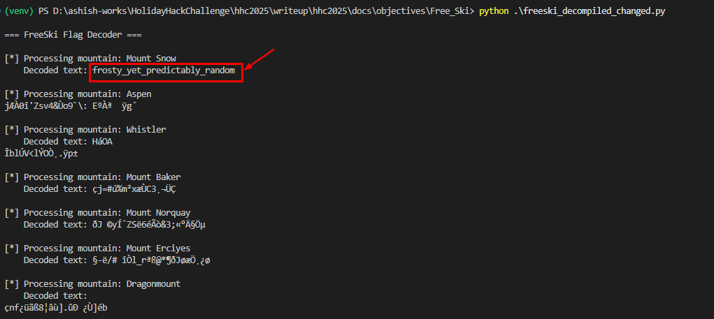
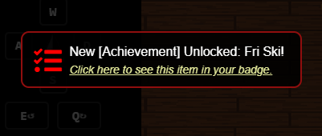

# Free Ski

<br/>

**Difficulty**: :fontawesome-solid-star::fontawesome-solid-star::fontawesome-solid-star::fontawesome-solid-star::fontawesome-solid-star:<br/>
**Area**: Retro Store<br/> 
**In-game avatar**: Olivia


## Hints
??? tip "Extraction"
    Have you ever used PyInstaller [Extractor](https://github.com/extremecoders-re/pyinstxtractor)?
??? tip "Decompilation!"
    Many Python decompilers don't understand Python 3.13, but [Decompyle++](https://github.com/zrax/pycdc) does!

## Objective

!!! question "Request"
   Go to the retro store and help Goose Olivia ski down the mountain and collect all five treasure chests to reveal the hidden flag in this classic SkiFree-inspired challenge.

??? quote "Olivia"
    This game looks simple enough, doesn't it? Almost too simple. But between you and me... it seems nearly impossible to win fair and square.<br/>
    My advice? If you ain't cheatin', you ain't tryin'. wink<br/>
    Now get out there and show that mountain who's boss!

### Item
We get an executable named [FreeSki.exe](../Free_Ski/FreeSki.exe) while talking to Olivia.<br>
Its a PyInstaller-compiled executable containing a SkiFree-inspired skiing game with hidden treasure chests and flag mechanics.

## High-Level Details
1. **Extract** – Unpack the PyInstaller executable to recover the embedded Python bytecode.

1. **Reverse** – Decompile the game logic, identify deterministic treasure generation, and locate the unused flag-decoding routine.

1. **Decode** – Recreate treasure values, reseed the RNG, XOR-decode the encoded flag, and recover the plaintext.


## Solution
Clone the the pyinstxtracter repo.<br/>
```
git clone https://github.com/extremecoders-re/pyinstxtractor.git
```
<br/>

Using pyinstxtractor, extract the files from freeski.exe. <br/>

<br/>

I used [pylingual](https://pylingual.io/) to decompile feeski.pyc and it give me the output <br/>
<br/>

??? Decompiled "Decompiled Freeski.pyc"
    ```py linenums="1" title="FreeSki_decompiled.py"
        # Decompiled with PyLingual (https://pylingual.io)
        # Internal filename: FreeSki.py
        # Bytecode version: 3.13.0rc3 (3571)
        # Source timestamp: 1970-01-01 00:00:00 UTC (0)

        global flag_text_surface
        global grace_period
        global Mountains
        global mountain_width
        import pygame
        import enum
        import random
        import binascii
        pygame.init()
        pygame.font.init()
        screen_width = 800
        screen_height = 600
        framerate_fps = 60
        object_horizonal_hitbox = 1.5
        object_vertical_hitbox = 0.5
        max_speed = 0.4
        accelerate_increment = 0.02
        decelerate_increment = 0.05
        scale_factor = 0.1
        pixels_per_meter = 30
        skier_vertical_pixel_location = 100
        mountain_width = 1000
        obstacle_draw_distance = 23
        skier_start = 5
        grace_period = 10
        screen = pygame.display.set_mode((screen_width, screen_height))
        clock = pygame.time.Clock()
        dt = 0
        pygame.key.set_repeat(500, 100)
        pygame.display.set_caption('FreeSki v0.0')
        skierimage = pygame.transform.scale_by(pygame.image.load('img/skier.png'), scale_factor)
        skier_leftimage = pygame.transform.scale_by(pygame.image.load('img/skier_left.png'), scale_factor)
        skier_rightimage = pygame.transform.scale_by(pygame.image.load('img/skier_right.png'), scale_factor)
        skier_crashimage = pygame.transform.scale_by(pygame.image.load('img/skier_crash.png'), scale_factor)
        skier_pizzaimage = pygame.transform.scale_by(pygame.image.load('img/skier_pizza.png'), scale_factor)
        treeimage = pygame.transform.scale_by(pygame.image.load('img/tree.png'), scale_factor)
        yetiimage = pygame.transform.scale_by(pygame.image.load('img/yeti.png'), scale_factor)
        treasureimage = pygame.transform.scale_by(pygame.image.load('img/treasure.png'), scale_factor)
        boulderimage = pygame.transform.scale_by(pygame.image.load('img/boulder.png'), scale_factor)
        victoryimage = pygame.transform.scale_by(pygame.image.load('img/victory.png'), 0.7)
        gamefont = pygame.font.Font('fonts/VT323-Regular.ttf', 24)
        text_surface1 = gamefont.render('Use arrow keys to ski and find the 5 treasures!', False, pygame.Color('blue'))
        text_surface2 = gamefont.render("          find all the lost bears. don't drill into a rock. Win game.", False, pygame.Color('yellow'))
        flagfont = pygame.font.Font('fonts/VT323-Regular.ttf', 32)
        flag_text_surface = flagfont.render('replace me', False, pygame.Color('saddle brown'))
        flag_message_text_surface1 = flagfont.render('You win! Drill Baby is reunited with', False, pygame.Color('yellow'))
        flag_message_text_surface2 = flagfont.render('all its bears. Welcome to Flare-On 12.', False, pygame.Color('yellow'))

        class SkierStates(enum.Enum):
            CRUISING = enum.auto()
            ACCELERATING = enum.auto()
            DECELERATING = enum.auto()
            TURNING_LEFT = enum.auto()
            TURNING_RIGHT = enum.auto()
            CRASHED = enum.auto()
        SkierStateImages = {SkierStates.CRUISING: skierimage, SkierStates.ACCELERATING: skierimage, SkierStates.DECELERATING: skier_pizzaimage, SkierStates.TURNING_LEFT: skier_leftimage, SkierStates.TURNING_RIGHT: skier_rightimage, SkierStates.CRASHED: skier_crashimage}

        class Skier:

            def __init__(self, x, y):
                """X and Y denote the pixel coordinates of the bottom center of the skier image"""
                self.state = SkierStates.CRUISING
                self.elevation = 0.0
                self.horizonal_location = 0.0
                self.speed = 0.0
                self.x = x
                self.y = y
                imagerect = skierimage.get_rect()
                self.rect = pygame.Rect(self.x - imagerect.left / 2, self.y - imagerect.height, 0, 0)

            def Draw(self, surface):
                surface.blit(SkierStateImages[self.state], self.rect)

            def TurnLeft(self):
                self.StateChange(SkierStates.TURNING_LEFT)

            def TurnRight(self):
                self.StateChange(SkierStates.TURNING_RIGHT)

            def SlowDown(self):
                self.speed -= decelerate_increment
                if self.speed < 0.0:
                    self.speed = 0.0
                self.StateChange(SkierStates.DECELERATING)

            def SpeedUp(self):
                self.speed += accelerate_increment
                if self.speed > max_speed:
                    self.speed = max_speed
                self.StateChange(SkierStates.ACCELERATING)

            def Cruise(self):
                self.StateChange(SkierStates.CRUISING)

            def StateChange(self, newstate):
                if self.state != SkierStates.CRASHED:
                    self.state = newstate
                return None

            def UpdateLocation(self):
                """update elevation and horizonal location based on one frame of the current speed and turning status
        speed will be split between down and to the turning side with simplified math to avoid calculating 
        square roots"""
                if self.state == SkierStates.TURNING_LEFT:
                    self.elevation -= self.speed * 0.7
                    self.horizonal_location -= self.speed * 0.7
                if self.elevation < 0:
                    self.elevation = 0
                return None

            def isMoving(self):
                if self.speed != 0:
                    pass
                return True

            def Crash(self):
                self.StateChange(SkierStates.CRASHED)
                self.speed = 0.0

            def Reset(self):
                self.state = SkierStates.CRUISING
                self.speed = 0.0
                self.elevation = 0.0
                self.horizonal_location = 0.0

            def isReadyForReset(self):
                if not self.state == SkierStates.CRASHED and self.elevation == 0.0:
                    pass
                return True

        class Obstacles(enum.Enum):
            BOULDER = enum.auto()
            TREE = enum.auto()
            YETI = enum.auto()
            TREASURE = enum.auto()
        ObstacleImages = {Obstacles.BOULDER: boulderimage, Obstacles.TREE: treeimage, Obstacles.YETI: yetiimage, Obstacles.TREASURE: treasureimage}
        ObstacleProbabilities = {Obstacles.BOULDER: 0.005, Obstacles.TREE: 0.01, Obstacles.YETI: 0.005}
        fakeObstacleProbabilities = {Obstacles.BOULDER: 0.1, Obstacles.TREE: 0.1, Obstacles.YETI: 0.1}

        def CalculateObstacleProbabilityRanges(probabilities):
            remaining = 1.0
            last_end = 0.0
            range_dict = {}
            for key in probabilities.keys():
                new_last_end = last_end + probabilities[key]
                range_dict[key] = (last_end, new_last_end)
                last_end = new_last_end
            return range_dict
        ObstacleProbabilitiesRanges = CalculateObstacleProbabilityRanges(ObstacleProbabilities)

        class Mountain:

            def __init__(self, name, height, treeline, yetiline, encoded_flag):
                self.name = name
                self.height = height
                self.treeline = treeline
                self.yetiline = yetiline
                self.encoded_flag = encoded_flag
                self.treasures = self.GetTreasureLocations()

            def GetObstacles(self, elevation):
                obstacles = [None] * mountain_width
                if elevation > self.height - grace_period:
                    return obstacles

            def GetTreasureLocations(self):
                locations = {}
                random.seed(binascii.crc32(self.name.encode('utf-8')))
                prev_height = self.height
                prev_horiz = 0
                for i in range(0, 5):
                    e_delta = random.randint(200, 800)
                    h_delta = random.randint(int(0 - e_delta / 4), int(e_delta / 4))
                    locations[prev_height - e_delta] = prev_horiz + h_delta
                    prev_height = prev_height - e_delta
                    prev_horiz = prev_horiz + h_delta
                return locations
        Mountains = [Mountain('Mount Snow', 3586, 3400, 2400, b'\x90\x00\x1d\xbc\x17b\xed6S"\xb0<Y\xd6\xce\x169\xae\xe9|\xe2Gs\xb7\xfdy\xcf5\x98'), Mountain('Aspen', 11211, 11000, 10000, b'U\xd7%x\xbfvj!\xfe\x9d\xb9\xc2\xd1k\x02y\x17\x9dK\x98\xf1\x92\x0f!\xf1\\\xa0\x1b\x0f'), Mountain('Whistler', 7156, 6000, 6500, b'\x1cN\x13\x1a\x97\xd4\xb2!\xf9\xf6\xd4#\xee\xebh\xecs.\x08M!hr9?\xde\x0c\x86\x02'), Mountain('Mount Baker', 10781, 9000, 6000, b'\xac\xf9#\xf4T\xf1%h\xbe3FI+h\r\x01V\xee\xc2C\x13\xf3\x97ef\xac\xe3z\x96'), Mountain('Mount Norquay', 6998, 6300, 3000, b'\x0c\x1c\xad!\xc6,\xec0\x0b+"\x9f@.\xc8\x13\xadb\x86\xea{\xfeS\xe0S\x85\x90\x03q'), Mountain('Mount Erciyes', 12848, 10000, 12000, b'n\xad\xb4l^I\xdb\xe1\xd0\x7f\x92\x92\x96\x1bq\xca`PvWg\x85\xb21^\x93F\x1a\xee'), Mountain('Dragonmount', 16282, 15500, 16000, b'Z\xf9\xdf\x7f_\x02\xd8\x89\x12\xd2\x11p\xb6\x96\x19\x05x))v\xc3\xecv\xf4\xe2\\\x9a\xbe\xb5')]

        class ObstacleSet(list):

            def __init__(self, mountain, top, max_distance):
                super().__init__([])
                self.mountain = mountain
                self.top = None
                self.max = max_distance
                self.Update(top)

            def Update(self, newtop):
                if self.top and newtop >= self.top:
                    pass
                return None

            def CollisionDetect(self, skier):
                for row in self:
                    if row[0] > skier.elevation:
                        continue
                    if row[0] < skier.elevation - object_vertical_hitbox:
                        pass
                    return None

        def SetFlag(mountain, treasure_list):
            global flag_text_surface
            product = 0
            for treasure_val in treasure_list:
                product = product << 8 ^ treasure_val
            random.seed(product)
            decoded = []
            for i in range(0, len(mountain.encoded_flag)):
                r = random.randint(0, 255)
                decoded.append(chr(mountain.encoded_flag[i] ^ r))
            flag_text = 'Flag: %s' % ''.join(decoded)
            print(flag_text)
            flag_text_surface = flagfont.render(flag_text, False, pygame.Color('saddle brown'))

        def main():
            victory_mode = False
            running = True
            reset_mode = True
            if running:
                screen.fill(pygame.Color('white'))
                if reset_mode:
                    player_started = False
                    treasures_collected = []
                    skier = Skier(screen_width / 2, skier_vertical_pixel_location)
                    mnt = random.choice(Mountains)
                    skier.elevation = mnt.height - skier_start
                    obstacles = ObstacleSet(mnt, mnt.height - skier_start, obstacle_draw_distance)
                    reset_mode = False
                for event in pygame.event.get():
                    running = False if event.type == pygame.QUIT else False
                    if event.type == pygame.KEYDOWN:
                        if skier.isReadyForReset():
                            reset_mode = True
                            break
                    elif event.type == pygame.KEYUP:
                        pass
                    else:
                        skier.Cruise()
                if victory_mode:
                    screen.blit(victoryimage, (42, 42))
                    x = screen_width / 2 - flag_text_surface.get_width() / 2
                    y = screen_height / 2 - flag_text_surface.get_height() / 2 + 40
                    screen.blit(flag_text_surface, (x, y))
                pygame.display.flip()
                dt = clock.tick(framerate_fps) / 1000
            pygame.quit()
        if __name__ == '__main__':
            main()
    ```

There is this interesting function named ```SetFlag``` which is never called.<br/>
It uses the treasure list to generate a unique seed (line 4, 5 and 6), and that seed then drives the deterministic random number generation needed to encode the data (lines 8-10). 

```py linenums="1" hl_lines="3 4 5 6 8 9 10" title="The Setflag() method"
 def SetFlag(mountain, treasure_list):
    global flag_text_surface
    product = 0
    for treasure_val in treasure_list:
        product = product << 8 ^ treasure_val
    random.seed(product)
    decoded = []
    for i in range(0, len(mountain.encoded_flag)):
        r = random.randint(0, 255)
        decoded.append(chr(mountain.encoded_flag[i] ^ r))
    flag_text = 'Flag: %s' % ''.join(decoded)
    print(flag_text)
    flag_text_surface = flagfont.render(flag_text, False, pygame.Color('saddle brown'))
```

Since the seed used in the random function to encode is deterministic from the teasure list, we can use the similar code to decode to get the original ASCII value if there is one for each mountain.

So, now we write a different program by taking the key parts of the original program. <br/>
#### Getting the moutain data
Getting the mountain data (name, height and encoded flags) as a list [line 8-16]
#### The GetTreasureLocations() method:
The change here is instead using the init function, It takes the height as parameter[line 18-33].<br/>
This gives the dictionary of location of mountain with key being the elevation row and the value being the horizontal offset.<br/>
e.g.
```
{2966: 113, 2420: 85, 1718: 188, 1094: 142, 466: 85}
```
#### DecodeFlag() method
This is same as the original SetFlag but renamed [line 35-49]
#### The main() method
This iterates through mountain list, calls the GetTreasureLocation() to get the location dictionary. <br/>
but since SetFlag is operating on integer, not a dictionary line like below :
```
for treasure_val in treasure_list:
        product = product << 8 ^ treasure_val
    random.seed(product)
```
so, we need to "flatten" the location to a single value using the below pseudocode
```
treasure_val = elevation_row * mountain_width + horizontal_offset
```
to this [line 63]
```
treasure_values = [row * MOUNTAIN_WIDTH + horiz for row, horiz in locs.items()]
```

Then we call the DecodeFlag with the encoded data and their treasure list for all the mountains to decode to ASCII.


```py linenums="1" hl_lines="8-16 18-33 35-49 63" title="The Setflag() method"
import random
import binascii

# Constants
MOUNTAIN_WIDTH = 1000

# Data: Mountain names, heights, and their encoded flags
MOUNTAINS = [
    ("Mount Snow", 3586, b'\x90\x00\x1d\xbc\x17b\xed6S"\xb0<Y\xd6\xce\x169\xae\xe9|\xe2Gs\xb7\xfdy\xcf5\x98'),
    ("Aspen", 11211, b'U\xd7%x\xbfvj!\xfe\x9d\xb9\xc2\xd1k\x02y\x17\x9dK\x98\xf1\x92\x0f!\xf1\\\xa0\x1b\x0f'),
    ("Whistler", 7156, b'\x1cN\x13\x1a\x97\xd4\xb2!\xf9\xf6\xd4#\xee\xebh\xecs.\x08M!hr9?\xde\x0c\x86\x02'),
    ("Mount Baker", 10781, b'\xac\xf9#\xf4T\xf1%h\xbe3FI+h\r\x01V\xee\xc2C\x13\xf3\x97ef\xac\xe3z\x96'),
    ("Mount Norquay", 6998, b'\x0c\x1c\xad!\xc6,\xec0\x0b+"\x9f@.\xc8\x13\xadb\x86\xea{\xfeS\xe0S\x85\x90\x03q'),
    ("Mount Erciyes", 12848, b'n\xad\xb4l^I\xdb\xe1\xd0\x7f\x92\x92\x96\x1bq\xca`PvWg\x85\xb21^\x93F\x1a\xee'),
    ("Dragonmount", 16282, b'Z\xf9\xdf\x7f_\x02\xd8\x89\x12\xd2\x11p\xb6\x96\x19\x05x))v\xc3\xecv\xf4\xe2\\\x9a\xbe\xb5'),
]

def GetTreasureLocations(name, height):
    """
    Recreates the treasure locations using the mountain's name and height.
    """
    random.seed(binascii.crc32(name.encode('utf-8')))
    locations = {}
    prev_height = height
    prev_horiz = 0

    for i in range(0, 5):
            e_delta = random.randint(200, 800)
            h_delta = random.randint(int(0 - e_delta / 4), int(e_delta / 4))
            locations[prev_height - e_delta] = prev_horiz + h_delta
            prev_height = prev_height - e_delta
            prev_horiz = prev_horiz + h_delta
    return locations

def DecodeFlag(encoded, treasure_list):
    """
    Decodes the flag by seeding the random generator with the treasure list and XORing the encoded flag.
    """
    product = 0
    for t in treasure_list:
        product = (product << 8) ^ t

    random.seed(product)
    decoded = []
    for i in range(0, len(encoded)):
        r = random.randint(0, 255)
        decoded.append(chr(encoded[i] ^ r))

    return decoded

def main():
    print("\n=== FreeSki Flag Decoder ===\n")

    best_overall = None

    for name, height, encoded_flag in MOUNTAINS:
        print(f"[*] Processing mountain: {name}")

        # Recreate the treasure locations for this mountain
        locs = GetTreasureLocations(name, height)

        # Convert the treasure locations into integer values
        treasure_values = [row * MOUNTAIN_WIDTH + horiz for row, horiz in locs.items()]

        # Decode the flag using the treasure values
        decoded = DecodeFlag(encoded_flag, treasure_values)
        print(f"    Decoded text: {''.join((decoded))}\n")

if __name__ == "__main__":
    main()
```

Upon running the above script, we get the ASCII value for only Mount snow. <br/>
```
frosty_yet_predictably_random
```
<br/>

We submit that as the answer and that is accepted. <br/>

!!! success "Answer"
   ```
   frosty_yet_predictably_random
   ```
   <br/>

## Response
!!! quote "Goose Olivia"
    Looks like you found your own way down that mountain... and maybe took a few shortcuts along the way. <br/>
    No judgment here—sometimes the clever path IS the right path. Now I'm one step closer to figuring out my own mystery. Thanks for the company, friend!