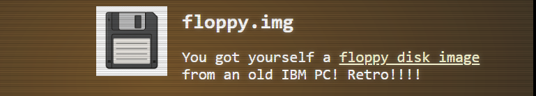
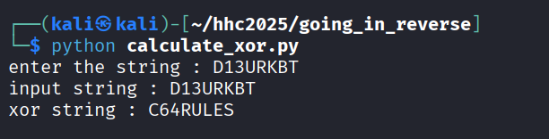
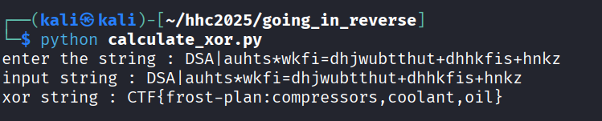

# Going in Reverse


**Difficulty**: :fontawesome-solid-star::fontawesome-solid-star::fontawesome-regular-star::fontawesome-regular-star::fontawesome-regular-star:<br/>
**Direct link**: [Going_in_reverse](https://dosis-network-down.holidayhackchallenge.com/){:target="_blank" rel="noopener"}


## Hints
??? tip "Hint 1"
    Holy cow! Another retro floppy disk, what are the odds? Well it looks like this one is intact.
??? tip "Hint 2"
    Maybe it is encrypted OR encoded?
??? tip "Hint 3"
    It looks like the program on the disk contains some weird coding.

## Objective

!!! question "Request"
   Kevin in the Retro Store needs help rewinding tech and going in reverse. Extract the flag and enter it here.

??? quote "Kevin McFarland"
    You know, there's something beautifully nostalgic about stumbling across old computing artifacts. Just last week, I was sorting through some boxes in my garage and came across a collection of 5.25" floppies from my college days - mostly containing terrible attempts at programming assignments and a few games I'd copied from friends.<br/>

    Finding an old Commodore 64 disk with a mysterious BASIC program on it? That's like discovering a digital time capsule. The C64 was an incredible machine for its time - 64KB of RAM seemed like an ocean of possibility back then. I spent countless hours as a kid typing in program listings from Compute! magazine, usually making at least a dozen typos along the way.<br/>

    The thing about BASIC programs from that era is they were often written by clever programmers who knew how to hide things in plain sight. Sometimes the most interesting discoveries come from reading the code itself rather than watching it execute. It's like being a digital archaeologist - you're not just looking at what the program does, you're understanding how the programmer thought.<br/>

    Take your time with this one. Those old-school programmers had to be creative within such tight constraints. You'll know the flag by the Christmas phrase that pays.

### Item
We get a BASIC program while talking to Kevin.<br>


## Solution

#### The BASIC program.

Here in below below code, each character of the user input password (in the variable PASS$)
is checked if Its matching with the character of the expected password (in the variable ENC_PASS$) in the same position. If any of them dont match, user is sent to line 90 where “ACCESS DENIED” is printed and program end for the user. <br/>

So what if we calculate XOR 7 for each character of the expected password D13URKBT.
<br/>

```
10 REM *** COMMODORE 64 SECURITY SYSTEM ***
20 ENC_PASS$ = "D13URKBT"
30 ENC_FLAG$ = "DSA|auhts*wkfi=dhjwubtthut+dhhkfis+hnkz"
40 INPUT "ENTER PASSWORD: "; PASS$
50 IF LEN(PASS$) <> LEN(ENC_PASS$) THEN GOTO 90
60 FOR I = 1 TO LEN(PASS$)
70 IF CHR$(ASC(MID$(PASS$,I,1)) XOR 7) <> MID$(ENC_PASS$,I,1) THEN GOTO 90
80 NEXT I
85 FLAG$ = "" : FOR I = 1 TO LEN(ENC_FLAG$) : FLAG$ = FLAG$ + CHR$(ASC(MID$(ENC_FLAG$,I,1)) XOR 7) : NEXT I : PRINT FLAG$
90 PRINT "ACCESS DENIED"
100 END
```

So what if we calculate XOR 7 for each character of the expected password D13URKBT.<br/>

```py linenums="1" title="calculate_xor.py"
#XOR a single character with 7.
def xor7_char(c):
	return chr(ord(c) ^ 7)


input_string = input("enter the string : ")
print(f"input string : {input_string}")

xor_string = ""
for c in input_string:
    xor_string += xor7_char(c)  
print(f"xor string : {xor_string}")
```

```
python calculate_xor.py
```
Enter the string :
```
D13URKBT
```



But that is just to bypass the logic so we dont get sent to line 90 and exit.<br/>
Then in the line 85, effectively calculates the XOR 7 of the variable ENC_FLAG$<br/>
` is a comment in BASIC, so we just need to calculate the XOR 7 for DSA|auhts*wkfi=dhjwubtthut+dhhkfis+hnkz<br/>

```bash title="BASIC program"
10 REM *** COMMODORE 64 SECURITY SYSTEM ***
20 ENC_PASS$ = "D13URKBT"
30 ENC_FLAG$ = "DSA|auhts*wkfi=dhjwubtthut+dhhkfis+hnkz"
40 INPUT "ENTER PASSWORD: "; PASS$
50 IF LEN(PASS$) <> LEN(ENC_PASS$) THEN GOTO 90
60 FOR I = 1 TO LEN(PASS$)
70 IF CHR$(ASC(MID$(PASS$,I,1)) XOR 7) <> MID$(ENC_PASS$,I,1) THEN GOTO 90
80 NEXT I
85 FLAG$ = "" : FOR I = 1 TO LEN(ENC_FLAG$) : FLAG$ = FLAG$ + CHR$(ASC(MID$(ENC_FLAG$,I,1)) XOR 7) : NEXT I : PRINT FLAG$
90 PRINT "ACCESS DENIED"
100 END
```
### Calculating the XOR 7 for DSA|auhts*wkfi=dhjwubtthut+dhhkfis+hnkz
```
python calculate_xor.py
```
Enter the string :
```
DSA|auhts*wkfi=dhjwubtthut+dhhkfis+hnkz
```



We get ```CTF{frost-plan:compressors,coolant,oil}``` <br/>

We submit the above output and that is accepted as the answer.


!!! success "Answer"
    ```
    CTF{frost-plan:compressors,coolant,oil}
    ```
## Response
!!! quote "Kevin McFarland"
    Excellent work! You've just demonstrated one of the most valuable skills in cybersecurity - the ability to think like the original programmer and unravel their logic without needing to execute a single line of code.<br/>