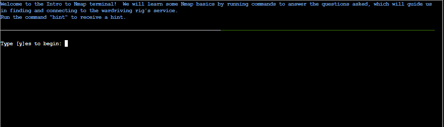
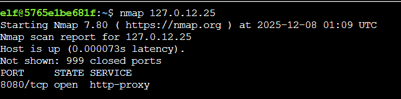
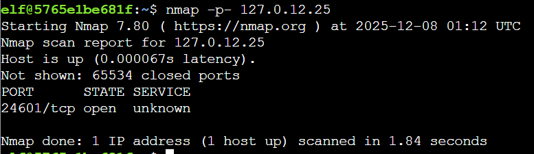
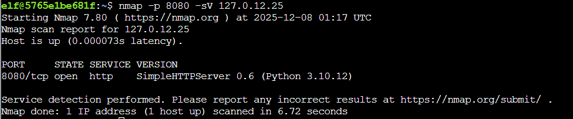

# Intro to Nmap


**Difficulty**: :fontawesome-solid-star::fontawesome-regular-star::fontawesome-regular-star::fontawesome-regular-star::fontawesome-regular-star:<br/>
**Direct link**: [Objective 1 terminal](https://hhc25-wetty-prod.holidayhackchallenge.com/?&challenge=termNmap)

## Objective

!!! question "Request"
    Meet Eric in the hotel parking lot for Nmap know-how and scanning secrets. Help him connect to the wardriving rig on his motorcycle!


??? quote "Eric Pursley"
    Hey, I'm Eric. As you can see, I'm an avid motorcyclist. And I love traveling the world with my wife.<br/>
    I enjoy being creative and making things. For example, a cybersecurity tool called Zero-E that I'm quite proud of, and the Baldur's Gate 3 mod called Manaflare. I'm even in the BG3 credits!<br/>
    I also make tools, ranges, and HHC worlds for Counter Hack. Yup, including the one you're in right now.<br/>
    But most of the time, I'm helping organizations in the real world be more secure. I do a bunch of different kinds of pentesting, but speciailize in network and physical.<br/>
    Some advice: stay laser-focused on your goals and don't let the distractions life throws at you lead you astray. That's how I ended up at Counter Hack!


## Solution
The initial prompt <br/>


## Goal 1 : 
When run without any options, nmap performs a TCP port scan of the top 1000 ports. Run a default nmap scan of 127.0.12.25 and see which port is open.

```
 nmap 127.0.12.25
```
Output :<br/>


## Goal 2 : 
Sometimes the top 1000 ports are not enough. Run an nmap scan of all TCP ports on 127.0.12.25 and see which port is open.
```
 nmap -p- 127.0.12.25
```
Output :<br/>


## Goal 3 : 
Nmap can also scan a range of IP addresses.  Scan the range 127.0.12.20 - 127.0.12.28 and see which has a port open. 
```
nmap -p- 127.0.12.20-28
```
Output : <br/>
We see a port 8080 open.<br/>


## Goal 5 : 
Nmap has a version detection engine, to help determine what services are running on a given port. What service is running on 127.0.12.25 TCP port 8080?
```
nmap -p 8080 -sV 127.0.12.25
```
Output :<br/>


## Goal 6 :
Sometimes you just want to interact with a port, which is a perfect job for Ncat! <br/>
Use the ncat tool to connect to TCP port 24601 on 127.0.12.25 and view the banner returned.
```
nc 127.0.12.25 24601
```
Output :<br/>
After connecting to the port 24601 via ncat, the objective is completed.


!!! success "Answer"
    Completed in the game.

## Response

!!! quote "Eric Pursley"
    Excellent! You stayed laser-focused and didn't let any distractions lead you astray - that's exactly how you reach your goals!
