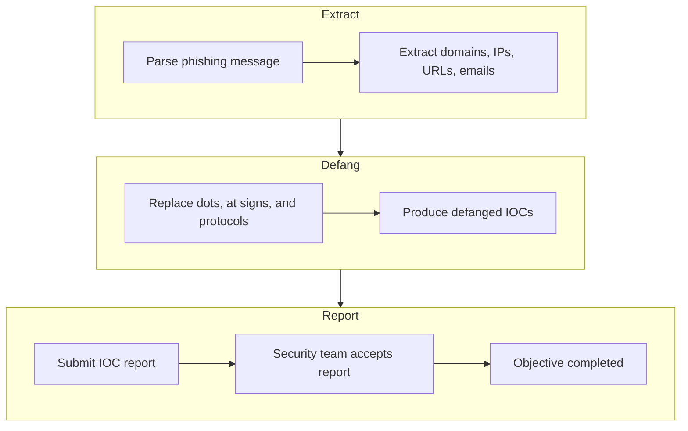
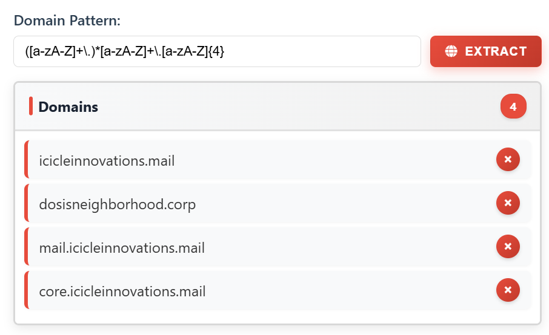
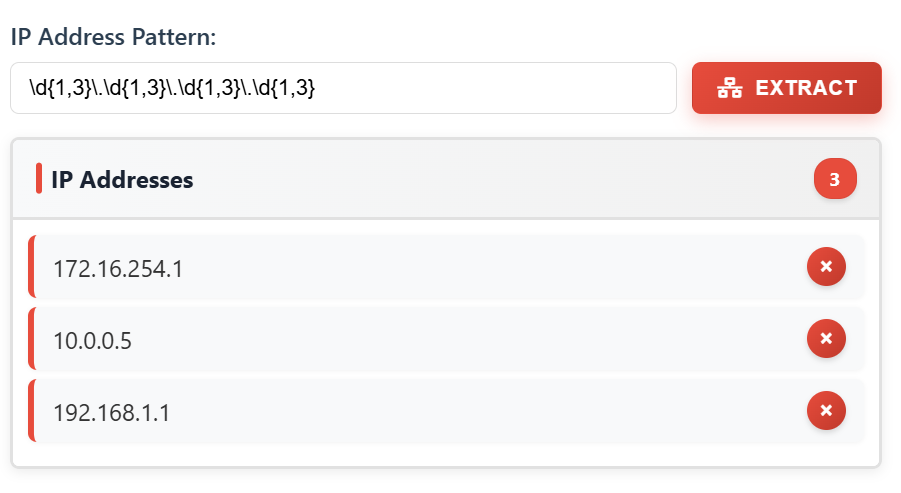
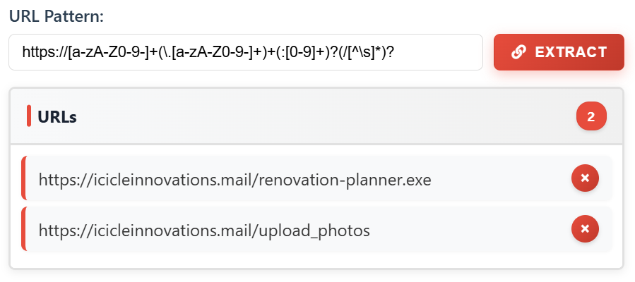
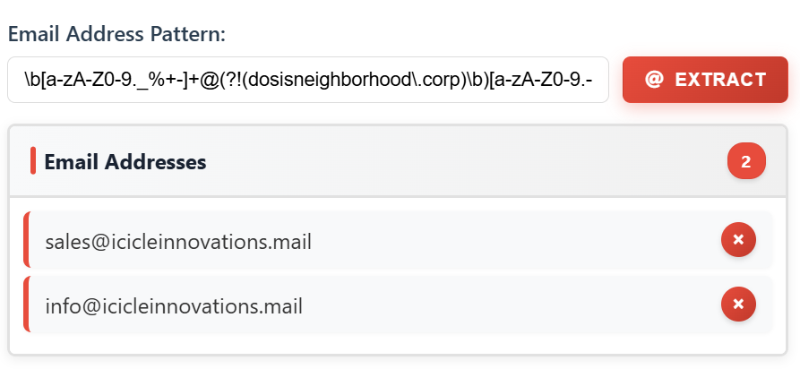
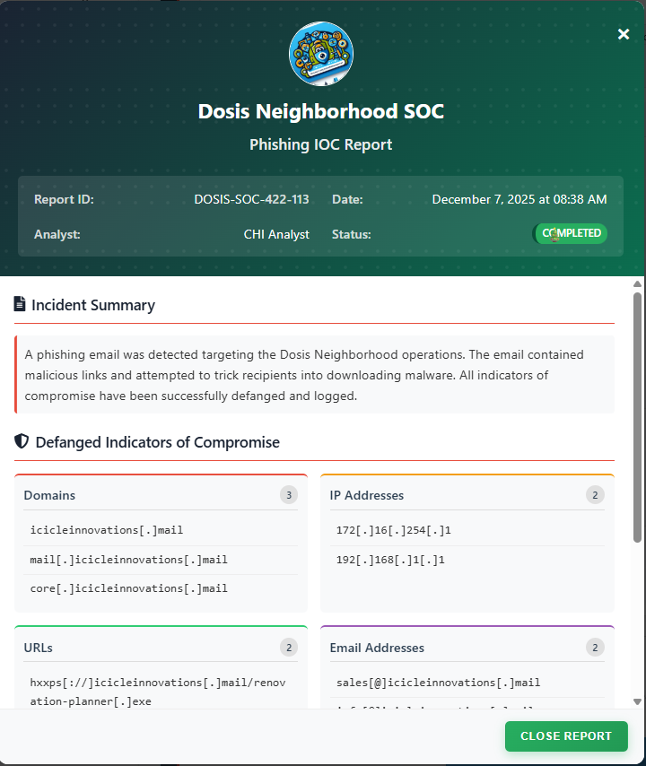

# Its All About Defang


**Difficulty**: :fontawesome-solid-star::fontawesome-regular-star::fontawesome-regular-star::fontawesome-regular-star::fontawesome-regular-star:<br/>
**Direct link**: [Its all about defang](https://its-all-about-defang.holidayhackchallenge.com/?id=3cac49be-9584-47b6-8dff-e92c260d676f){:target="_blank" rel="noopener"}


## Objective

!!! question "Request"
    Find Ed Skoudis upstairs in City Hall and help him troubleshoot a clever phishing tool in his cozy office.

??? quote "Ed Skoudis"
    Oh gosh, I could talk for hours about this stuff but I really need your help!<br/>

    The team has been working on this new SOC tool that helps triage phishing emails...and there are some...issues.<br/>

    We have had some pretty sketchy emails coming through and we need to make sure we block ALL of the indicators of compromise.<br/>

    Can you help me? No pressure...<br/>

## High-Level Steps

1. **Extract** – Use regex to identify IOCs in the phishing message.
2. **Defang** – Convert malicious indicators into a harmless format.
3. **Report** – Submit the defanged IOCs to the security team.



## Hints

??? tip "Defang All The Thingz"
    The PTAS does a pretty good job at defanging, however, the feature we are still working on is one that defangs ALL scenarios. For now, you will need to write a custom sed command combining all defang options.

??? tip "Extract IOCs"
    Remember, the new Phishing Threat Analysis Station (PTAS) is still under construction. Even though the regex patterns are provided, they haven't been fine tuned. Some of the matches may need to be manually removed.

## Solution
### Summary
This challenge shows a phishing message from which we needed to extract IOCs (domains, IP addresses, URLs and email addresses) and defanging them meaning replace the malicious content
with harmless placeholders and report them.

### Step 1 : Extract IOCs using regex
#### Domains
```bash
([a-zA-Z]+\.)*[a-zA-Z]+\.(?!corp\b)[a-zA-Z]{4}
```



#### IP Address
```bash
\b(?!10\.)(?:25[0-5]|2[0-4]\d|1\d{2}|[1-9]?\d)(?:\.(?:25[0-5]|2[0-4]\d|1\d{2}|[1-9]?\d)){3}\b
```



#### URLs
```bash
https://[a-zA-Z0-9-]+(\.[a-zA-Z0-9-]+)+(:[0-9]+)?(/[^\s]*)?
```

{ width="500" height="350" }

#### Email Addresses
```bash
\b[a-zA-Z0-9._%+-]+@(?!(dosisneighborhood\.corp)\b)[a-zA-Z0-9.-]+\.[a-zA-Z]{2,}\b
```

{ width="500" height="350" }

### Step 2 : Defang IOCs
Different IOCs need different way to replace characters on them to defang them,
For example:

- For domain and URLs It would be replace all . with [.]
- For  emails It would be replace all @ with [@] 
- For  urls It would be replace http with hxxp

We can use ```sed``` to do the replacements and combine all of them with semicolons to apply the defang to all the IOCs.

```
s/\./[.]/g; s/@/[@]/g; s/http/hxxp/g; s/:\//[://]/g
```

{ width="800" height="650" }

We submit the report to the security team and It is accepted.

{ width="700" height="550" }


!!! success "Answer"
    Solved in the game

## Response

!!! quote "Ed Skoudis"
    Well you just made that look like a piece of cake! Though I prefer cookies...I know where to find the best in town!<br/>
    Thanks again! See ya 'round!
