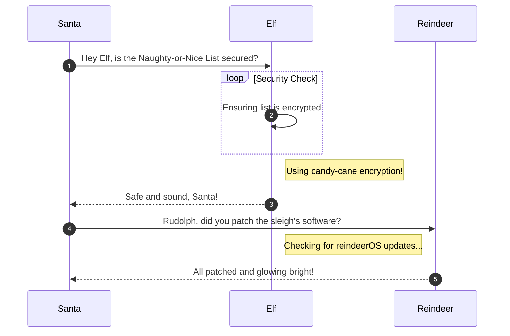

# Its All About Defang


**Difficulty**: :fontawesome-solid-star::fontawesome-regular-star::fontawesome-regular-star::fontawesome-regular-star::fontawesome-regular-star:<br/>
**Direct link**: [Its all about defang](https://its-all-about-defang.holidayhackchallenge.com/)

## Objective

!!! question "Request"
    Find Ed Skoudis upstairs in City Hall and help him troubleshoot a clever phishing tool in his cozy office.

??? quote "Ed Skoudis"
    Oh gosh, I could talk for hours about this stuff but I really need your help!<br/>

    The team has been working on this new SOC tool that helps triage phishing emails...and there are some...issues.<br/>

    We have had some pretty sketchy emails coming through and we need to make sure we block ALL of the indicators of compromise.<br/>

    Can you help me? No pressure...<br/>


## Hints

??? tip "Defang All The Thingz"
    The PTAS does a pretty good job at defanging, however, the feature we are still working on is one that defangs ALL scenarios. For now, you will need to write a custom sed command combining all defang options.

??? tip "Extract IOCs"
    Remember, the new Phishing Threat Analysis Station (PTAS) is still under construction. Even though the regex patterns are provided, they haven't been fine tuned. Some of the matches may need to be manually removed.

## Solution
### Summary
This challenge shows a phishing message from which we needed to extract IOCs (domains, IP addresses, URLs and email adddresses) and defanging them meaning replace the malicious content
with harmless placeholders and report them.

### Step 1 : Extract IOCs using regex
#### Domains
```bash
`([a-zA-Z]+\.)*[a-zA-Z]+\.[a-zA-Z]{4}
```

{ width="500" height="350" }

#### IP Address
```bash
` \d{1,3}\.\d{1,3}\.\d{1,3}\.\d{1,3}
```

{ width="500" height="350" }

#### URLs
```bash
` https://[a-zA-Z0-9-]+(\.[a-zA-Z0-9-]+)+(:[0-9]+)?(/[^\s]*)?
```

{ width="500" height="350" }

#### Email Addresses
```bash
` \b[a-zA-Z0-9._%+-]+@(?!(dosisneighborhood\.corp)\b)[a-zA-Z0-9.-]+\.[a-zA-Z]{2,}\b
```

{ width="500" height="350" }

### Step 2 : Defang IOCs
Different IOCs need different way to replace characters on them to defang them,
For example:

- For domain and URLs It would be replace all . with [.]
- For  emails It would be replace all @ with [@] 
- For  urls It would be replace http with hxxp

We can use ```sed``` to do the replacements and combine all of them with semicolons to apply the defang to all the IOCs.

```
s/\./[.]/g; s/@/[@]/g; s/http/hxxp/g; s/:\//[://]/g
```

{ width="500" height="350" }

This section explains the different steps taken to solve the challenge. Try to find a good balance between providing sufficient detail and not overloading the reader with too much information. Use [admonitions](https://squidfunk.github.io/mkdocs-material/reference/admonitions/), [images](https://squidfunk.github.io/mkdocs-material/reference/images/), [diagrams](https://squidfunk.github.io/mkdocs-material/reference/diagrams/), [code blocks](https://squidfunk.github.io/mkdocs-material/reference/code-blocks/), and [tables](https://squidfunk.github.io/mkdocs-material/reference/data-tables/) to highlight and structure important information or provide additional clarification.

### Admonitions

!!! warning "Anchor the decorations"
    Ensure that all festive decorations, especially electrical ones, are securely anchored. We don’t want them floating off into the tropical sunset!

!!! info "Palm tree lighting tip"
    While on the island, make sure to hang your Christmas lights on a palm tree. It’s not only festive but also a great beacon for Santa to find you!

### Images


### Diagrams



### Code blocks

```bash linenums="1" hl_lines="7" title="Countdown script (with line 7 highlighted)"
#!/bin/bash
echo "Christmas Holiday Countdown"

days_until_xmas=$(($(date -d "Dec 25" +%j) - $(date +%j)))

if [ $days_until_xmas -ge 0 ]; then
  echo "Only $days_until_xmas days until Christmas!"
else
  echo "Christmas has passed! Hope you had a great time!"
fi
```

### Tables

| Activity             | Santa's Verdict       | Elf Comments                    |
| :------------------- | :-------------------- | :------------------------------ |
| Iceberg Surfing      | Risky Business        | "Lost three surfboards!"        |
| Polar Bear Hugs      | Approach with Caution | "Fluffy but... brisk."          |
| Snow Fort Building   | Highly Recommended    | "Elf-sized doorways only."      |
| Aurora Light Chasing | Magical Experience    | "Better than Christmas lights!" |
| Penguin Parade       | Absolute Must-See     | "They're oddly organized!"      |

!!! success "Answer"
    Insert the answer to the objective here.

## Response

!!! quote "Insert Elf Name"
    Copy the final part of the conversation with Elf Name here.
