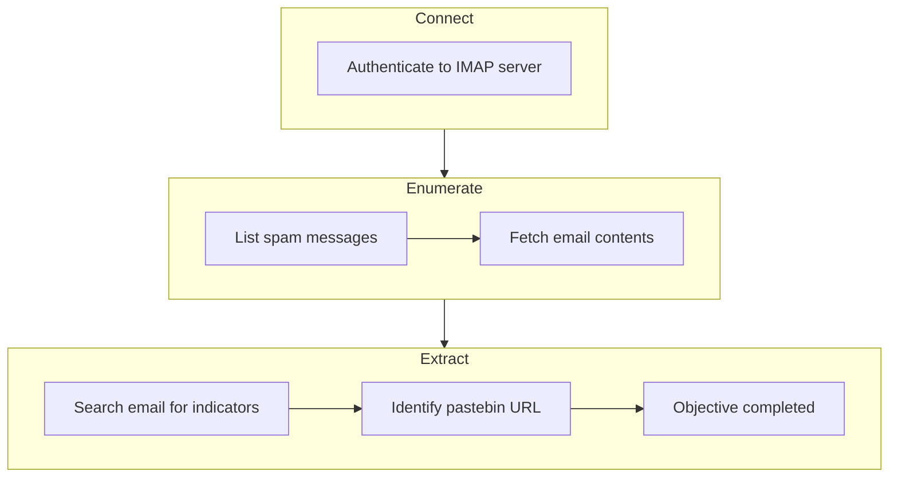
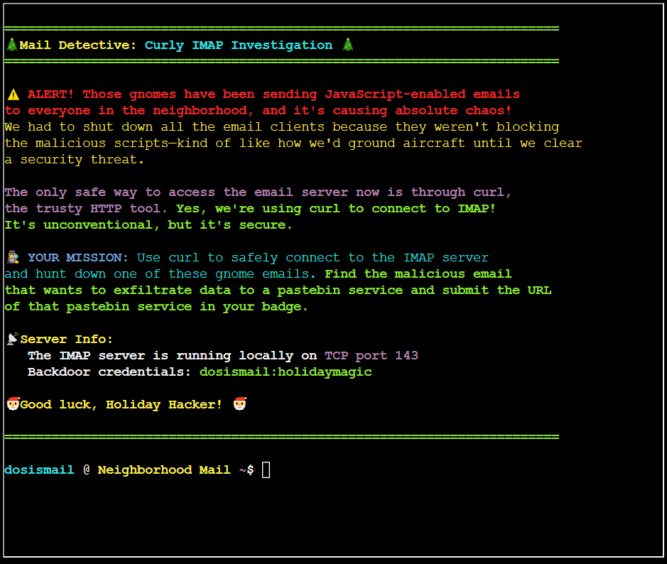
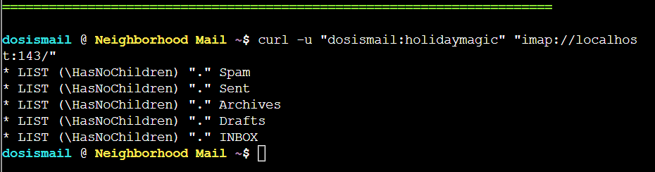
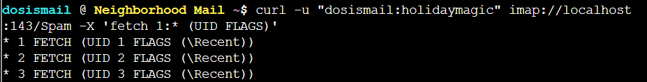
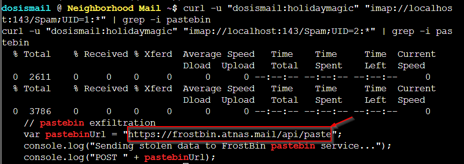
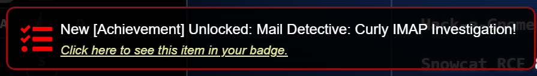

# Mail Detective


**Difficulty**: :fontawesome-solid-star::fontawesome-solid-star::fontawesome-regular-star::fontawesome-regular-star::fontawesome-regular-star:<br/>
**Direct link**: [Mail Detective](https://hhc25-wetty-prod.holidayhackchallenge.com/?&challenge=termCurlyImaps){:target="_blank" rel="noopener"}


## Hints
??? tip "Did You Say Curl?"
      If I heard this correctly...our sneaky security gurus found a way to interact with the IMAP server using Curl! Yes...the CLI HTTP tool! Here are some helpful docs I found <br/>
      https://everything.curl.dev/usingcurl/reademail.html


## Objective

!!! question "Request"
   Help Mo in City Hall solve a curly email caper and crack the IMAP case. <br/>
   What is the URL of the pastebin service the gnomes are using?

??? quote "Maurice Wilson"
    Hey there! I'm Mo, on loan from the Air Force, and let me tell you - Counter Hack is the best job I have ever had! <br/>

    So here's our situation: those gnomes have been sending JavaScript-enabled emails to everyone in the neighborhood, and it's causing chaos.<br/>

    We had to shut down all the email clients because they weren't blocking the malicious scripts - kind of like how we'd ground aircraft until we clear a security threat.<br/>

    The only safe way to access the email server now is through curl - yes, the HTTP tool!<br/>

    Think you can help me use curl to connect to the IMAP server and hunt down one of these gnome emails?<br/>

    Outstanding work! You've mastered using curl for IMAP - that's some serious command-line skills that would make any Air Force tech proud.<br/>

    Counter Hack really is the best job I have ever had, especially when we get to solve problems like this!<br/>

## High-Level Steps

1. **Connect** – Authenticate to the IMAP server using curl.
2. **Enumerate** – Retrieve and review messages from the spam folder.
3. **Extract** – Identify the malicious pastebin URL from the email content.




## Solution
Initial prompt : <br/>


Connect to the mail server with the given credentials. <br/>
```
curl -u "dosismail:holidaymagic" "imap://localhost:143/"
```



Get all the messages from spam folder.<br/>

```
curl -u "dosismail:holidaymagic" imap://localhost:143/Spam -X 'fetch 1:* (UID FLAGS)'
```



Examine each message looking for pastebin url
```
curl -u "dosismail:holidaymagic" "imap://localhost:143/Spam;UID=1:*" | grep -i pastebin
curl -u "dosismail:holidaymagic" "imap://localhost:143/Spam;UID=2:*" | grep -i pastebin
```


Message # 2 has the below pastebin URL which is the answer.<br/>
https://frostbin.atnas.mail/api/paste




!!! success "Answer"
   ```
   https://frostbin.atnas.mail/api/paste
   ```
   
## Response
!!! quote "Maurice Wilson"
    Outstanding work! You've mastered using curl for IMAP - that's some serious command-line skills that would make any Air Force tech proud.<br/>
