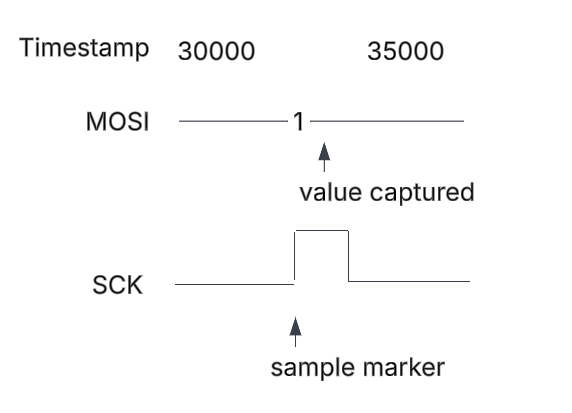
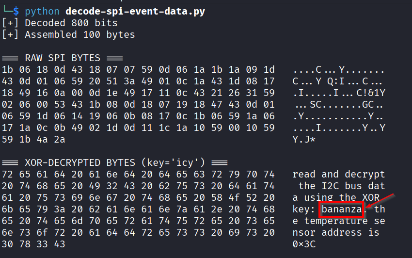
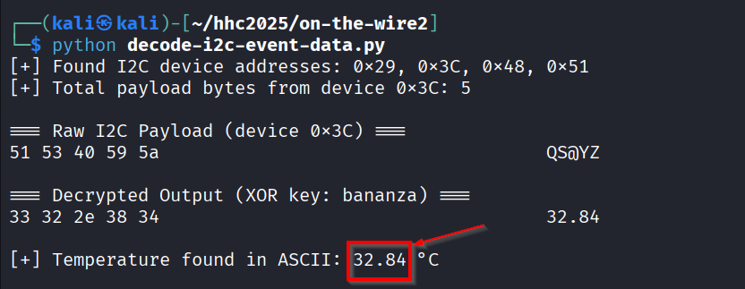

# On the Wire


**Difficulty**: :fontawesome-solid-star::fontawesome-solid-star::fontawesome-solid-star::fontawesome-solid-star::fontawesome-regular-star:<br/>
**Direct link**: [On-the-wire](https://signals.holidayhackchallenge.com/?&challenge=termSignals){:target="_blank" rel="noopener"}


## Hints
??? tip "Bits and Bytes"
    **Critical detail - Bit ordering varies by protocol:**

    **MSB-first (Most Significant Bit first):**<br/>

    SPI and I2C typically send the highest bit (bit 7) first<br/>
    When assembling bytes: ```byte = (byte << 1) | bit_value```<br/>
    Start with an empty byte, shift left, add the new bit<br/>

    **LSB-first (Least Significant Bit first):**<br/>
    1-Wire and UART send the lowest bit (bit 0) first<br/>
    When assembling bytes: ```byte |= bit_value << bit_position```<br/>
    Build the byte from bit 0 to bit 7<br/>
    
    **I2C specific considerations:**<br/>

    Every 9th bit is an ACK (acknowledgment) bit - ignore these when decoding data<br/>
    The first byte in each transaction is the device address (7 bits) plus a R/W bit<br/>
    You may need to filter for specific device addresses <br/>

    **Converting bytes to text:**
    ```
    String.fromCharCode(byte_value)  // Converts byte to ASCII character
    ```

??? tip "Garbage?"
    **If your decoded data looks like gibberish:**

    The data may be encrypted with XOR cipher<br/>
    XOR is a simple encryption: ```encrypted_byte XOR key_byte = plaintext_byte```<br/>
    The same operation both encrypts and decrypts: ```plaintext XOR key = encrypted, encrypted XOR key = plaintext```<br/>
    How XOR cipher works:
    ```
    function xorDecrypt(encrypted, key) {
    let result = "";
    for (let i = 0; i < encrypted.length; i++) {
        const encryptedChar = encrypted.charCodeAt(i);
        const keyChar = key.charCodeAt(i % key.length);  // Key repeats
        result += String.fromCharCode(encryptedChar ^ keyChar);
    }
    return result;
    }
    ```
    **Key characteristics:** <br/>
    - The key is typically short and repeats for the length of the message<br/>
    - You need the correct key to decrypt (look for keys in previous stage messages)<br/>
    - If you see readable words mixed with garbage, you might have the wrong key or bit order<br/>
    
    **Testing your decryption:** <br/>
    - Encrypted data will have random-looking byte values<br/>
    - Decrypted data should be readable ASCII text<br/>
    - Try different keys from messages you've already decoded<br/>

??? tip "On Rails"
    **Stage-by-stage approach** <br/>

    1. Connect to the captured wire files or endpoints for the relevant wires.
    1. Collect all frames for the transmission (buffer until inactivity or loop boundary).
    1. Identify protocol from wire names (e.g., dq → 1-Wire; mosi/sck → SPI; sda/scl → I²C).
    1. Decode the raw signal:
    1. Pulse-width protocols: locate falling→rising transitions and measure low-pulse width.
    1. Clocked protocols: detect clock edges and sample the data line at the specified sampling phase.
    1. Assemble bits into bytes taking the correct bit order (LSB vs MSB).
    1. Convert bytes to text (printable ASCII or hex as appropriate).
    1. Extract information from the decoded output — it contains the XOR key or other hints for the next stage.
    ---

    1. Repeat Stage 1 decoding to recover raw bytes (they will appear random).
    1. Apply XOR decryption using the key obtained from the previous stage.
    1. Inspect decrypted output for next-stage keys or target device information.

    ---

    * Multiple 7-bit device addresses share the same SDA/SCL lines.
    * START condition: SDA falls while SCL is high. STOP: SDA rises while SCL is high.
    * First byte of a transaction = (7-bit address << 1) | R/W. Extract address with address = first_byte >> 1.
    * Identify and decode every device’s transactions; decrypt only the target device’s payload.
    * Print bytes in hex and as ASCII (if printable) — hex patterns reveal structure.
    * Check printable ASCII range (0x20–0x7E) to spot valid text.
    * Verify endianness: swapping LSB/MSB will quickly break readable text.
    * For XOR keys, test short candidate keys and look for common English words.
    * If you connect mid-broadcast, wait for the next loop or detect a reset/loop marker before decoding.
    * Buffering heuristic: treat the stream complete after a short inactivity window (e.g., 500 ms) or after a full broadcast loop.
    * Sort frames by timestamp per wire and collapse consecutive identical levels before decoding to align with the physical waveform.


## Objective

!!! question "Request"
   Help Evan next to city hall hack this gnome and retrieve the temperature value reported by the I²C device at address 0x3C. <br/>
   The temperature data is XOR-encrypted, so you’ll need to work through each communication stage to uncover the necessary keys. <br/>
   Start with the unencrypted data being transmitted over the 1-wire protocol.

??? quote "Evan Booth"
    So here's the deal - there are some seriously bizarre signals floating around this area.<br/>
    Not your typical radio chatter or WiFi noise, but something... different.<br/>
    I've been trying to make sense of the patterns, but it's like trying to build a robot hand out of a coffee maker - you need the right approach.<br/>
    Think you can help me decode whatever weirdness is being transmitted out there?


## Solution


### 1-Wire protocol
??? "Fundamentals of 1-Wire protocol"
    **What is 1-Wire?**
    1-Wire is a communication protocol designed to transfer data between a master device (like a microcontroller or Raspberry Pi) and one or more peripheral devices (such as temperature sensors) using just a single data wire, plus ground.<br/>

    As the name suggests, all communication happens over one shared data line, which makes 1-Wire very simple from a wiring perspective. Because of this simplicity, it’s commonly used for low-speed, low-power devices where minimizing wires and hardware complexity is important.<br/>

    **What is the Data Line in 1-Wire?**
    In 1-Wire, there is only one signal line, usually called DQ or DATA.<br/>
    This single wire is used for: <br/>
    - Sending data from the master to the device
    - Sending data from the device back to the master
    - Synchronization (there is no separate clock line)
    The data line is normally held high using a pull-up resistor.<br/>
    Both the master and the slave devices communicate by pulling the line low for specific durations of time.<br/>

    So instead of using a separate clock (like I²C’s SCL), 1-Wire encodes data entirely using timing.<br/>

    **How does communication work without a clock?**<br/>

    Unlike I²C, 1-Wire has no clock line.<br/>

    Instead:<br/>
    - The master controls all timing
    - Data bits are represented by how long the line stays low
    
    In simple terms:<br/>
    - A short low pulse represents one type of bit 
    - A long low pulse represents another type of bit

    Both the master and the device agree on these timing rules beforehand (defined by the 1-Wire protocol).<br/>
    The device measures the duration of the low pulse to determine whether the bit is a 0 or a 1.<br/>

    This is why, when analyzing 1-Wire captures, you often look at microsecond-level timing differences between signal transitions.<br/>

    **How does the master and device communicate?**<br/>
        - The master always initiates communication
        - The master sends commands by pulling the data line low in specific timing patterns
        - Devices respond by pulling the same line low during assigned time slots

    Multiple devices can share the same wire because:<br/>
        - Each device has a unique 64-bit ROM address
        - The master can talk to a specific device or broadcast to all devices on the bus
    
    **What are practical examples where 1-Wire is used?**
    A very common example is the DS18B20 temperature sensor.<br/>

    Typical setup:<br/>
        - A Raspberry Pi or microcontroller acts as the master.<br/>
        - One or more DS18B20 sensors are connected to the same single data wire<br/>

    The master:<br/>
    - Discovers devices by their unique IDs
    - Requests temperature readings
    - Receives the temperature data back over the same wire
    
    Because only one data wire is required, 1-Wire is often used when:
    - Wiring needs to be simple
    - Devices are physically spread out
    - Data rates are low but reliability matters

#### High level tasks :
1. Collection of data
1. Decoding of SPI data
    1. Extract the bitstream from the the collected data
    1. Convert the bits to bytes
    1. Print the ASCII to get the key

#### Collecting the 1-wire signals
We see the messages over websockets <br/>
 <br/>

| Header                                                         | 
| ---------------------------------------------------------------|
| { width="900" }| 
| Messages                                                       |
| { width="900" }|

The data from the websocket is in JSON format.<br/>
We write a python script to collect the data from the websockets and convert to CSV.

??? "Python script : Collect the 1-wire data [dq line] in a CSV from websocket endpoint"
    ```py linenums="1" title="collect-1-Wire-data.py"
        import asyncio
        import websockets
        import csv
        import json
        import signal
        import sys

        running = True

        def signal_handler(sig, frame):
            global running
            print("\n[!] Stopping...")
            running = False

        signal.signal(signal.SIGINT, signal_handler)

        async def collect_data():
            uri = "wss://signals.holidayhackchallenge.com/wire/dq"

            # Define all fieldnames, even optional ones
            fieldnames = ["line", "t", "v", "marker"]

            with open("1-wire.csv", mode="w", newline="") as csvfile:
                writer = csv.DictWriter(csvfile, fieldnames=fieldnames)
                writer.writeheader()

                try:
                    async with websockets.connect(uri) as websocket:
                        print(f"[+] Connected to {uri}")
                        while running:
                            try:
                                message = await asyncio.wait_for(websocket.recv(), timeout=10)
                                data = json.loads(message)

                                # Ensure 'marker' key is present
                                if "marker" not in data:
                                    data["marker"] = ""

                                # Write row with all expected fields
                                row = {key: data.get(key, "") for key in fieldnames}
                                writer.writerow(row)
                                csvfile.flush()
                                print(f"[>] Logged: {row}")
                            except asyncio.TimeoutError:
                                print("[!] Timeout waiting for data... still listening.")
                except Exception as e:
                    print(f"[!] Error: {e}")

        if __name__ == "__main__":
            asyncio.run(collect_data())
    ```

**Top 20 rows in the output 1-Wire-data.csv** <br/>
 <br/>

| Column/Field Name      | Description                                             |
| ---------------------- | ------------------------------------------------------- |
| line                   | the data line [dq]                                      |
| t                      | timestamp of the signal transmission (in microsecond)   |
| v                      | logical voltage level on the dq line at time t          |
| marker                 | Annotation                                              |


#### Decoding the 1-wire signal

!!! note "From the hint"

    Pulse-width protocols: locate falling→rising transitions and measure low-pulse width.

??? "Understanding the falling and rising transition"
    A falling edge is detected when the signal transitions from HIGH (v=1) to LOW (v=0), marking the start of a LOW pulse. <br/>
    A rising edge occurs when the signal transitions from LOW to HIGH (v=0 to v=1), marking the end of the LOW pulse.<br/>
    Following the pulse-width protocol hint, falling→rising transitions are located.

??? "Understanding low-pulse width"
    - A pulse is when a signal:
        * leaves its idle state,
        * stays in another state for some time,
        * and then returns.

    - In 1-Wire:
        * Idle state = HIGH
        * Active state = LOW

    So a pulse looks like: 
    ```HIGH → LOW → HIGH```
    That LOW section is the pulse.

    **Width** = In signal processing with is is how long something lasts in time. <br/>
    Therefore : <br/>
    low-pulse width = time spent in LOW state
    and 
    LOW-pulse width = t(rising edge) - t(falling edge)


Based on the above concepts and understanding, we can visualize the signal transmission like below : <br/>

 <br/>

Based on the data collected in the CSV from the websockets endpoint, we apply a threshold of more than 6 microseconds to identify meaningful transitions. <br/> 
Any timing difference greater than 6 microseconds is considered a valid signal boundary, while differences of 6 microseconds or less are treated as noise and discarded. <br/>

??? "Python script : Decoding the 1-wire data"
    ```py linenums="1" title="decode-1-wire.py"
    import csv

    # Based on the data collected in the CSV from the websockets endpoint, we apply a threshold of more than 6 microseconds to identify meaningful transitions.
    # Any timing difference greater than 6 microseconds is considered a valid signal boundary, while differences of 6 microseconds or less are treated as noise and discarded.

    BIT_THRESHOLD_US = 7

    """
        Reads the csv file containing the 1-wire signal data and convert 

        :param signal: time-ordered list of (timestamp, value) tuples, where value  represents the logic level on the data line (1 = high, 0 = low), and timestamp is  measured in microseconds.
        :return: bit stream
    """
    def load_signal_data(csv_filename):
        signal = []

        with open(csv_filename, newline="") as csvfile:
            reader = csv.DictReader(csvfile)
            for row in reader:
                try:
                    t = int(row["t"]) if row["t"] else None
                    v = int(row["v"]) if row["v"] else None

                    if t is not None and v is not None:
                        signal.append((t, v))
                except Exception:
                    continue

        return signal


    """
        The extract_bits function is responsible for converting raw 1-Wire signal transitions into logical bits (0 and 1) based on pulse timing.

        :param signal: csv file path
        :return: List of time-ordered list of (timestamp, value) tuples, where value represents the logic level on the data line (1 = high, 0 = low), and timestamp is  measured in microseconds.
    """
    def extract_bits(signal):
        bits = []
        i = 1

        while i < len(signal):
            t_prev, v_prev = signal[i - 1]
            t_curr, v_curr = signal[i]

            # Detect falling edge (1 → 0)
            if v_prev == 1 and v_curr == 0:
                fall_time = t_curr

                # Look ahead for rising edge (0 → 1)
                for j in range(i + 1, len(signal)):
                    t_next, v_next = signal[j]

                    if v_next == 1:
                        pulse_width = t_next - fall_time

                        # Short pulse → bit 1, long pulse → bit 0
                        bit = 1 if pulse_width < BIT_THRESHOLD_US else 0
                        bits.append(bit)

                        i = j  # Jump to end of this pulse
                        break

            i += 1

        return bits

    """
        Reconstructs byte values from an LSB-first bit stream.

        The input bit stream is processed in groups of eight bits. Each group is
        assembled into a single byte by placing each bit into its corresponding
        bit position (least-significant-bit first). The resulting bytes are
        returned as integer values.

        :param bits: List of bits (0 or 1) extracted from the signal
        :return: List of reconstructed byte values
    """
    def bits_to_bytes(bits):
        bytes_out = []
        
        # For loop with step of 8 because we need to group bits to byte
        for i in range(0, len(bits), 8):
            # getting the 8 bits
            byte_bits = bits[i:i + 8]
            if len(byte_bits) < 8:
                break
            # Here we have a group of 8 bits


            byte = 0
            # Enumerate through the bits we collected - using the bit value as well Its position
            for bit_position, bit_value in enumerate(byte_bits):
                # bit_val << bit_pos would put bit in position "bit_position".
                # Because now bits are received sequentially and must be accumulated into a single byte without overwriting previously decoded bits, a bitwise OR operation is used to merge each shifted bit into the byte.
                byte |= (bit_value << bit_position)

            bytes_out.append(byte)

        return bytes_out


    def bytes_to_ascii(byte_list):
        message = ""

        for b in byte_list:
            if 32 <= b <= 126:  # Printable ASCII
                message += chr(b)
            else:
                message += f"\\x{b:02x}"

        return message


    if __name__ == "__main__":
        csv_file = "1-wire.csv"

        print("[*] Loading signal...")
        signal = load_signal_data(csv_file)

        print("[*] Extracting bits...")
        bits = extract_bits(signal)
        print(f"[*] Extracted {len(bits)} bits ({len(bits) // 8} bytes)")

        print("[*] Converting to bytes...")
        byte_values = bits_to_bytes(bits)

        print("[*] Message in ASCII:")
        ascii_output = bytes_to_ascii(byte_values)
        print(ascii_output)

    ```
We run the script and get the key as "icy". <br/>


### SPI protocol
??? "Fundamentals of SPI protocol"
    **What is SPI?** <br/>
    SPI, stands for Serial Peripheral Interface, is basically a communication protocol often used to send data between microcontrollers and small peripherals like sensors, SD cards, and displays. It's known for being pretty fast and straightforward. <br/>

    **What is MOSI and SCK?** <br/>
    MOSI stands for "Master Out Slave In", which means it’s the line on which the master device sends data out to a slave device. <br/>
    SCK is the "Serial Clock". This is the line that the master uses to send a clock signal to keep everything in sync.<br/>

    In other words, with SPI, the master is always driving a clock signal, and it’s pushing data out through the MOSI line. The slave devices listen to that clock and pick up the data accordingly.

    **How SPI is different from 1-Wire protocol?** <br/>
    In a 1-wire protocol, you typically have just one data line that handles both sending and receiving bits. <br/>
    1-Wire is simpler in terms of wiring, but it’s not as fast or as flexible as SPI. <br/>
    SPI is generally faster and more suited for situations where you need to move data quickly and have multiple devices.

    **What are the practical examples where SPI is used?** <br/>
    When you insert an SD card to a RaspberryPI, Raspberry Pi is the master controlling the communication and telling the SD card which is the slave device when to send data and when to receive it. This communication happens over SPI.<br/>
    Raspberry Pi (the master) sends the actual data to the SD card over MOSI line. <br/>
    Raspberry Pi also sends the clock signal on the SCK line so the SD card knows WHEN to read each bit of data that's coming in on MOSI.

In the challenge, the MOSI and SCK line data are transmitted via two websocket endpoints.<br/>
<br/>

#### High level tasks :
1. Collection of data
1. Decoding of SPI data
    1. Extract the bitstream from the the collected data
    1. Convert the bits to bytes
    1. XOR decrypt the bytes using the key 'icy'
    1. Print the ASCII to get the key

#### Collection of data :
Collect MOSI and SCK data from websocket endpoints to one CSV file and order the data on timestamp. <br/>
??? "Python script : Collecting the SPI data [MOSI and SCK lines] in one CSV from their respective websocket endpoints"
    ```py  linenums="1"
    import asyncio
    import csv
    import json
    import websockets

    MOSI_WS = "wss://signals.holidayhackchallenge.com/wire/mosi"
    SCK_WS  = "wss://signals.holidayhackchallenge.com/wire/sck"

    OUTPUT_FILE = "spi_events_sorted.csv"

    events = []


    async def collect_signal(ws_url):
        async with websockets.connect(ws_url) as websocket:
            async for message in websocket:
                data = json.loads(message)
                events.append({
                    "line": data.get("line", ""),
                    "t": data.get("t", ""),
                    "v": data.get("v", ""),
                    "marker": data.get("marker", "")
                })


    def sort_events():
        def safe_int(v):
            try:
                return int(v)
            except (ValueError, TypeError):
                return -1

        events.sort(key=lambda e: safe_int(e["t"]))


    def write_csv():
        with open(OUTPUT_FILE, "w", newline="") as f:
            writer = csv.DictWriter(f, fieldnames=["line", "t", "v", "marker"])
            writer.writeheader()
            writer.writerows(events)


    async def main():
        print("[*] Collecting SPI signals (Ctrl+C to stop)")

        tasks = [
            asyncio.create_task(collect_signal(MOSI_WS)),
            asyncio.create_task(collect_signal(SCK_WS)),
        ]

        try:
            await asyncio.gather(*tasks)
        finally:
            # This ALWAYS runs — even on Ctrl+C
            print("\n[*] Stopping collection")
            for t in tasks:
                t.cancel()

            print("[*] Sorting events by timestamp")
            sort_events()

            print(f"[*] Writing sorted CSV to {OUTPUT_FILE}")
            write_csv()

            print("[+] Done")


    if __name__ == "__main__":
        try:
            asyncio.run(main())
        except KeyboardInterrupt:
            # Prevent ugly traceback
            pass
    ```

*Excerpt data*: <br/>
```
line,t,v,marker
sck,30000,0,
mosi,30000,1,data-bit
sck,30000,0,
mosi,30000,1,data-bit
sck,30000,0,
mosi,30000,1,data-bit
sck,30000,0,
sck,35000,1,sample
sck,35000,1,sample
sck,35000,1,sample
```

#### Decoding the SPI data

1.  **Extract the bitstream from the the collected data** <br/>
The basic principle here is to collect the most recent MOSI value at the time of the SCK sample event In the below example, the bit 1 from MOSI first line below will be extracted.<br/>
   
``` py linenums="1"
mosi,30000,1,data-bit
sck,30000,0,
sck,35000,1,sample
```

<br/>

1. **Convert the bits to bytes**<br/>
Take bitstream and pack them into 8-bit bytes, assuming MSB-first order (the first bit we see becomes the leftmost bit of the byte). <br/>
Bits are assembled using the formula:
```
byte = (byte << 1) | bit
```

1.  **XOR decrypt the bytes using the key 'icy'** <br/>
We have the key 'icy' (0x69, 0x63, 0x79) from 1-wire decoding. We use the key to XOR decrypt the bytes.

1. **Print the ASCII to get the key**<br/>
Print the printable range 0x20 (space) to 0x7E (~). We replace anything non-printable with [.]. This reveals readable ASCII, including the key "bananza".

??? "Python script : Decoding the SPI data"
    ```py linenums="1"
    import csv

    INPUT_FILE = "spi_events_sorted.csv"

    XOR_KEY = b"icy"


    # -------------------------------
    # Stage 1: Load sorted events
    # -------------------------------
    def load_sorted_events(csv_file):
        events = []
        with open(csv_file, newline="") as f:
            reader = csv.DictReader(f)
            for row in reader:
                events.append(row)
        return events


    # -------------------------------
    # Stage 2: Decode SPI bitstream
    # -------------------------------
    def decode_bitstream(events):
        bitstream = []

        current_mosi = None
        seen_sample_timestamps = set()

        for row in events:
            line = row.get("line", "")
            t = row.get("t", "")
            v = row.get("v", "")
            marker = row.get("marker", "")

            if line == "mosi":
                try:
                    current_mosi = int(v)
                except (ValueError, TypeError):
                    continue

            elif line == "sck" and marker == "sample":
                if t in seen_sample_timestamps:
                    continue
                seen_sample_timestamps.add(t)

                if current_mosi is None:
                    continue

                bitstream.append(current_mosi)

        return bitstream


    # -------------------------------
    # Stage 3: Bits → Bytes (MSB-first)
    # -------------------------------
    def bits_to_bytes(bitstream):
        bytes_out = []
        current_byte = 0
        bit_count = 0

        for bit in bitstream:
            current_byte = (current_byte << 1) | bit
            bit_count += 1

            if bit_count == 8:
                bytes_out.append(current_byte)
                current_byte = 0
                bit_count = 0

        return bytes_out


    # -------------------------------
    # Stage 4: Pretty-print bytes
    # -------------------------------
    def print_bytes_hex_ascii(byte_values, label):
        print(f"\n=== {label} ===")
        for i in range(0, len(byte_values), 16):
            chunk = byte_values[i:i + 16]
            hex_part = " ".join(f"{b:02x}" for b in chunk)
            ascii_part = "".join(chr(b) if 0x20 <= b <= 0x7E else "." for b in chunk)
            print(f"{hex_part:<48}  {ascii_part}")


    # -------------------------------
    # Stage 5: XOR decryption
    # -------------------------------
    def xor_decrypt(byte_values, key):
        decrypted = []
        key_len = len(key)

        for i, b in enumerate(byte_values):
            decrypted.append(b ^ key[i % key_len])

        return decrypted


    # -------------------------------
    # Main orchestration
    # -------------------------------
    def main():
        events = load_sorted_events(INPUT_FILE)

        bitstream = decode_bitstream(events)
        print(f"[+] Decoded {len(bitstream)} bits")

        byte_values = bits_to_bytes(bitstream)
        print(f"[+] Assembled {len(byte_values)} bytes")

        print_bytes_hex_ascii(byte_values, "RAW SPI BYTES")

        decrypted_bytes = xor_decrypt(byte_values, XOR_KEY)
        print_bytes_hex_ascii(decrypted_bytes, "XOR-DECRYPTED BYTES (key='icy')")


    if __name__ == "__main__":
        main()
    ```
Decoding the stream from SPI shows the key 'bananza'.

<br/>


### I2C protocol
??? "Fundamentals"
    **What is I²C?** <br/>
    I²C, stands for Inter-Integrated Circuit, is basically a communication protocol often used to send data between microcontrollers and small peripherals like sensors, EEPROMs, and real-time clock modules. It’s designed to use fewer wires and to allow multiple devices to share the same bus. <br/>

    **What is SDA and SCL?** <br/>
    SDA stands for “Serial Data Line”, which means it’s the line on which data is sent and received between the master and slave devices. <br/>
    SCL is the “Serial Clock Line”. This is the line that the master uses to send a clock signal to keep everything in sync. <br/>

    In other words, with I²C, the master is always driving a clock signal on SCL, and data is exchanged on the SDA line. The slave devices listen to that clock and read or drive data on SDA accordingly.

    **How I²C is different from 1-Wire protocol?** <br/>
    In a 1-wire protocol, you typically have just one data line that handles both sending and receiving bits. <br/>
    I²C uses two separate lines: one for data (SDA) and one for clock (SCL). <br/>
    I²C is more structured than 1-Wire and supports features like device addressing and acknowledgments.

    **How I²C is different from SPI?** <br/>
    SPI uses separate data lines and a dedicated chip-select for each slave device. <br/>
    I²C allows multiple devices to share the same two wires by using device addresses instead of chip-select lines. <br/>
    SPI is generally faster, while I²C is simpler in terms of wiring and scaling to multiple devices.

    **What are the practical examples where I²C is used?** <br/>
    When you connect sensors like temperature sensors, EEPROM chips, or real-time clock modules to a Raspberry Pi, the communication often happens over I²C. <br/>
    Raspberry Pi (the master) controls the communication by sending a clock signal on the SCL line. <br/>
    Both the Raspberry Pi and the slave devices send and receive data over the SDA line, with data being read when the clock signal is high.

In the challenge, the SDA and SCL line data are transmitted via two separate websocket endpoints.<br/>
<br/>


### High level tasks
1. Collection of I2C data
1. Decoding of I2C data
    1. Extract the bitstream from the collected data
    1. Convert the bits to bytes
    1. Handle I²C protocol-specific bits
    1. XOR decrypt the bytes using the key 'bananza'
    1. Print the ASCII output

**Collection of I2C data**<br/>
Collect SDA and SCL data from websocket endpoints into a single CSV file and order the data by timestamp.
This ordering reconstructs the chronological behavior of the I2C bus.

??? "Python script : Collecting the I2C data [SDA and SCL lines] from websocket endpoints"
    ```py linenums="1"
    import asyncio
    import json
    import csv
    from websockets import connect

    # I2C WebSocket endpoints
    SDA_WS = "wss://signals.holidayhackchallenge.com/wire/sda"
    SCL_WS = "wss://signals.holidayhackchallenge.com/wire/scl"

    OUTPUT_CSV = "i2c_combined_sorted.csv"

    # Shared frame buffer
    frames = []
    stop_event = asyncio.Event()

    # Fixed CSV columns
    CSV_FIELDS = [
        "line",
        "t",
        "v",
        "marker",
        "byteIndex",
        "bitIndex",
        "type"
    ]


    def normalize_frame(data):
        """
        Ensure all expected CSV fields exist.
        Missing fields are filled with empty string.
        """
        return {field: data.get(field, "") for field in CSV_FIELDS}


    async def collect(ws_url):
        async with connect(ws_url) as ws:
            while not stop_event.is_set():
                try:
                    msg = await ws.recv()
                    data = json.loads(msg)
                    frames.append(normalize_frame(data))
                except Exception:
                    break


    def write_sorted_csv():
        print("[*] Sorting frames by timestamp...")

        frames.sort(
            key=lambda x: int(x["t"]) if x["t"] != "" else 0
        )

        print(f"[*] Writing {len(frames)} rows to {OUTPUT_CSV}")
        with open(OUTPUT_CSV, "w", newline="") as f:
            writer = csv.DictWriter(f, fieldnames=CSV_FIELDS)
            writer.writeheader()
            writer.writerows(frames)


    async def main():
        tasks = [
            asyncio.create_task(collect(SDA_WS)),
            asyncio.create_task(collect(SCL_WS)),
        ]

        try:
            await asyncio.gather(*tasks)
        except KeyboardInterrupt:
            print("\n[*] Ctrl+C detected — stopping capture...")
            stop_event.set()

            # Allow collectors to exit cleanly
            await asyncio.sleep(0.2)

        finally:
            write_sorted_csv()


    if __name__ == "__main__":
        asyncio.run(main())

    ```

**Decoding of I2C data**<br/>

1. **Extract the bitstream from the collected data** <br/>
The basic principle here is to extract the SDA value when the SCL line is high.
In I2C, data is valid and must be sampled while SCL is high.
Each SCL high period contributes one data bit from SDA.
So, in conclusion, when SCL shows "sample", take the most recent SDA value.

1. **Convert the bits to bytes** <br/>
Take the extracted bitstream and pack it into 8-bit bytes, assuming MSB-first order, which is standard for I2C.
Bits are assembled using ```byte = (byte << 1) | bit```

1. **Handle I²C protocol-specific bits** <br/>
From the hint : <br/>
Every 9th bit is an ACK (acknowledgment) bit - ignore these when decoding data<br/>
The first byte in each transaction is the device address (7 bits) plus a R/W bit<br/>
You may need to filter for specific device addresses <br/>

1. **XOR decrypt the bytes using the key 'bananza'**<br/>
The decoded data bytes are XOR-decrypted using the repeating key bananza, which was obtained from the SPI decoding stage.

1. **Print the ASCII output**<br/>
Print bytes in both hex and ASCII format.
Printable ASCII characters (0x20–0x7E) are displayed directly, while non-printable values are replaced with ..
This reveals readable ASCII content.

??? "Python script : Decoding the I2C data"
    ```py linenums="1"
    import csv
    import re
    from collections import defaultdict

    CSV_FILE = "i2c_events_sorted.csv"
    TARGET_ADDR_7BIT = 0x3C
    XOR_KEY = "bananza"


    def safe_int(x):
        """
        Convert CSV string fields to int safely.
        Returns None if empty/invalid.
        """
        if x is None:
            return None
        s = str(x).strip()
        if s == "":
            return None
        try:
            return int(s)
        except ValueError:
            return None


    def xor_with_key(data_bytes, key):
        """
        XOR decrypt (or encrypt) with a repeating ASCII key.
        """
        key_bytes = [ord(c) for c in key]
        out = []
        for i, b in enumerate(data_bytes):
            out.append(b ^ key_bytes[i % len(key_bytes)])
        return out


    def print_bytes_hex_ascii(byte_values, label):
        """
        Print bytes in hex + ASCII (printable range only).
        """
        print(f"\n=== {label} ===")
        for i in range(0, len(byte_values), 16):
            chunk = byte_values[i:i + 16]
            hex_part = " ".join(f"{b:02x}" for b in chunk)
            ascii_part = "".join(chr(b) if 0x20 <= b <= 0x7E else "." for b in chunk)
            print(f"{hex_part:<48}  {ascii_part}")


    def read_rows(csv_file):
        """
        Read CSV rows and normalize fields.
        Skips totally empty 'welcome' style rows.
        """
        rows = []
        with open(csv_file, newline="") as f:
            reader = csv.DictReader(f)

            for row in reader:
                line = (row.get("line") or "").strip().lower()
                marker = (row.get("marker") or "").strip().lower()
                typ = (row.get("type") or "").strip().lower()

                t = safe_int(row.get("t"))
                v = safe_int(row.get("v"))
                byte_index = safe_int(row.get("byteIndex"))
                bit_index = safe_int(row.get("bitIndex"))

                # Skip rows that have no meaningful signal info (e.g., welcome rows)
                if line == "" and marker == "" and typ == "" and t is None and v is None:
                    continue

                rows.append({
                    "line": line,
                    "t": t,
                    "v": v,
                    "marker": marker,
                    "byteIndex": byte_index,
                    "bitIndex": bit_index,
                    "type": typ,
                })

        return rows


    def split_transactions(rows):
        """
        Group rows into I2C transactions using marker == 'start' and marker == 'stop'.

        Returns: list of list-of-rows
        """
        txns = []
        current = []
        in_txn = False

        for r in rows:
            m = r["marker"]

            if m == "start":
                # start a new transaction
                if current:
                    # if something was accumulated but never stopped, keep it
                    txns.append(current)
                current = [r]
                in_txn = True
                continue

            if in_txn:
                current.append(r)

            if in_txn and m == "stop":
                txns.append(current)
                current = []
                in_txn = False

        # If capture ends mid-transaction, keep it
        if current:
            txns.append(current)

        return txns


    def bits_msb_first_to_byte(bits_by_index):
        """
        bits_by_index: dict {bitIndex: bitValue} for bitIndex 0..7 (MSB-first ordering)
        We assemble: bitIndex 0 is the MSB, bitIndex 7 is the LSB.
        """
        value = 0
        for i in range(0, 8):
            b = bits_by_index.get(i)
            if b not in (0, 1):
                # Missing bit -> fail
                return None
            value |= (b << (7 - i))
        return value


    def decode_transaction(txn_rows):
        """
        Decode one I2C transaction:
        - Build address byte from marker == 'address-bit' rows using bitIndex
        - Build data bytes from marker == 'data-bit' rows grouped by byteIndex/bitIndex

        Returns:
        (slave_addr_7bit, rw_bit, payload_bytes_list)
        or (None, None, []) if cannot decode.
        """
        # ---- Address bits ----
        addr_bits = {}
        for r in txn_rows:
            if r["marker"] == "address-bit" and r["line"] == "sda":
                bi = r["bitIndex"]
                if bi is not None and r["v"] in (0, 1):
                    addr_bits[bi] = r["v"]

        addr_byte = bits_msb_first_to_byte(addr_bits)
        if addr_byte is None:
            return (None, None, [])

        rw_bit = addr_byte & 0x01
        slave_addr_7bit = addr_byte >> 1

        # ---- Data bits -> bytes ----
        # Group all SDA data-bit rows by byteIndex
        bytes_bits = defaultdict(dict)  # {byteIndex: {bitIndex: bit}}
        for r in txn_rows:
            if r["marker"] == "data-bit" and r["line"] == "sda":
                byte_i = r["byteIndex"]
                bit_i = r["bitIndex"]
                if byte_i is None or bit_i is None:
                    continue
                if r["v"] not in (0, 1):
                    continue
                bytes_bits[byte_i][bit_i] = r["v"]

        payload = []
        for byte_i in sorted(bytes_bits.keys()):
            bval = bits_msb_first_to_byte(bytes_bits[byte_i])
            if bval is None:
                # If a byte is incomplete, skip it (or break — skipping is safer in noisy captures)
                continue
            payload.append(bval)

        return (slave_addr_7bit, rw_bit, payload)


    def extract_payload_for_device(rows, target_addr_7bit):
        """
        Walk through all transactions, decode them, and concatenate payload bytes
        for target address (0x3C).
        """
        txns = split_transactions(rows)

        all_payload = []
        seen_addresses = []

        for txn in txns:
            addr, rw, payload = decode_transaction(txn)
            if addr is None:
                continue

            seen_addresses.append(addr)

            if addr == target_addr_7bit:
                # This is a transaction for our device
                all_payload.extend(payload)

        return seen_addresses, all_payload


    def main():
        rows = read_rows(CSV_FILE)

        seen_addresses, payload = extract_payload_for_device(rows, TARGET_ADDR_7BIT)

        # Print which devices were seen
        if seen_addresses:
            uniq = sorted(set(seen_addresses))
            print("[+] Found I2C device addresses:", ", ".join(f"0x{x:02X}" for x in uniq))
        else:
            print("[-] No decodable I2C transactions found.")
            return

        if not payload:
            print(f"[-] No payload bytes found for target device 0x{TARGET_ADDR_7BIT:02X}")
            return

        print(f"[+] Total payload bytes from device 0x{TARGET_ADDR_7BIT:02X}: {len(payload)}")

        # Raw bytes
        print_bytes_hex_ascii(payload, f"Raw I2C Payload (device 0x{TARGET_ADDR_7BIT:02X})")

        # XOR decrypt
        decrypted = xor_with_key(payload, XOR_KEY)
        print_bytes_hex_ascii(decrypted, f"Decrypted Output (XOR key: {XOR_KEY})")

        # Extract ASCII temperature
        decoded_text = bytes(decrypted).decode(errors="replace")
        match = re.search(r"\d+\.\d+", decoded_text)
        if match:
            temp = match.group(0)
            print(f"\n[+] Temperature found in ASCII: {temp} °C")
        else:
            print("\n[-] No temperature-like float found in decrypted ASCII.")


    if __name__ == "__main__":
        main()
    ```

Decoding the I2C data with the key bananza shows the temperature at address 0x3C as 32.84. <br/>
<br/>

!!! success "Answer"
    ```
    32.84
    ```
   <br/>


## Response
!!! quote "Evan Booth"
    Nice work! You cracked that signal encoding like a pro.<br/>
    Turns out the weirdness had a method to it after all - just like most of my builds!<br/>

