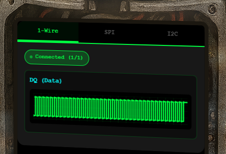
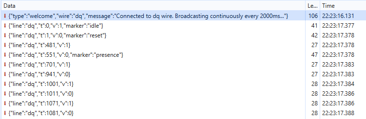
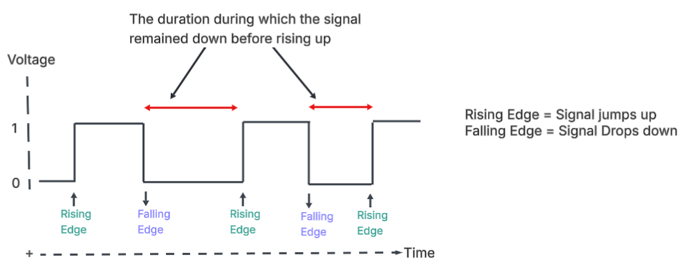

# On the Wire


**Difficulty**: :fontawesome-solid-star::fontawesome-solid-star::fontawesome-solid-star::fontawesome-solid-star::fontawesome-regular-star:<br/>
**Direct link**: [On-the-wire](https://signals.holidayhackchallenge.com/?&challenge=termSignals)


## Hints
??? tip "Bits and Bytes"
    **Critical detail - Bit ordering varies by protocol:**

    **MSB-first (Most Significant Bit first):**<br/>

    SPI and I2C typically send the highest bit (bit 7) first<br/>
    When assembling bytes: ```byte = (byte << 1) | bit_value```<br/>
    Start with an empty byte, shift left, add the new bit<br/>

    **LSB-first (Least Significant Bit first):**<br/>
    1-Wire and UART send the lowest bit (bit 0) first<br/>
    When assembling bytes: ```byte |= bit_value << bit_position```<br/>
    Build the byte from bit 0 to bit 7<br/>
    
    **I2C specific considerations:**<br/>

    Every 9th bit is an ACK (acknowledgment) bit - ignore these when decoding data<br/>
    The first byte in each transaction is the device address (7 bits) plus a R/W bit<br/>
    You may need to filter for specific device addresses <br/>

    **Converting bytes to text:**
    ```
    String.fromCharCode(byte_value)  // Converts byte to ASCII character
    ```

??? tip "Garbage?"
    **If your decoded data looks like gibberish:**

    The data may be encrypted with XOR cipher<br/>
    XOR is a simple encryption: ```encrypted_byte XOR key_byte = plaintext_byte```<br/>
    The same operation both encrypts and decrypts: ```plaintext XOR key = encrypted, encrypted XOR key = plaintext```<br/>
    How XOR cipher works:
    ```
    function xorDecrypt(encrypted, key) {
    let result = "";
    for (let i = 0; i < encrypted.length; i++) {
        const encryptedChar = encrypted.charCodeAt(i);
        const keyChar = key.charCodeAt(i % key.length);  // Key repeats
        result += String.fromCharCode(encryptedChar ^ keyChar);
    }
    return result;
    }
    ```
    **Key characteristics:** <br/>
    - The key is typically short and repeats for the length of the message<br/>
    - You need the correct key to decrypt (look for keys in previous stage messages)<br/>
    - If you see readable words mixed with garbage, you might have the wrong key or bit order<br/>
    
    **Testing your decryption:** <br/>
    - Encrypted data will have random-looking byte values<br/>
    - Decrypted data should be readable ASCII text<br/>
    - Try different keys from messages you've already decoded<br/>

??? tip "On Rails"
    **Stage-by-stage approach** <br/>

    1. Connect to the captured wire files or endpoints for the relevant wires.
    1. Collect all frames for the transmission (buffer until inactivity or loop boundary).
    1. Identify protocol from wire names (e.g., dq → 1-Wire; mosi/sck → SPI; sda/scl → I²C).
    1. Decode the raw signal:
    1. Pulse-width protocols: locate falling→rising transitions and measure low-pulse width.
    1. Clocked protocols: detect clock edges and sample the data line at the specified sampling phase.
    1. Assemble bits into bytes taking the correct bit order (LSB vs MSB).
    1. Convert bytes to text (printable ASCII or hex as appropriate).
    1. Extract information from the decoded output — it contains the XOR key or other hints for the next stage.
    ---

    1. Repeat Stage 1 decoding to recover raw bytes (they will appear random).
    1. Apply XOR decryption using the key obtained from the previous stage.
    1. Inspect decrypted output for next-stage keys or target device information.

    ---

    * Multiple 7-bit device addresses share the same SDA/SCL lines.
    * START condition: SDA falls while SCL is high. STOP: SDA rises while SCL is high.
    * First byte of a transaction = (7-bit address << 1) | R/W. Extract address with address = first_byte >> 1.
    * Identify and decode every device’s transactions; decrypt only the target device’s payload.
    * Print bytes in hex and as ASCII (if printable) — hex patterns reveal structure.
    * Check printable ASCII range (0x20–0x7E) to spot valid text.
    * Verify endianness: swapping LSB/MSB will quickly break readable text.
    * For XOR keys, test short candidate keys and look for common English words.
    * If you connect mid-broadcast, wait for the next loop or detect a reset/loop marker before decoding.
    * Buffering heuristic: treat the stream complete after a short inactivity window (e.g., 500 ms) or after a full broadcast loop.
    * Sort frames by timestamp per wire and collapse consecutive identical levels before decoding to align with the physical waveform.


## Objective

!!! question "Request"
   Help Evan next to city hall hack this gnome and retrieve the temperature value reported by the I²C device at address 0x3C. <br/>
   The temperature data is XOR-encrypted, so you’ll need to work through each communication stage to uncover the necessary keys. <br/>
   Start with the unencrypted data being transmitted over the 1-wire protocol.

??? quote "Evan Booth"
    So here's the deal - there are some seriously bizarre signals floating around this area.<br/>
    Not your typical radio chatter or WiFi noise, but something... different.<br/>
    I've been trying to make sense of the patterns, but it's like trying to build a robot hand out of a coffee maker - you need the right approach.<br/>
    Think you can help me decode whatever weirdness is being transmitted out there?


## Solution
This challenge consists of 3 parts of decoding 3 communication protocols : 1-Wire, SPI and I2C with information in 1-wire and SPI to retrieve the temperature value reported by the I²C device at address 0x3C.


### 1-Wire protocol

#### Collecting the 1-wire signals
We see the messages over websockets <br/>

| Header                                                         | 
| ---------------------------------------------------------------|
| { width="900" }| 
| Messages                                                       |
| { width="900" }|

The data from the websocket is in JSON format.<br/>
We write a python script to collect the data from the websockets and convert to CSV.

??? "collect-1-Wire-data.py"
    ```py linenums="1" title="collect-1-Wire-data.py"
        import asyncio
        import websockets
        import csv
        import json
        import signal
        import sys

        running = True

        def signal_handler(sig, frame):
            global running
            print("\n[!] Stopping...")
            running = False

        signal.signal(signal.SIGINT, signal_handler)

        async def collect_data():
            uri = "wss://signals.holidayhackchallenge.com/wire/dq"

            # Define all fieldnames, even optional ones
            fieldnames = ["line", "t", "v", "marker"]

            with open("1-wire.csv", mode="w", newline="") as csvfile:
                writer = csv.DictWriter(csvfile, fieldnames=fieldnames)
                writer.writeheader()

                try:
                    async with websockets.connect(uri) as websocket:
                        print(f"[+] Connected to {uri}")
                        while running:
                            try:
                                message = await asyncio.wait_for(websocket.recv(), timeout=10)
                                data = json.loads(message)

                                # Ensure 'marker' key is present
                                if "marker" not in data:
                                    data["marker"] = ""

                                # Write row with all expected fields
                                row = {key: data.get(key, "") for key in fieldnames}
                                writer.writerow(row)
                                csvfile.flush()
                                print(f"[>] Logged: {row}")
                            except asyncio.TimeoutError:
                                print("[!] Timeout waiting for data... still listening.")
                except Exception as e:
                    print(f"[!] Error: {e}")

        if __name__ == "__main__":
            asyncio.run(collect_data())
    ```

**Top 20 rows in the output 1-Wire-data.csv** <br/>
 <br/>

| Column/Field Name      | Description                                             |
| ---------------------- | ------------------------------------------------------- |
| line                   | the data line [dq]                                      |
| t                      | timestamp of the signal transmission (in microsecond)   |
| v                      | logical voltage level on the dq line at time t          |
| marker                 | Annotation                                              |


#### Decoding the 1-wire signal

!!! note "From the hint"

    Pulse-width protocols: locate falling→rising transitions and measure low-pulse width.

??? "Understanding the falling and rising transition"
    A falling edge is detected when the signal transitions from HIGH (v=1) to LOW (v=0), marking the start of a LOW pulse. <br/>
    A rising edge occurs when the signal transitions from LOW to HIGH (v=0 to v=1), marking the end of the LOW pulse.<br/>
    Following the pulse-width protocol hint, falling→rising transitions are located.

??? "Understanding low-pulse width"
    - A pulse is when a signal:
        * leaves its idle state,
        * stays in another state for some time,
        * and then returns.

    - In 1-Wire:
        * Idle state = HIGH
        * Active state = LOW

    So a pulse looks like: 
    ```HIGH → LOW → HIGH```
    That LOW section is the pulse.

    **Width** = In signal processing with is is how long something lasts in time. <br/>
    Therefore : <br/>
    low-pulse width = time spent in LOW state
    and 
    LOW-pulse width = t(rising edge) - t(falling edge)


Based on the above concepts and understanding, we can visualize the signal transmission like below : <br/>

 <br/>

Based on the data collected in the CSV from the websockets endpoint, we apply a threshold of more than 6 microseconds to identify meaningful transitions. <br/> 
Any timing difference greater than 6 microseconds is considered a valid signal boundary, while differences of 6 microseconds or less are treated as noise and discarded. <br/>

The below python script does below on high level

1. Load raw 1-Wire timing data
1. Extract logical bits based on pulse width
1. Reconstruct bytes using LSB-first ordering
1. Render output as readable ASCII

??? "decode-1-wire.py"
    ```py linenums="1" title="decode-1-wire.py"
    import csv

    # Based on the data collected in the CSV from the websockets endpoint, we apply a threshold of more than 6 microseconds to identify meaningful transitions.
    # Any timing difference greater than 6 microseconds is considered a valid signal boundary, while differences of 6 microseconds or less are treated as noise and discarded.

    BIT_THRESHOLD_US = 7

    """
        Reads the csv file containing the 1-wire signal data and convert 

        :param signal: time-ordered list of (timestamp, value) tuples, where value  represents the logic level on the data line (1 = high, 0 = low), and timestamp is  measured in microseconds.
        :return: bit stream
    """
    def load_signal_data(csv_filename):
        signal = []

        with open(csv_filename, newline="") as csvfile:
            reader = csv.DictReader(csvfile)
            for row in reader:
                try:
                    t = int(row["t"]) if row["t"] else None
                    v = int(row["v"]) if row["v"] else None

                    if t is not None and v is not None:
                        signal.append((t, v))
                except Exception:
                    continue

        return signal


    """
        The extract_bits function is responsible for converting raw 1-Wire signal transitions into logical bits (0 and 1) based on pulse timing.

        :param signal: csv file path
        :return: List of time-ordered list of (timestamp, value) tuples, where value represents the logic level on the data line (1 = high, 0 = low), and timestamp is  measured in microseconds.
    """
    def extract_bits(signal):
        bits = []
        i = 1

        while i < len(signal):
            t_prev, v_prev = signal[i - 1]
            t_curr, v_curr = signal[i]

            # Detect falling edge (1 → 0)
            if v_prev == 1 and v_curr == 0:
                fall_time = t_curr

                # Look ahead for rising edge (0 → 1)
                for j in range(i + 1, len(signal)):
                    t_next, v_next = signal[j]

                    if v_next == 1:
                        pulse_width = t_next - fall_time

                        # Short pulse → bit 1, long pulse → bit 0
                        bit = 1 if pulse_width < BIT_THRESHOLD_US else 0
                        bits.append(bit)

                        i = j  # Jump to end of this pulse
                        break

            i += 1

        return bits

    """
        Reconstructs byte values from an LSB-first bit stream.

        The input bit stream is processed in groups of eight bits. Each group is
        assembled into a single byte by placing each bit into its corresponding
        bit position (least-significant-bit first). The resulting bytes are
        returned as integer values.

        :param bits: List of bits (0 or 1) extracted from the signal
        :return: List of reconstructed byte values
    """
    def bits_to_bytes(bits):
        bytes_out = []
        
        # For loop with step of 8 because we need to group bits to byte
        for i in range(0, len(bits), 8):
            # getting the 8 bits
            byte_bits = bits[i:i + 8]
            if len(byte_bits) < 8:
                break
            # Here we have a group of 8 bits


            byte = 0
            # Enumerate theough the bits we collected - using the bit value as well Its position
            for bit_position, bit_value in enumerate(byte_bits):
                # bit_val << bit_pos would put bit in position "bit_position".
                # Because now bits are received sequentially and must be accumulated into a single byte without overwriting previously decoded bits, a bitwise OR operation is used to merge each shifted bit into the byte.
                byte |= (bit_value << bit_position)

            bytes_out.append(byte)

        return bytes_out


    def bytes_to_ascii(byte_list):
        message = ""

        for b in byte_list:
            if 32 <= b <= 126:  # Printable ASCII
                message += chr(b)
            else:
                message += f"\\x{b:02x}"

        return message


    if __name__ == "__main__":
        csv_file = "1-wire.csv"

        print("[*] Loading signal...")
        signal = load_signal_data(csv_file)

        print("[*] Extracting bits...")
        bits = extract_bits(signal)
        print(f"[*] Extracted {len(bits)} bits ({len(bits) // 8} bytes)")

        print("[*] Converting to bytes...")
        byte_values = bits_to_bytes(bits)

        print("[*] Message in ASCII:")
        ascii_output = bytes_to_ascii(byte_values)
        print(ascii_output)

    ```
We run the script and get the key as "icy". <br/>


### SPI protocol
??? Fundamentals of SPI protocol
    **What is SPI?** <br/>
    SPI, stands for Serial Peripheral Interface, is basically a communication protocol often used to send data between microcontrollers and small peripherals like sensors, SD cards, and displays. It's known for being pretty fast and straightforward. <br/>

    **What is MOSI and SCK?** <br/>
    MOSI stands for "Master Out Slave In", which means it’s the line on which the master device sends data out to a slave device. <br/>
    SCK is the "Serial Clock". This is the line that the master uses to send a clock signal to keep everything in sync.<br/>

    In other words, with SPI, the master is always driving a clock signal, and it’s pushing data out through the MOSI line. The slave devices listen to that clock and pick up the data accordingly.

    **How SPI is different from 1-Wire protocol?** <br/>
    in a 1-wire protocol, you typically have just one data line that handles both sending and receiving bits. <br/>
    1-Wire is simpler in terms of wiring, but it’s not as fast or as flexible as SPI. <br/>
    SPI is generally faster and more suited for situations where you need to move data quickly and have multiple devices.

    **What are the practical examples where SPI is used?** <br/>
    When you insert an SD card to a RaspberryPI, Raspberry Pi is the master controlling the communication and telling the SD card which is the slave device when to send data and when to receive it. This communication happens over SPI.<br/>
    Raspberry Pi (the master) sends the actual data to the SD card over MOSI line. <br/>
    Raspberry Pi also sends the clock signal on the SCK line so the SD card knows WHEN to read each bit of data that's coming in on MOSI.


!!! success "Answer"
   Bartholomew Quibblefrost


## Response
!!! quote "Josh Wright"
    Excellent work! You've demonstrated textbook penetration testing skills across every challenge - your discipline and methodology are impeccable!.<br/>
