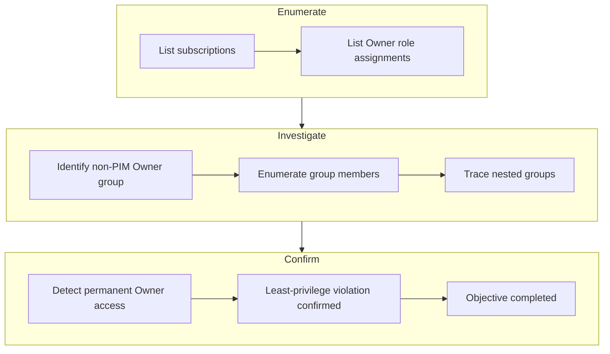
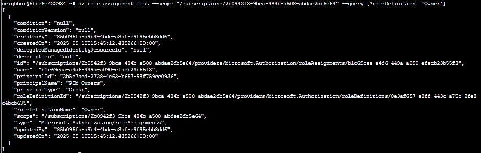
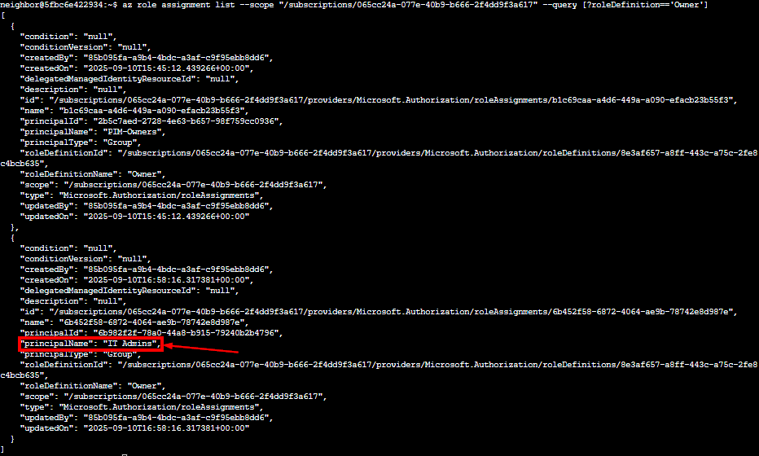

# Owner

{ width="500" }

**Difficulty**: :fontawesome-solid-star::fontawesome-regular-star::fontawesome-regular-star::fontawesome-regular-star::fontawesome-regular-star:<br/>
**Direct link**: [Owner](https://hhc25-wetty-prod.holidayhackchallenge.com/?&challenge=termMSOwner){:target="_blank" rel="noopener"}<br/>
**Area**: Near the park <br/> 
**In-game avatar**: Goose James

## Objective

!!! question "Request"
   Help Goose James near the park discover the accidentally leaked SAS token in a public JavaScript file and determine what Azure Storage resource it exposes and what permissions it grants.

??? quote "Goose James"
    The Neighborhood HOA uses Azure for their IT infrastructure.<br/>
    The Neighborhood network admins use RBAC fo access control.<br/>
    Your task is to audit their RBAC configuration to ensure they're following security best practices.

## High-Level Steps

1. **Enumerate** – Identify subscriptions and their Owner role assignments.
2. **Investigate** – Examine groups and nested memberships for excessive privileges.
3. **Confirm** – Validate permanent Owner access and complete the audit.



## Solution

### Goal 1
```
az account list --query "[].name"
```
{ width="1000" }

### Goal 2
You can do some more advanced queries using conditional filtering with custom output. <br/>
$ az account list --query "[?state=='Enabled'].{Name:name, ID:id}"<br/>
Cool! 😎  [?condition] filters what you want, {custom:fields} makes clean output ✨<br/>

```
az account list --query "[?state=='Enabled'].{Name:name, ID:id}"
```

{ width="1000" }


### Goal 3
Let's take a look at the Owner's of the first listed subscription 🔍. Pass in the first subscription id. <br>
Try: az role assignment list --scope "/subscriptions/{ID of first Subscription}" --query [?roleDefinition=='Owner'] <br>

```
az role assignment list --scope "/subscriptions/2b0942f3-9bca-484b-a508-abdae2db5e64" --query [?roleDefinition=='Owner']
```
{ width="1000" }

### Goal 4
Ok 🤔 — there is a group present for the Owners permission; however, we've been assured this is a 🔐 PIM enabled group.<br/>
Currently, no PIM activations are present. 🚨<br/>
Let's run the previous command against the other subscriptions to see what we come up with.


This below subscription has a group which is not PIM-Owner. Rather, there is a group named "IT-Admins"

```
az role assignment list --scope "/subscriptions/065cc24a-077e-40b9-b666-2f4dd9f3a617" --query [?roleDefinition=='Owner']
```
{ width="1000" }


### Goal 4
Looks like you are on to something here! 🕵️  We were assured that only the 🔐 PIM group was present for each subscription.<br/>
🔎 Let's figure out the membership of that group.<br/>
Hint: use the az ad member list command. Pass the group id instead of the name.<br/>
Remember: | less lets you scroll through long output

```
az ad member list --group "6b982f2f-78a0-44a8-b915-79240b2b4796"
```
{ width="1000" }

### Goal 5
Well 😤, that's annoying. Looks like we have a nested group! <br/>
Let's run the command one more time against this group.<br/>

```
az ad member list --group "631ebd3f-39f9-4492-a780-aef2aec8c94e"
```
{ width="1000" }

### Goal 6
elevated access instead of permanent assignments. <br/>
Permanent Owner roles create persistent attack paths and violate least-privilege principles.<br/>
Challenge Complete! To finish, type: finish

```
finish
```

This completes the challenge.<br/>
{ width="1000" }

!!! success "Answer"
    Completed in the game.

## Response
!!! quote "Goose James"
    You found the permanent assignments! CLUCK! <br/>
    See, I'm not crazy - the security really WAS misconfigured. Now maybe I can finally get some peace and quiet...

## Learnings
1. Permanent Owner assignments could be dangerous, especially when they're hidden behind groups and nested memberships.

## Prevention & Hardening Notes
1. Use Azure PIM for all Owner-level access and avoid permanent Owner assignments at the subscription scope.
1. Regularly audit RBAC role assignments, including group memberships and nested groups, to ensure least-privilege is actually being enforced.
