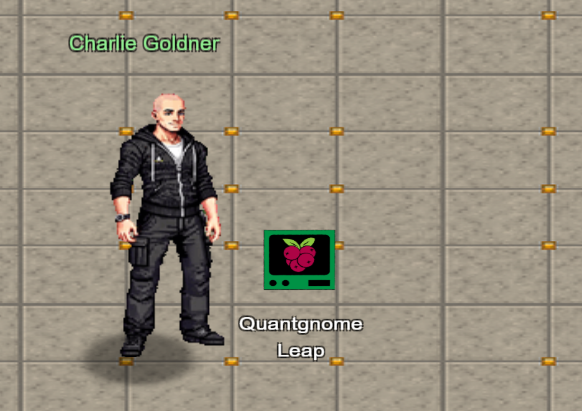
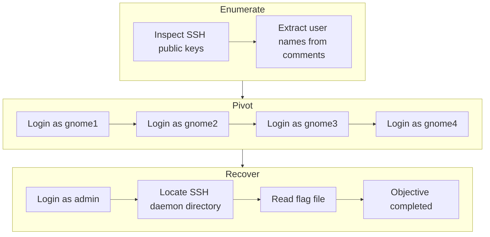
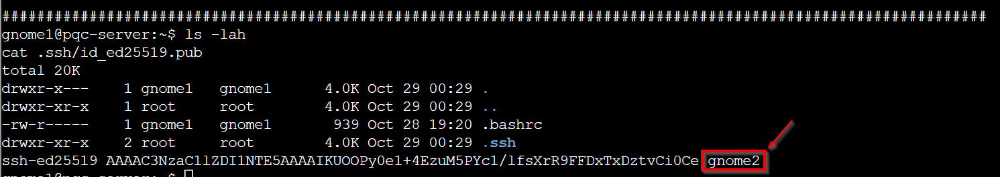

# Quantgnome Leap



**Difficulty**: :fontawesome-solid-star::fontawesome-solid-star::fontawesome-regular-star::fontawesome-regular-star::fontawesome-regular-star:<br/>
**Direct link**: [Quantgnome Leap](https://hhc25-wetty-prod.holidayhackchallenge.com/?&challenge=termQuantgnome){:target="_blank" rel="noopener"}<br/> 
**Area**: The Hotel<br/> 
**In-game avatar**: Charlie Goldner

## Hints
??? tip "Hint 1"
    Process information is very useful to determine where an application configuration file is located. I bet there is a secret located in that application directory, you just need the right user to read it!
??? tip "Hint 2"
    User keys are like presents. The keys are kept in a hidden location until they need to be used. Hidden files in Linux always start with a dot. Since everything in Linux is a file, directories that start with a dot are also...hidden!
??? tip "Hint 3"
    If you want to create SSH keys, you would use the ssh-keygen tool. We have a special tool that generates post-quantum cryptographic keys. The suffix is the same as ssh-keygen. It is only the first three letters that change.
??? tip "Hint 4"
    When you give a present, you often put a label on it to let someone know that the present is for them. Sometimes you even say who the present is from. The label is always put on the outside of the present so the public knows the present is for a specific person. SSH keys have something similar called a comment. SSH keys sometimes have a comment that can help determine who and where the key can be used.


## Objective

!!! question "Request"
   Charlie in the hotel has quantum gnome mysteries waiting to be solved. What is the flag that you find?

??? quote "Charlie Goldner"
        Things are getting strange, and I think we've wandered into a quantum conundrum!<br/>
        If you help me unravel these riddles, we might just outsmart future quantum computers.<br/>
        Cryptic puzzles, quirky gnomes, and post-quantum secrets—will you leap with me?<br/>

## High-Level Steps

1. **Enumerate** – Analyze SSH key comments to identify valid users.
2. **Pivot** – Authenticate across multiple users using chained SSH keys.
3. **Recover** – Access the final account and retrieve the flag.



## Solution
From the hint: <br/>
SSH keys have something similar called a comment. SSH keys sometimes have a comment that can help determine who and where the key can be used.

Find the public key in the host which has the comment as the 4th part of the string
```
ls -lah
cd .ssh
ls -lah
awk '{print $3}' id_rsa.pub
```

The comment is gnome1. That may be name of a user.


So, we use the same user for public key to login to the host. <br>

```
ssh -i ~/.ssh/id_rsa gnome1@127.0.0.1
```


Looking for the ssk public key and find the gnome2 in the comment.<br/>
```
ls -lah
cat .ssh/id_ed25519.pub
```


So, now login to the host using the gnome2 using the key.<br/>
```
ssh -i ~/.ssh/id_ed25519 gnome2@127.0.0.1
```


You authenticated with an ED25519 key, smaller than an RSA key, but still not secure in a post-quantum world due to Shor's algorithm.

Take a look around and see if you can find a way to login to the gnome3 account.
```
cat .ssh/id_mayo2.pub
```

We see genome3


Login using gnome3.
```
ssh -i ~/.ssh/id_mayo2 gnome3@127.0.0.1
```


Print the contents of the public key.
```
ls -lah
cat .ssh/id_ecdsa_nistp256_sphincssha2128fsimple.pub
```

We see gnome4 user.


SSH using gnome4.
```
ssh -i ~/.ssh/id_ecdsa_nistp256_sphincssha2128fsimple gnome4@127.0.0.1
```


Take a look around and see if you can find a way to login to the admin account.<br/>
```
ls -lah
cat .ssh/id_ecdsa_nistp521_mldsa87.pub
```
We see 'admin' user.


Login using admin.
```
ssh -i ~/.ssh/id_ecdsa_nistp521_mldsa87 admin@127.0.0.1
```
We are in the final step.


The above screen notes - "You now have access to a directory in the same location as the SSH daemon. Time to look around for your final flag". <br/>

```
which ssh
ls -lah /opt/oqh-ssh
```
We see the flag.<br/>


The flag above is a directory. There is a file named 'flag' in it.
We read its contents and It is HHC{L3aping_0v3r_Quantum_Crypt0}

We submit that as the answer and It is accepted.


!!! success "Answer"
```
HHC{L3aping_0v3r_Quantum_Crypt0}
```

## Response
!!! quote "Charlie Goldner"
    That was wild—who knew quantum gnomes could hide so many secrets?<br/>
    Thanks for helping me leap into the future of cryptography!


## Learnings
I didn't even know you can have comments in SSH keys.


## Prevention & Hardening Notes
1. Anything sensitive in comments is not acceptable. So, code review (both manual and automated) is important to catch those.
1. Lock down file permissions between users.
Here Multiple user accounts (gnome1,gnome4,admin) existed on the same host.