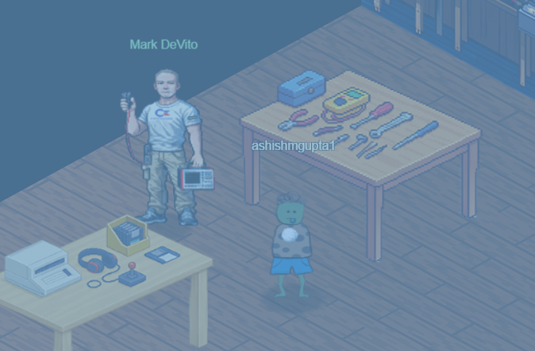
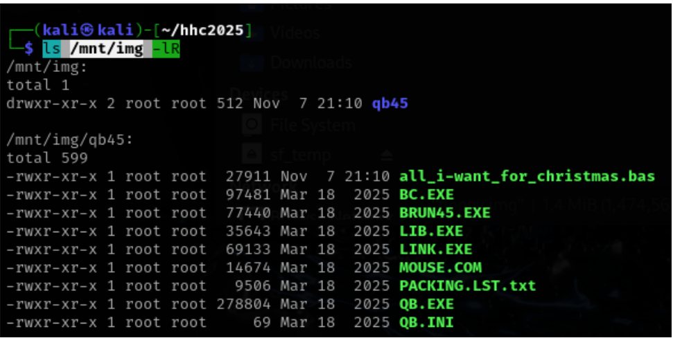
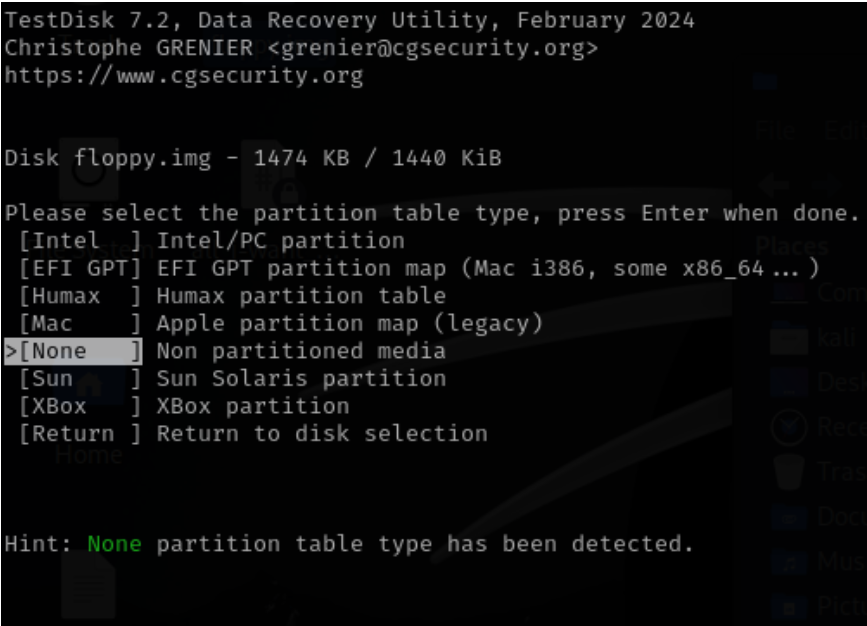
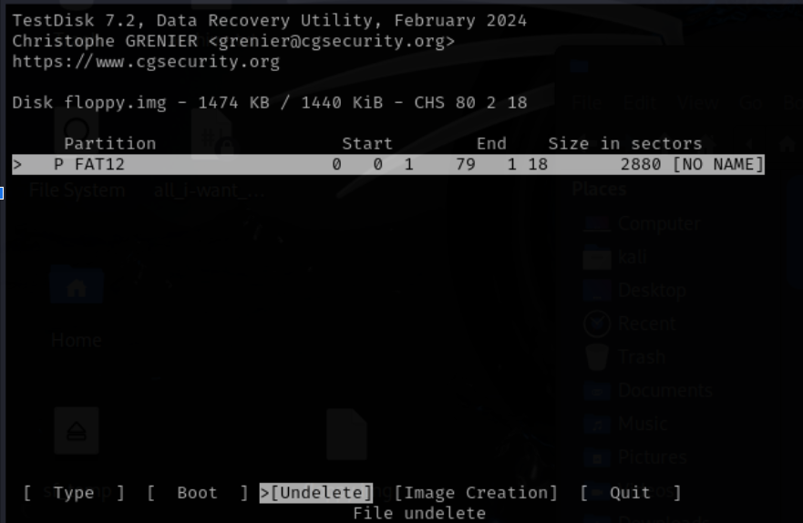
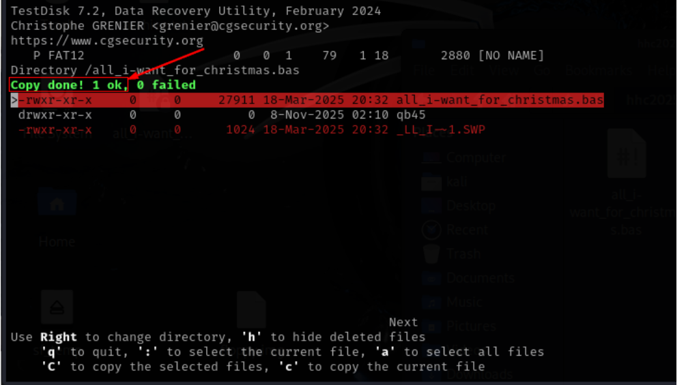
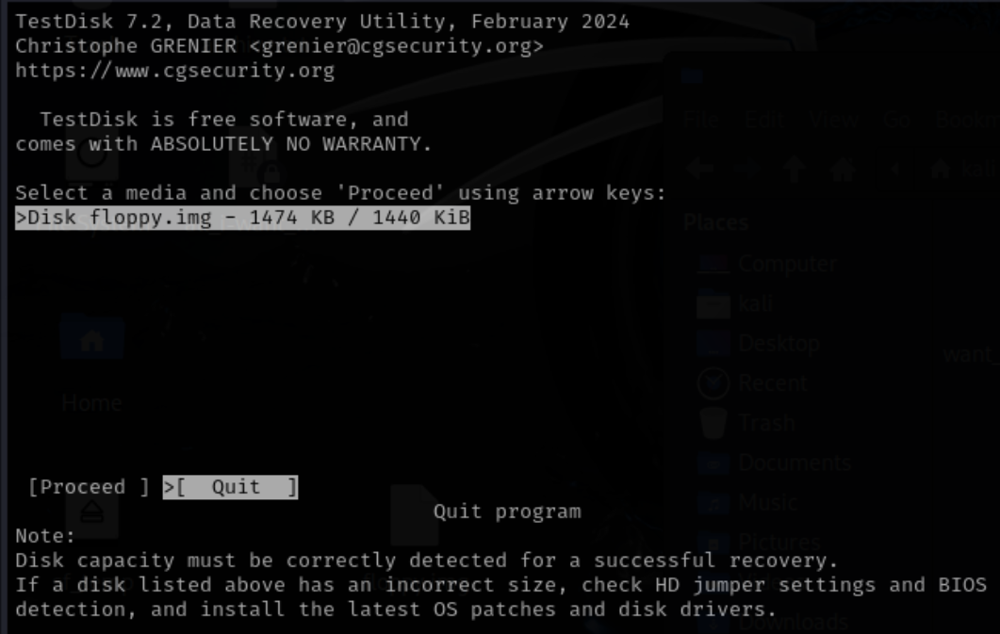
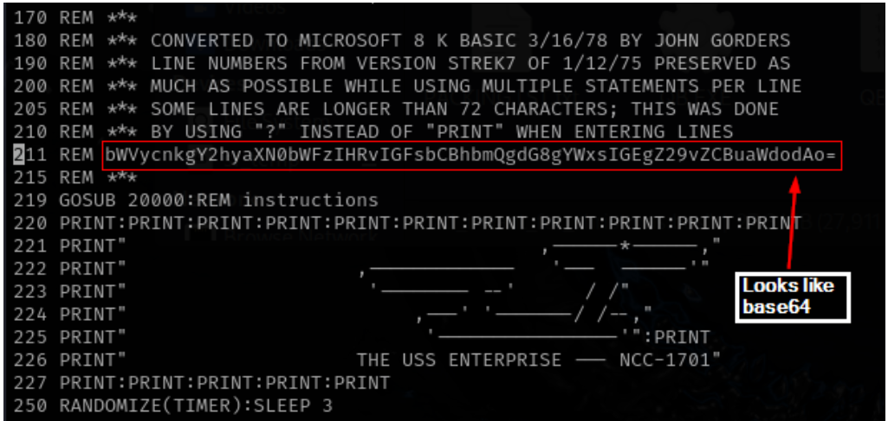

# Retro Recovery



**Difficulty**: :fontawesome-solid-star::fontawesome-solid-star::fontawesome-regular-star::fontawesome-regular-star::fontawesome-regular-star:<br/>

## Hints

??? tip "Retro Recovery Hint 1"
    I know there are still tools available that can help you find deleted files. Maybe that might help. Ya know, one of my favorite games was a Quick Basic game called Star Trek.

??? tip "Retro Recovery Hint 2"
    Wow! A disk from the 1980s! I remember delivering those computer disks to the good boys and girls. Games were their favorite, but they weren't like they are now.

??? tip "Retro Recovery Hint 3"
    I miss old school games. I wonder if there is anything on this disk? I remember, when kids would accidentlly delete things.......... it wasn't to hard to recover files. I wonder if you can still mount these disks?

## Objective

!!! question "Request"
   Join Mark in the retro shop. Analyze his disk image for a blast from the retro past and recover some classic treasures.

??? quote "Mark DeVito"
    I am an avid collector of things of the past. I love old technology. I love how it connects us to the past. Some remind me of my dad, who was an engineer on the Apollo 11 mission and helped develop the rendezvous and altimeter radar on the space craft.<br/>

    If you ever get into collecting things like vintage computers, here is a tip. Never forget to remove the RIFA capacitors from vintage computer power supplies when restoring a system. If not they can pop and fill the room with nasty smoke.<br/>

    I love vintage computing, it’s the very core of where and when it all began. I still enjoy writing programs in BASIC and have started re-learning Apple II assembly language. I started writing code in 1982 on a Commodore CBM.<br/>

    Sometimes it is the people no one can imagine anything of who do the things no one can imagine. - Alan Turing<br/>

    You never forget your first 8-bit system.

### Item
We get a floppy from when we talk to Mark.<br>


## Solution
We mount the image to explore the files in it.

```
sudo mount -o loop -t vfat floppy.img /mnt/img
ls /mnt/img -lR
```



Explore deleted files with TestDisk.
Select proceed<br/>
```
sudo testdisk floppy.img
```


Select None<br/>


Select Undelete<br/>


Press c to copy the current file<br/>


Press C to copy to the selected destination<br/>


Press c to copy the current file<br/>
Press q<br/>


Select “Quit” and hit enter.<br/>


Select Quit and hit enter.<br/>


Select the correct disk (floppy.img)<br/>
Select Quit and hit enter to quit the program<br/>


The file is recovered.<br/>


Just read the .bas file and we notice a string which looks like base64 encoded string.<br/>
```
cat all_i-want_for_christmas.bas
```


Decoding that base64 shows below 
"merry christmas to all and to all a good night"
We see if this is accepted as the answer and It was!

```
echo test | base64 -d
```


!!! success "Answer"
    merry christmas to all and to all a good night

## Response
!!! quote "Insert Elf Name"
    Excellent work! You've successfully recovered that deleted file and decoded the hidden message. <br/>
    Sometimes the old ways are the best ways. Vintage file systems never truly forget what they've seen. Play some Star Trek... it actually works.
