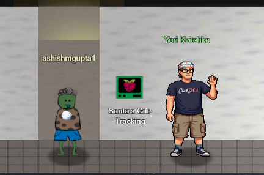
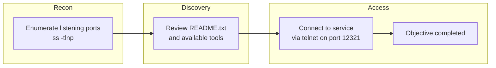
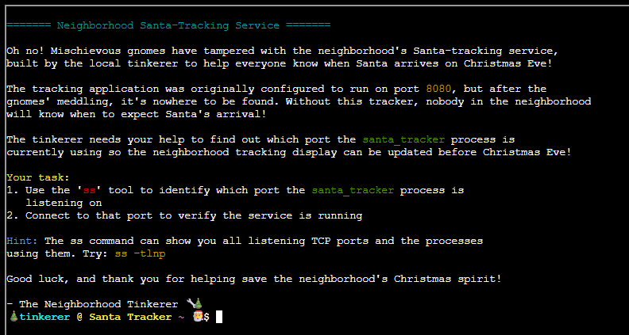
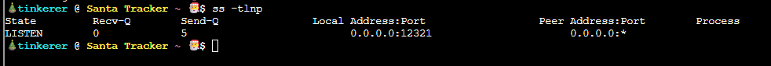
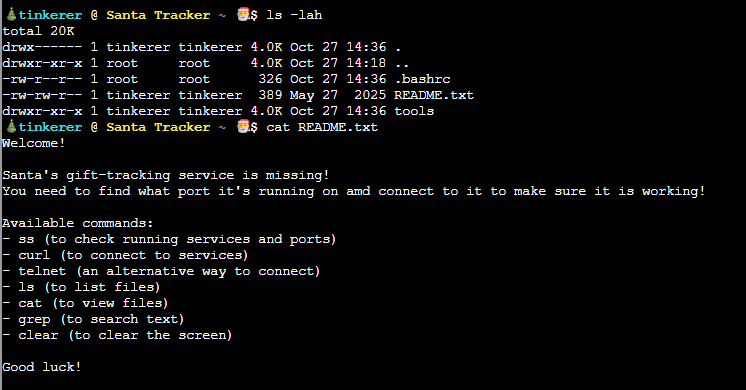

# Santa's Gift-Tracking Service Port Mystery



**Difficulty**: :fontawesome-solid-star::fontawesome-regular-star::fontawesome-regular-star::fontawesome-regular-star::fontawesome-regular-star:<br/>

**Direct link**: [Objective 1 terminal](https://hhc25-wetty-prod.holidayhackchallenge.com/?&challenge=termGiftTracking){:target="_blank" rel="noopener"}

## Objective

!!! question "Request"
   Chat with Yori near the apartment building about Santa's mysterious gift tracker and unravel the holiday mystery.

??? quote "Yori Kvitchko"
    I was Ed's lost intern back in 2015, but I was found!<br/>
    Think you can check out this terminal for me? I need to use cURL to access the gift tracker system, but it has me stumped.<br/>
    Please see what you can do!<br/>

## High-Level Steps

1. **Recon** – Enumerate listening ports and running services.
2. **Discovery** – Review documentation to identify the correct service access method.
3. **Access** – Connect to the service port to complete the objective.




## Solution

Initial console

{ width="1200" height="950" }

Show all the TCP ports and the processes.
```
ss -tlnp
```

{ width="1200" height="950" }

There is a README.txt which shows all the executables at our disposal.

```
ls -lah
cat README.txt
```

{ width="1200" height="950" }


We use telnet to connect to port 12321.

```
telnet 127.0.0.1 12321
```

We could connect to the port and the objective is completed.<br/>
{ width="1200" height="950" }


!!! success "Answer"
    Solved in the game.

## Response

!!! quote "Yori Kvitchko"
    Great work - thank you!<br/>
    Geez, maybe you can be my intern now!<br/>
