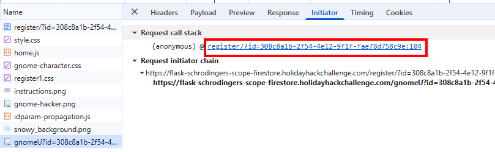

# IDORable Bistro


**Difficulty**: :fontawesome-solid-star::fontawesome-solid-star::fontawesome-regular-star::fontawesome-solid-star::fontawesome-regular-star:<br/>
**Direct link**: [Schrodingers Scope](https://flask-schrodingers-scope-firestore.holidayhackchallenge.com/)


## Hints
??? tip "Hint 1"
    Pay close attention to the instructions and be very wary of advice from the tongues of gnomes!<br/>
    Perhaps not ignore everything, but be careful!
??? tip "Hint 2"
    During any kind of penetration test, always be on the lookout for items which may be predictable from the available information, such as application endpoints. <br/>
    Things like a sitemap can be helpful, even if it is old or incomplete. Other predictable values to look for are things like token and cookie values
??? tip "Hint 3"
    As you test this with a tool like Burp Suite, resist temptations and stay true to the instructed path.
??? tip "Hint 4"
    Watch out for tiny, pesky gnomes who may be violating your progess. <br/>
    If you find one, figure out how they are getting into things and consider matching and replacing them out of your way.
??? tip "Hint 5"
    Though it might be more interesting to start off trying clever techniques and exploits, always start with the simple stuff first, such as reviewing HTML source code and basic SQLi.


## Objective

!!! question "Request"
    Kevin in the Retro Store ponders pentest paradoxes—can you solve Schrödinger's Scope?


## Solution
Initial page.<br/>


Upon just browsing around, 
, we accumulate violation because of background requests to URL /gnomeU
We first need to take that out so we don't get interrupted repeatedly.<br/>
For example : <br/>
```
https://flask-schrodingers-scope-firestore.holidayhackchallenge.com/gnomeU?id=308c8a1b-2f54-4e12-9f1f-fae78d758c9e
```
This is called from a JS file.


We will need to empty out the src of that img tag by modifying the server response so that URL is not called.


??? quote "The hint about the sitemap"
"Things like a sitemap can be helpful, even if it is old or incomplete."
This is the first thing we are going to look at.
[Site map](https://flask-schrodingers-scope-firestore.holidayhackchallenge.com/register/sitemap) <br/>

Remember - in order to be in scope, we can only try paths under /register.<br/>
So, nothing prevents us to use the sitemap to see what other paths noted there and use them under /register. 
For example, in the below example, we use /register/dev/dev_todos and that reveals the password for "teststudent". 

[/register/dev/dev_tools](https://flask-schrodingers-scope-firestore.holidayhackchallenge.com/register/dev/dev_tools) <br/>


and we get our first vulnerability reported.<br/>
and in addition, we have our credentials to login.<br/>
UserName : teststudent <br/>
Password : 2025h0L1d4y5 <br/>

But we get "Invalid Forwarding IP" error.


Forwarding IP could be related to the IP used in the X-Forwarded-For header.<br/>
Since this needed to be passed every time I would login, want to make sure the header is added for every request. <br/>


When we attempt again, we can see the XFF header with 127.0.0.1 added and we see the home page showing "Neighborhood College Courses".<br/>
<br/>
<br/>

In the home page we see a commented out unordered list with a link. <br/>
```/register/courses/search```
In my example, <br/>
```
https://flask-schrodingers-scope-firestore.holidayhackchallenge.com/register/courses/search?id=308c8a1b-2f54-4e12-9f1f-fae78d758c9e
```
<br/>

We want to uncomment that unordered list in the response body when It returns from the server before It renders in the browser so, we see the courses list in browser.<br/>

We create a regex replace rule with the Response body in the burp suite. </br>
```py title="Regex to match the commented unordered list"
\s*<!--\s*(<ul\s+id="courseSearch"[\s\S]*?<\/ul>)\s*-->
```
```py title="Regex replace"
$1
```
<br/>

With the above change, the courses list link appears.
<br/>

!!! success "Answer"
   Bartholomew Quibblefrost

## Response
!!! quote "Josh Wright"
    Excellent work! You've demonstrated textbook penetration testing skills across every challenge - your discipline and methodology are impeccable!.<br/>
