# IDORable Bistro

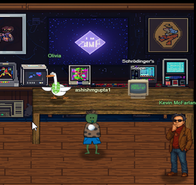

**Difficulty**: :fontawesome-solid-star::fontawesome-solid-star::fontawesome-solid-star::fontawesome-solid-star::fontawesome-regular-star:<br/>
**Direct link**: [Schrodingers Scope](https://flask-schrodingers-scope-firestore.holidayhackchallenge.com/)


## Hints
??? tip "Hint 1"
    Pay close attention to the instructions and be very wary of advice from the tongues of gnomes!<br/>
    Perhaps not ignore everything, but be careful!
??? tip "Hint 2"
    During any kind of penetration test, always be on the lookout for items which may be predictable from the available information, such as application endpoints. <br/>
    Things like a sitemap can be helpful, even if it is old or incomplete. Other predictable values to look for are things like token and cookie values
??? tip "Hint 3"
    As you test this with a tool like Burp Suite, resist temptations and stay true to the instructed path.
??? tip "Hint 4"
    Watch out for tiny, pesky gnomes who may be violating your progess. <br/>
    If you find one, figure out how they are getting into things and consider matching and replacing them out of your way.
??? tip "Hint 5"
    Though it might be more interesting to start off trying clever techniques and exploits, always start with the simple stuff first, such as reviewing HTML source code and basic SQLi.


## Objective

!!! question "Request"
    Kevin in the Retro Store ponders pentest paradoxes—can you solve Schrödinger's Scope?


## Solution
Initial page.<br/>
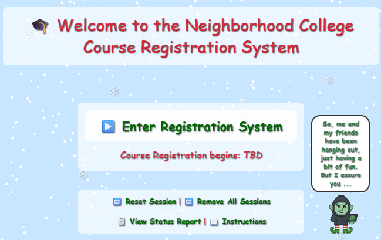

Upon just browsing around, we accumulate violations because of background requests to URL /gnomeU. <br/>
We first need to take that out so we don't get interrupted repeatedly.<br/>
For example : <br/>


```
https://flask-schrodingers-scope-firestore.holidayhackchallenge.com/gnomeU?id=308c8a1b-2f54-4e12-9f1f-fae78d758c9e
```
We just add a network request blocking for that URL.
```
https://flask-schrodingers-scope-firestore.holidayhackchallenge.com/gnomeU*
```
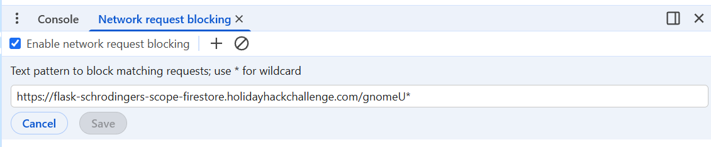

After the above blocking, all the requests to that URL would be blocked and we wont be bothered by Gnomes.

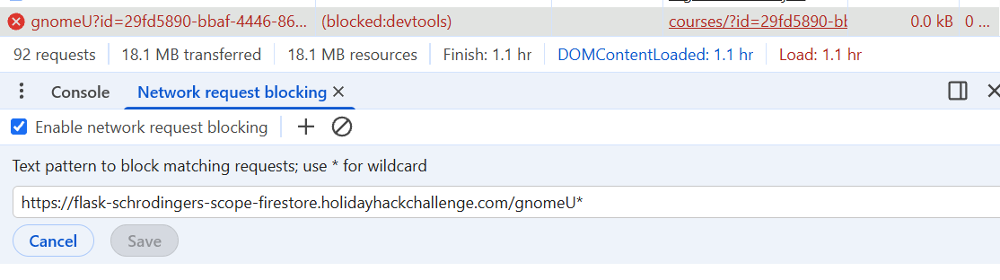


??? quote "The hint about the sitemap"
    "Things like a sitemap can be helpful, even if it is old or incomplete."

[Site map](https://flask-schrodingers-scope-firestore.holidayhackchallenge.com/register/sitemap) <br/>
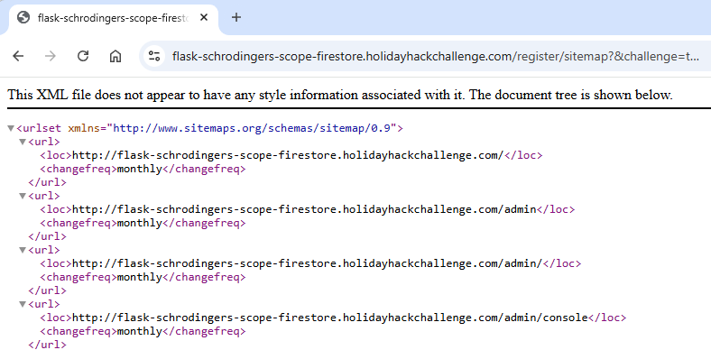 <br/>
Remember - in order to be in scope, we can only try paths under /register.<br/>
So, nothing prevents us to use the sitemap to see what other paths noted there and use them under /register. <br/>
For example, in the below example, we use /register/dev/dev_todos and that reveals the password for "teststudent". 

[/register/dev/dev_tools](https://flask-schrodingers-scope-firestore.holidayhackchallenge.com/register/dev/dev_tools) <br/>
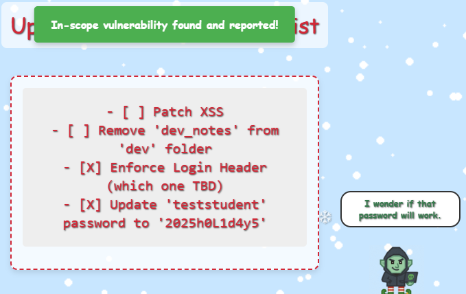

and we get our first vulnerability reported.<br/>
and in addition, we have our credentials to login.<br/>
```
UserName : teststudent 
Password : 2025h0L1d4y5
```
But we get "Invalid Forwarding IP" error.<br/>
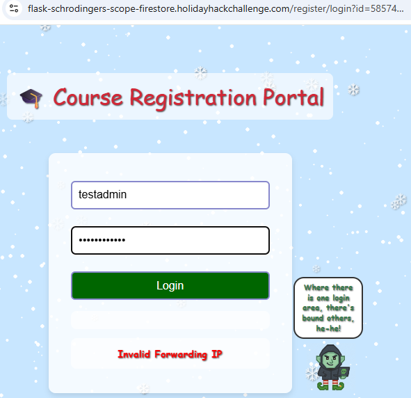

Forwarding IP could be related to the IP used in the X-Forwarded-For header.<br/>
Since this needed to be passed every time I would login, want to make sure the header is added for every request. <br/>


When we attempt again, we can see the XFF header with 127.0.0.1 added and we see the home page showing "Neighborhood College Courses".<br/>
<br/>
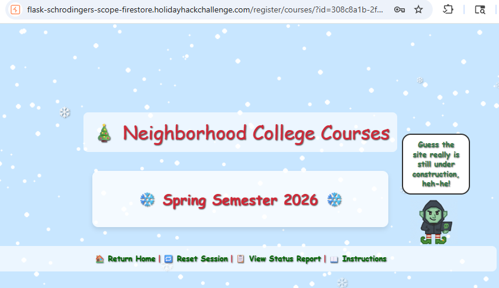<br/>

In the home page we see a commented out unordered list with a link. <br/>
```/register/courses/search```
In my example, <br/>
```
https://flask-schrodingers-scope-firestore.holidayhackchallenge.com/register/courses/search?id=308c8a1b-2f54-4e12-9f1f-fae78d758c9e
```
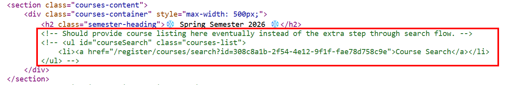<br/>

We want to uncomment that unordered list in the response body when It returns from the server before It renders in the browser so, we see the courses list in browser.<br/>

We create a regex replace rule with the Response body in the burp suite. </br>
```py title="Regex to match the commented unordered list"
\s*<!--\s*(<ul\s+id="courseSearch"[\s\S]*?<\/ul>)\s*-->
```
```py title="Regex replace"
$1
```
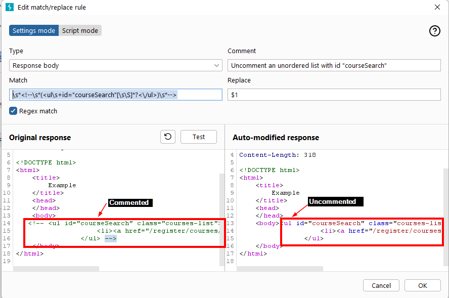<br/>

With the above change, the courses list link appears.
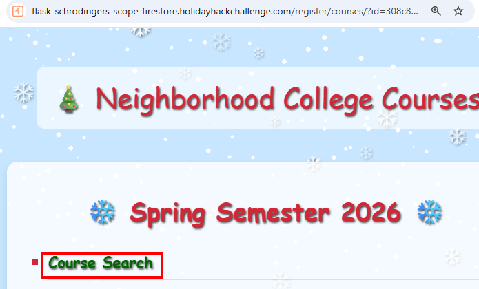<br/>

One of the endpoint /register/courseSearchUnlocked was throwing error because It was getting called without the id. We intercept and add the id in this and get successful response.

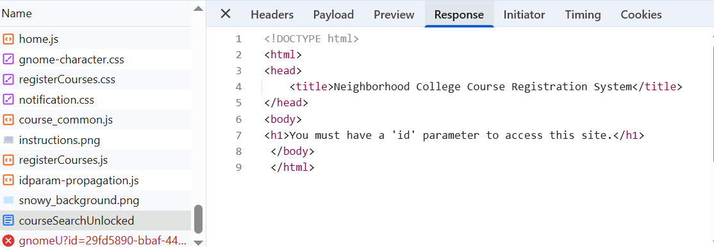<br/>

<br/>

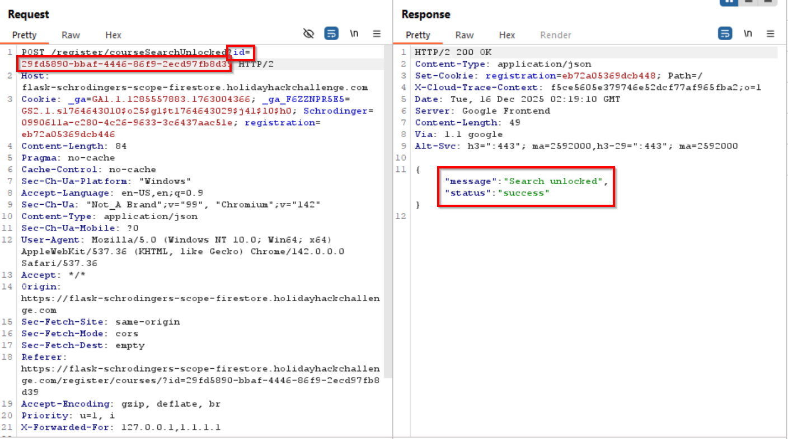<br/>

Vulnerability found : Found commented-out course search. <br/>
<br/>

Now we land on the below page. <br/>

```
https://flask-schrodingers-scope-firestore.holidayhackchallenge.com/register/courses/search?id=4a5b61e7-2a82-4908-94bd-4044b8653592
```

Searching the above with simple SQL injection payload <br/>
```
' OR 1=1 --
```
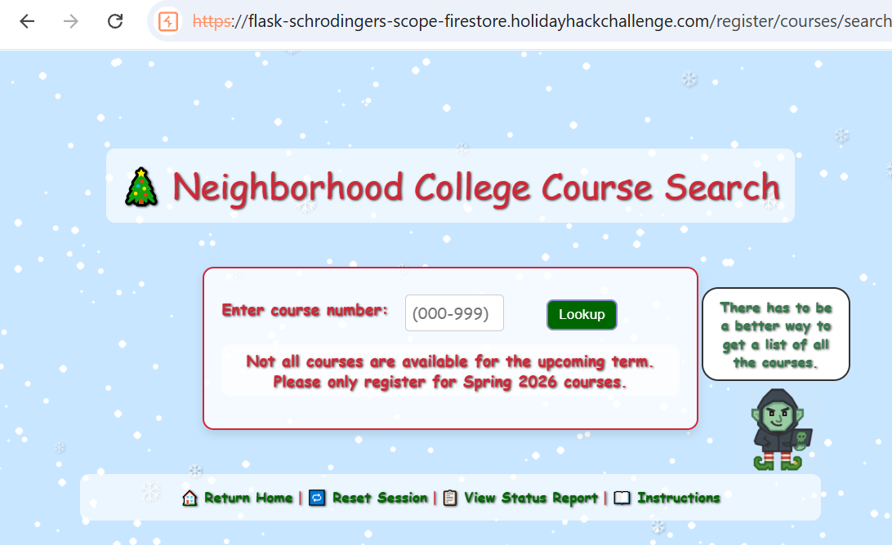<br/>

Shows the course list. <br/> 
<br/>

Vulnerability found : Identified SQL injection vulnerability<br/> 
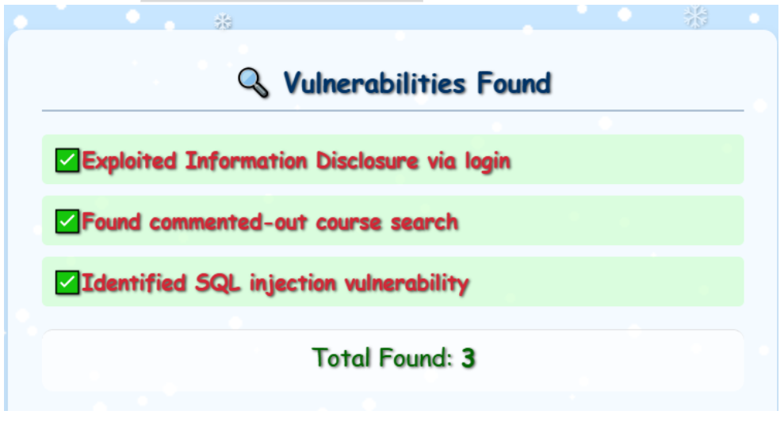<br/>

In the above course list there is an interesting one. <br/>
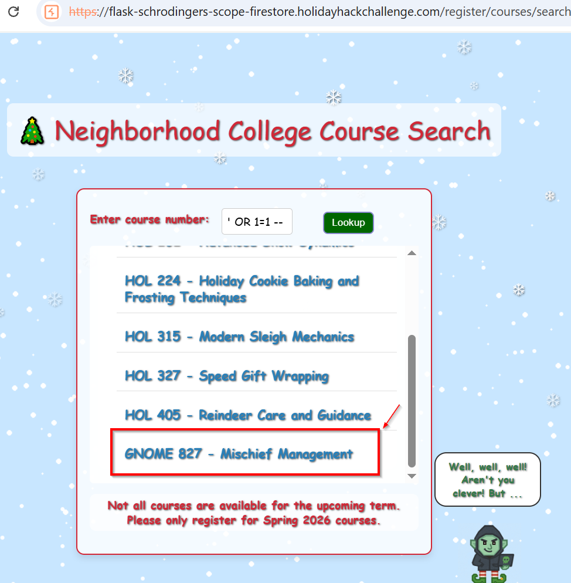<br/>

In the below screen the Gnome notes: <br/>
??? quote "Gnome on course details page"
    Have some heart and 'Continue' about your way. If you really 'MUST' do something, just 'Remove' the course. We'll put up another once you're done and in the clear, ok?

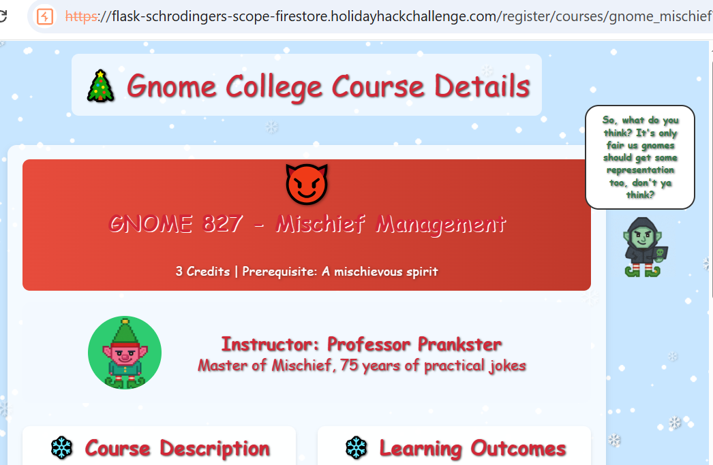<br/>


Instead of removing, we report it. <br/>
<br/>

Vulnerability reported and accepted <br/>
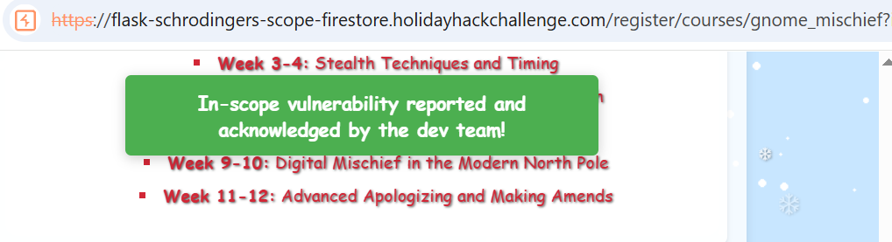<br/>

Vulnerability found : Reported the unauthorized gnome course<br/>
<br/

```
https://flask-schrodingers-scope-firestore.holidayhackchallenge.com/register/courses/wip/holiday_behavior
```

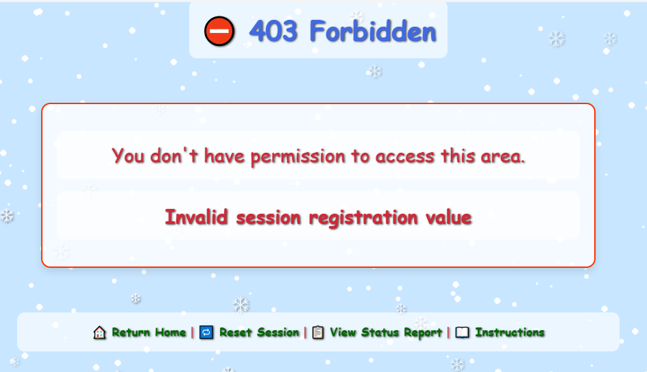<br/>

It may be referring to the value of the cookie named "registration" <br/>
<br/>

Looking at the values of the registration cookie for other courses, registration cookie starts with eb72a05369dcb4 with only last of the 2 digits different.<br/>

So we set up intruder for /register/courses/wip/holiday_behavior<br/>
<br/>

Payload <br/>
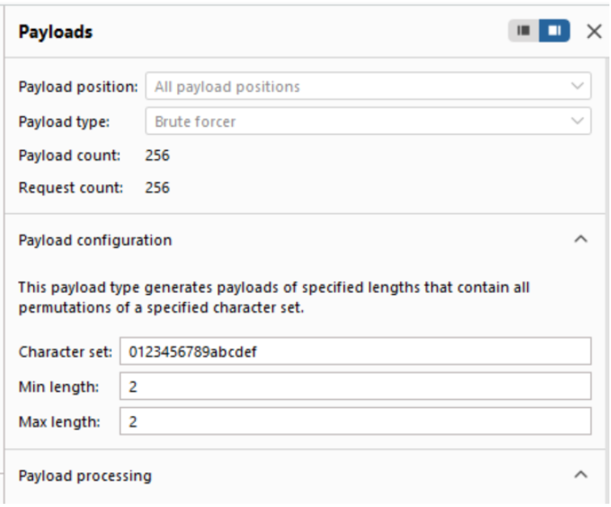<br/>

eb72a05369dcb44c shows 200 OK <br/>
<br/>

We intercept the request with a repeater and and send ```eb72a05369dcb44c``` as the registration cookie value.<br/>

<br/>

<br/>

!!! success "Answer"
   Solved in the game.

## Response
!!! quote "Kevin"
        ...
