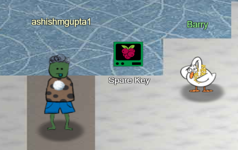
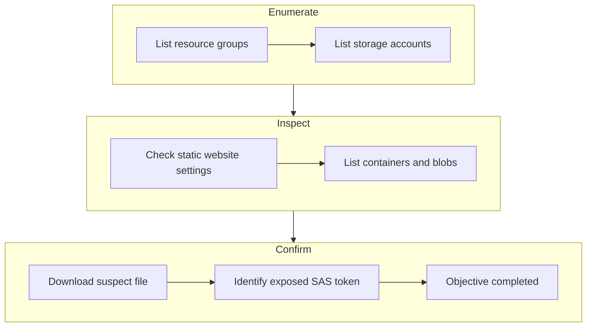
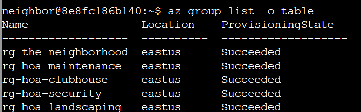
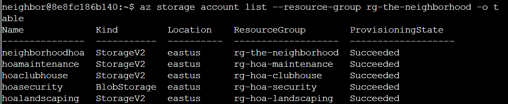
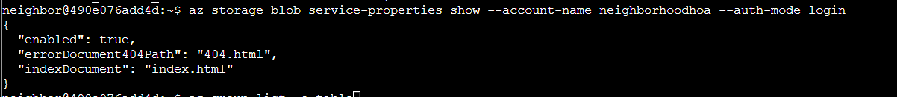
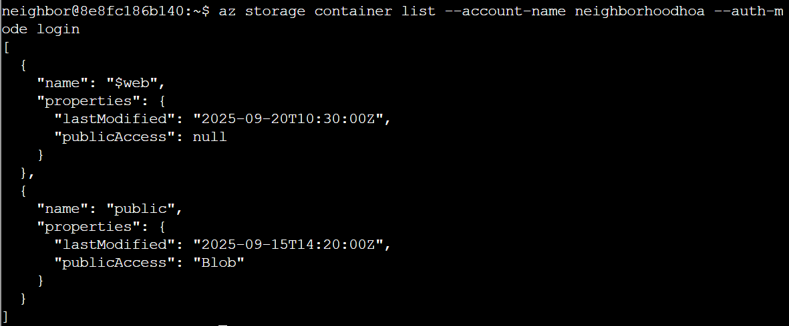
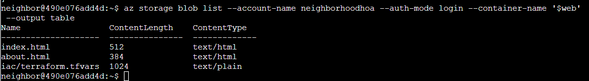
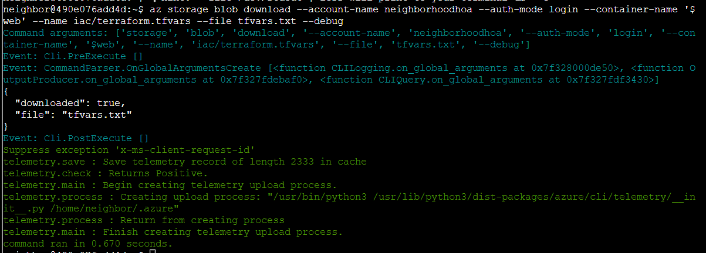

# Spare Key


**Difficulty**: :fontawesome-solid-star::fontawesome-regular-star::fontawesome-regular-star::fontawesome-regular-star::fontawesome-regular-star:<br/>
**Direct link**: [Spare Key](https://hhc25-wetty-prod.holidayhackchallenge.com/?&challenge=termMSSpareKey){:target="_blank" rel="noopener"}<br/>
**Area**: Near the pond<br/> 
**In-game avatar**: Goose Barry

## Objective

!!! question "Request"
    Help Goose Barry near the pond identify which identity has been granted excessive Owner permissions at the subscription level, violating the principle of least privilege.

??? quote "Goose Barry"
    You want me to say what exactly? Do I really look like someone who says MOOO?
    The Neighborhood HOA hosts a static website on Azure Storage.
    An admin accidentally uploaded an infrastructure config file that contains a long-lived SAS token.
    Use Azure CLI to find the leak and report exactly where it lives.

## High-Level Steps

1. **Enumerate** – Identify Azure resources and storage accounts.
2. **Inspect** – Review containers and static website files for sensitive data.
3. **Confirm** – Analyze exposed configuration files to confirm the secret leak.



## Solution
### Goal 1
Let's start by listing all resource groups. <br/>
$ az group list -o table<br/>
This will show all resource groups in a readable table format.

```
az group list -o table
```



### Goal 2
az storage account list --resource-group rg-the-neighborhood -o table <br/>
This shows what storage accounts exist and their types.<br/>

```
 az storage account list --resource-group rg-the-neighborhood -o table
```
 



### Goal 3
Someone mentioned there was a website in here.<br/>
maybe a static website?<br/>
try:$ az storage blob service-properties show --account-name <insert_account_name> --auth-mode login<br/>


```
az storage blob service-properties show --account-name neighborhoodhoa --auth-mode login
```




### Goal 4
Let's see what 📦 containers exist in the storage account.<br/>
💡 Hint: You will need to use az storage container list.<br/>
We want to list the container and its public access levels.
```
az storage container list --account-name neighborhoodhoa --auth-mode login
```



### Goal 5
Examine what files are in the static website container<br/>
💡 hint: when using --container-name you might need '<name>'<br/>
Look 👀 for any files that shouldn't be publicly accessible!<br/>

Looking at the the container named "public"
```
az storage blob list --account-name neighborhoodhoa --auth-mode login --container-name public
```


Looking at the the container named "$web"
```
az storage blob list --account-name neighborhoodhoa --auth-mode login --container-name '$web' --output table
```


### Goal 6
Take a look at the files here, what stands out?<br/>
Try examining a suspect file 🕵️:<br/>
💡 hint: --file /dev/stdout | less will print to your terminal 💻.<br/>

```
az storage blob download --account-name neighborhoodhoa --auth-mode login --container-name '$web' --name iac/terraform.tfvars --file tfvars.txt --debug
```



### Goal 7
⚠️   Accidentally uploading config files to $web can leak secrets. 🔐 <br/>
Challenge Complete! To finish, type: finish


!!! success "Answer"
    Completed in the game.

## Response

!!! quote "Goose Barry"
    There it is. A SAS token with read-write-delete permissions, publicly accessible. <br/>At least someone around here knows how to do a proper security audit.
