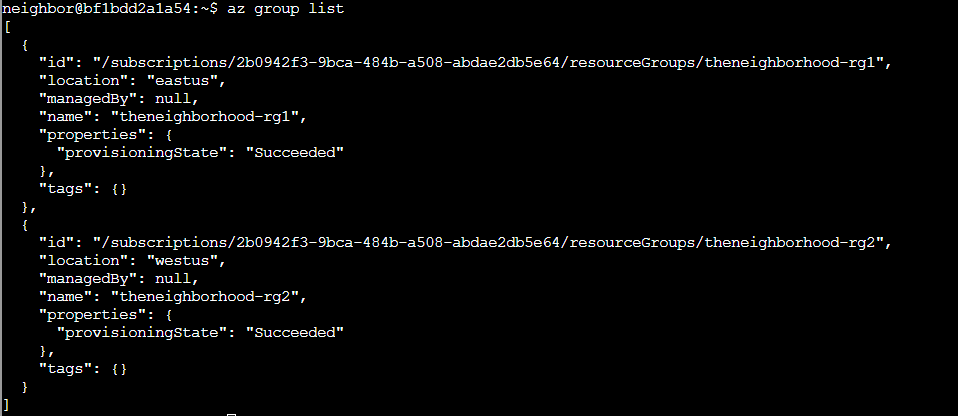
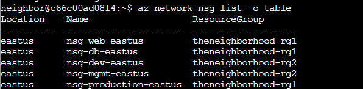
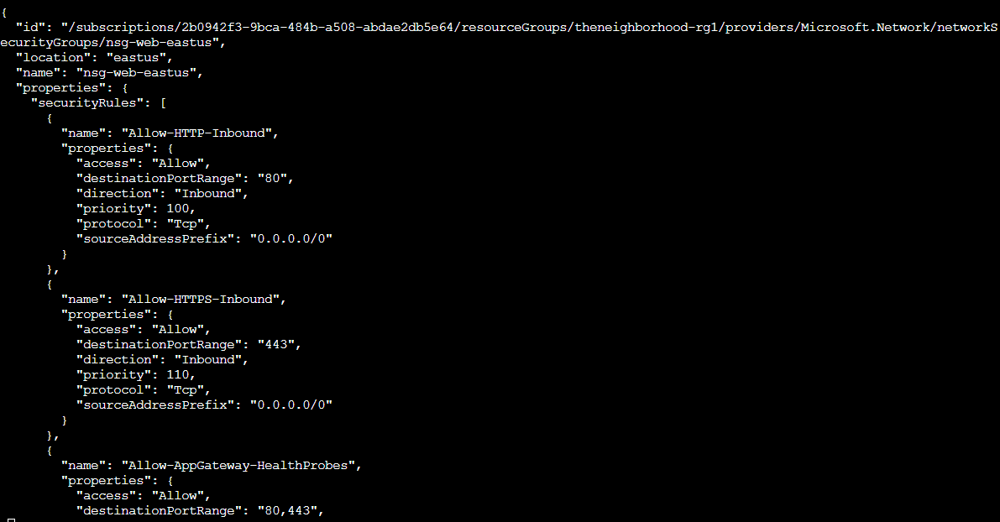
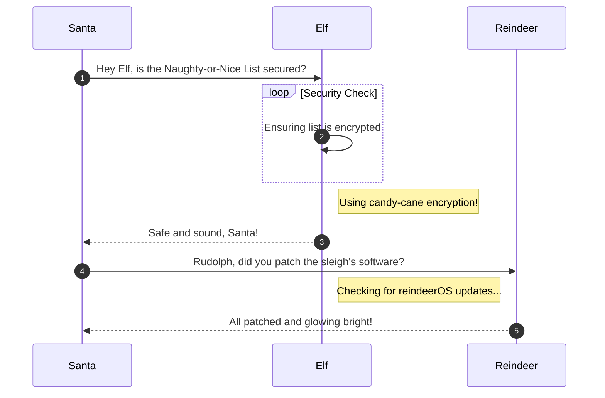

# The Open Door

**Difficulty**: :fontawesome-solid-star::fontawesome-regular-star::fontawesome-regular-star::fontawesome-regular-star::fontawesome-regular-star:<br/>
**Direct link**: [The Open Door](https://hhc25-wetty-prod.holidayhackchallenge.com/?&challenge=termMSOpenDoor)

## Objective
!!! question "Request"
    Help Goose Lucas in the hotel parking lot find the dangerously misconfigured Network Security Group rule that's allowing unrestricted internet access to sensitive ports like RDP or SSH.

??? quote "Goose Lucas"
    Copy the first part of the conversation with Elf Name here<br/>
    You can use `<br/>` to ensure each sentence starts on a new line.


## Solution


### Goal 1
Welcome back! Let's start by exploring output formats.<br/>
First, let's see resource groups in JSON format (the default):<br/>
$ az group list<br/>
JSON format shows detailed structured data.
```
az group list
```


### Goal 2
Great! Now let's see the same data in table format for better readability 👀
$ az group list -o table
Notice how -o table changes the output format completely!
Both commands show the same data, just formatted differently.

```
az group list -o table
```


### Goal 3
Lets take a look at Network Security Groups (NSGs).
To do this try: az network nsg list -o table
This lists all NSGs across resource groups.
For more information:
https://learn.microsoft.com/en-us/cli/azure/network/nsg?view=azure-cli-latest

```
az network nsg list -o table
```



### Goal 4
Inspect the Network Security Group (web)  🕵️
Here is the NSG and its resource group:--name nsg-web-eastus --resource-group theneighborhood-rg1 

Hint: We want to show the NSG details. Use | less to page through the output.
Documentation: https://learn.microsoft.com/en-us/cli/azure/network/nsg?view=azure-cli-latest#az-network-nsg-show

```
az network nsg show --name nsg-web-eastus --resource-group theneighborhood-rg1 
```



### Goal 5
Inspect the Network Security Group (mgmt)  🕵️
Here is the NSG and its resource group:--nsg-name nsg-mgmt-eastus --resource-group theneighborhood-rg2 

Hint: We want to list the NSG rules
Documentation: https://learn.microsoft.com/en-us/cli/azure/network/nsg/rule?view=azure-cli-latest#az-network-nsg-rule-list

```
az network nsg rule list --nsg-name nsg-mgmt-eastus --resource-group theneighborhood-rg2 
```

### Admonitions

!!! warning "Anchor the decorations"
    Ensure that all festive decorations, especially electrical ones, are securely anchored. We don’t want them floating off into the tropical sunset!

!!! info "Palm tree lighting tip"
    While on the island, make sure to hang your Christmas lights on a palm tree. It’s not only festive but also a great beacon for Santa to find you!

### Images


### Diagrams



### Code blocks

```bash linenums="1" hl_lines="7" title="Countdown script (with line 7 highlighted)"
#!/bin/bash
echo "Christmas Holiday Countdown"

days_until_xmas=$(($(date -d "Dec 25" +%j) - $(date +%j)))

if [ $days_until_xmas -ge 0 ]; then
  echo "Only $days_until_xmas days until Christmas!"
else
  echo "Christmas has passed! Hope you had a great time!"
fi
```

### Tables

| Activity             | Santa's Verdict       | Elf Comments                    |
| :------------------- | :-------------------- | :------------------------------ |
| Iceberg Surfing      | Risky Business        | "Lost three surfboards!"        |
| Polar Bear Hugs      | Approach with Caution | "Fluffy but... brisk."          |
| Snow Fort Building   | Highly Recommended    | "Elf-sized doorways only."      |
| Aurora Light Chasing | Magical Experience    | "Better than Christmas lights!" |
| Penguin Parade       | Absolute Must-See     | "They're oddly organized!"      |

!!! success "Answer"
    Insert the answer to the objective here.

## Response

!!! quote "Insert Elf Name"
    Copy the final part of the conversation with Elf Name here.
