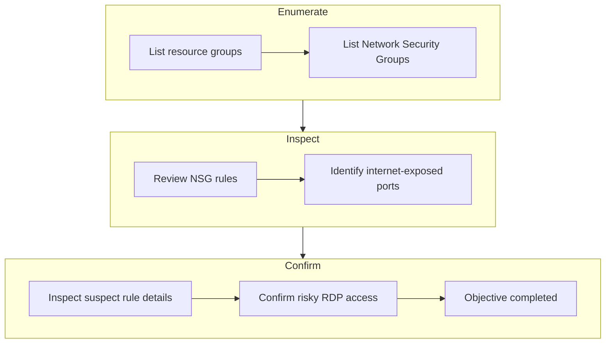
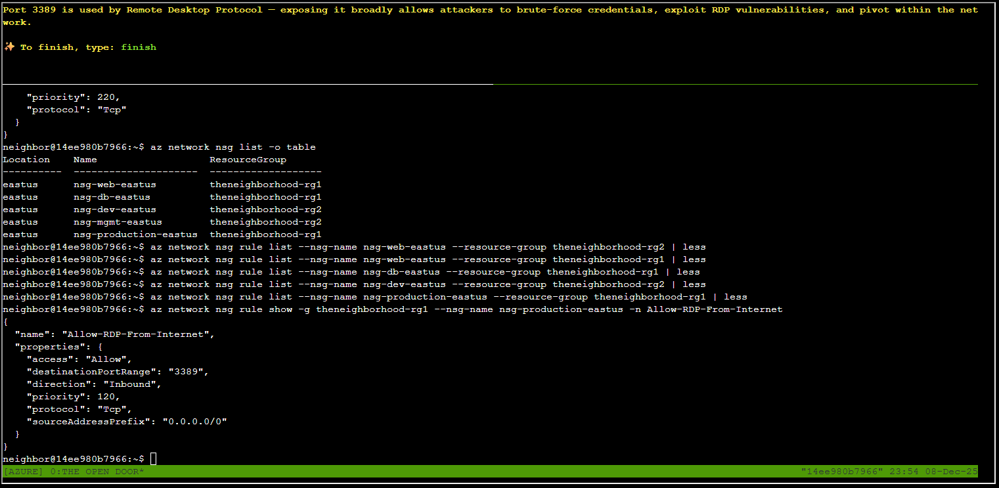

# The Open Door


**Difficulty**: :fontawesome-solid-star::fontawesome-regular-star::fontawesome-regular-star::fontawesome-regular-star::fontawesome-regular-star:<br/>

**Direct link**: [The Open Door](https://hhc25-wetty-prod.holidayhackchallenge.com/?&challenge=termMSOpenDoor){:target="_blank" rel="noopener"}

## Objective
!!! question "Request"
    Help Goose Lucas in the hotel parking lot find the dangerously misconfigured Network Security Group rule that's allowing unrestricted internet access to sensitive ports like RDP or SSH.

??? quote "Goose Lucas"
    Copy the first part of the conversation with Elf Name here<br/>
    You can use `<br/>` to ensure each sentence starts on a new line.


## High-Level Steps
1. **Enumerate** – Identify Network Security Groups and their associated rules.
2. **Inspect** – Review NSG rules for overly permissive internet access.
3. **Confirm** – Validate the risky rule exposing sensitive ports.



## Solution
The Console <br/>


### Goal 1
Welcome back! Let's start by exploring output formats.<br/>
First, let's see resource groups in JSON format (the default):<br/>
$ az group list<br/>
JSON format shows detailed structured data.
```
az group list
```


### Goal 2
Great! Now let's see the same data in table format for better readability 👀
$ az group list -o table
Notice how -o table changes the output format completely!
Both commands show the same data, just formatted differently.

```
az group list -o table
```


### Goal 3
Lets take a look at Network Security Groups (NSGs).
To do this try: az network nsg list -o table
This lists all NSGs across resource groups.
For more information:
https://learn.microsoft.com/en-us/cli/azure/network/nsg?view=azure-cli-latest

```
az network nsg list -o table
```


### Goal 4
Inspect the Network Security Group (web)  🕵️
Here is the NSG and its resource group:--name nsg-web-eastus --resource-group theneighborhood-rg1 

Hint: We want to show the NSG details. Use | less to page through the output.<br/>
Documentation: https://learn.microsoft.com/en-us/cli/azure/network/nsg?view=azure-cli-latest#az-network-nsg-show

```
az network nsg show --name nsg-web-eastus --resource-group theneighborhood-rg1 | less
```


### Goal 5
Inspect the Network Security Group (mgmt)  🕵️<br/>
Here is the NSG and its resource group:--nsg-name nsg-mgmt-eastus --resource-group theneighborhood-rg2 

Hint: We want to list the NSG rules<br/>
Documentation: https://learn.microsoft.com/en-us/cli/azure/network/nsg/rule?view=azure-cli-latest#az-network-nsg-rule-list

```
az network nsg rule list --nsg-name nsg-mgmt-eastus --resource-group theneighborhood-rg2 | less
```


### Goal 6
Take a look at the rest of the NSG rules and examine their properties.
After enumerating the NSG rules, enter the command string to view the suspect rule and inspect its properties.
Hint: Review fields such as direction, access, protocol, source, destination and port settings.

Documentation: https://learn.microsoft.com/en-us/cli/azure/network/nsg/rule?view=azure-cli-latest#az-network-nsg-rule-show

```

Location    Name                   ResourceGroup
----------  ---------------------  -------------------
eastus      nsg-web-eastus         theneighborhood-rg1
eastus      nsg-db-eastus          theneighborhood-rg1
eastus      nsg-dev-eastus         theneighborhood-rg2
eastus      nsg-mgmt-eastus        theneighborhood-rg2
eastus      nsg-production-eastus  theneighborhood-rg1

-- NO suspicious rules in the below NSG
az network nsg rule list --nsg-name nsg-web-eastus --resource-group theneighborhood-rg1 | less

-- NO suspicious rules in the below NSG
az network nsg rule list --nsg-name nsg-db-eastus --resource-group theneighborhood-rg1 | less

 -- NO suspicious rules in the below NSG
az network nsg rule list --nsg-name nsg-dev-eastus --resource-group theneighborhood-rg2 | less

-- no suspicious rules found in the below NSG
az network nsg rule show -g theneighborhood-rg2 --nsg-name nsg-mgmt-eastus -n Allow-Backup-Outbound

```

This NSG named "nsg-production-eastus" has suspicious rule : Allowing RDP access from the internet <br/>

```
az network nsg rule list --nsg-name nsg-production-eastus --resource-group theneighborhood-rg1 | less
```


### Goal 7
Take a look at the rest of the NSG rules and examine their properties.<br/>
After enumerating the NSG rules, enter the command string to view the suspect rule and inspect its properties.<br/>
Hint: Review fields such as direction, access, protocol, source, destination and port settings.<br/>

Documentation: https://learn.microsoft.com/en-us/cli/azure/network/nsg/rule?view=azure-cli-latest#az-network-nsg-rule-show<br/>

```
az network nsg rule show -g theneighborhood-rg1 --nsg-name nsg-production-eastus -n Allow-RDP-From-Internet

```



### Goal 8
Port 3389 is used by Remote Desktop Protocol — exposing it broadly allows attackers to brute-force credentials, exploit RDP vulnerabilities, and pivot within the network.
✨  To finish, type: finish

```
finish
```
The challenge is now completed.<br/>


!!! success "Answer"
    Completed in the game.

## Response

!!! quote "Goose Lucas"
    Ha! 'Properly protected' they said. More like 'properly exposed to the entire internet'!<br/>
    Good catch, amigo.
