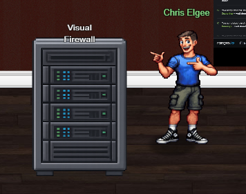
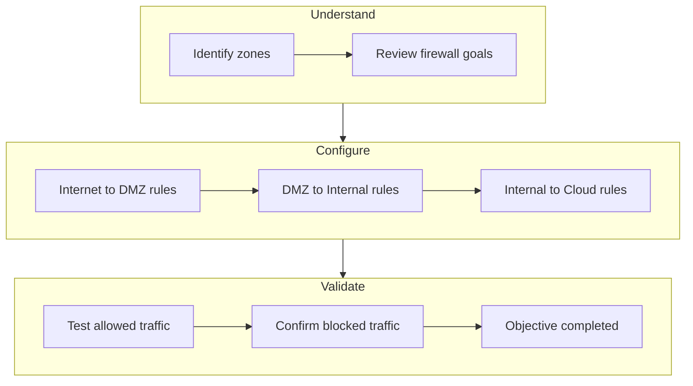
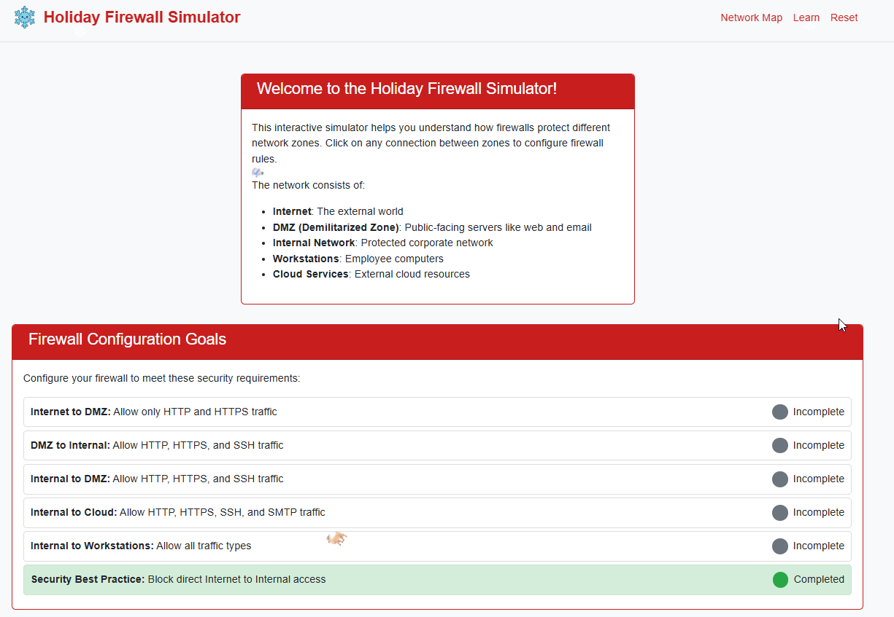
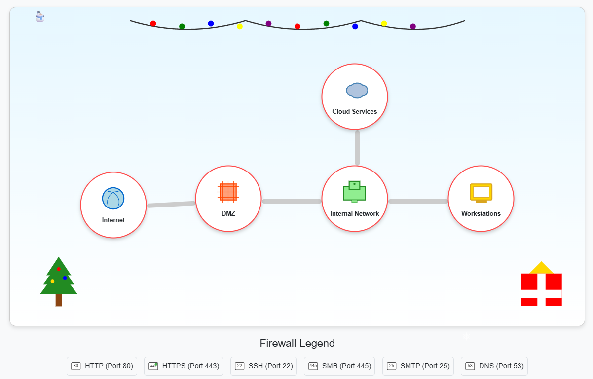
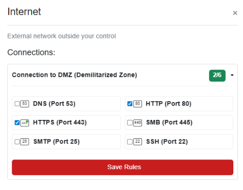
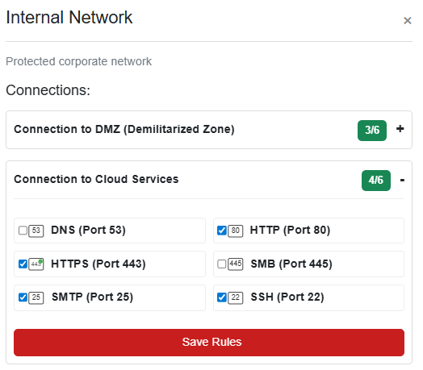
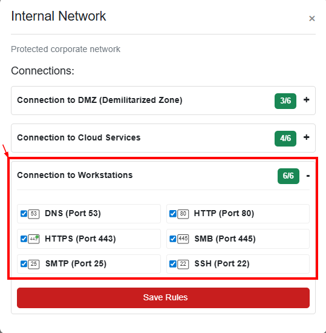
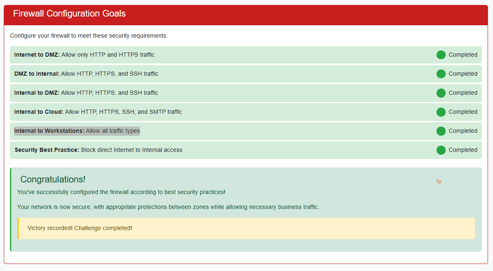

# Visual Firewall Thinger

**Difficulty**: :fontawesome-solid-star::fontawesome-regular-star::fontawesome-regular-star::fontawesome-regular-star::fontawesome-regular-star: 
**Direct link**: [Visual Firewall Thinger](https://visual-firewall.holidayhackchallenge.com/){:target="_blank" rel="noopener"} 
**Area**: Hotel  
**In-game avatar**: Chris Elgee

## Objective

!!! question "Request"
    Find Elgee in the big hotel for a firewall frolic and some techy fun.

??? quote "Chris Elgee"
    Oh hi! Am I on the road again? I should buy souvenirs for the family.
    Loud shirts? Love them. Because - hey, if you aren't having fun, what are you even doing??
    And yes, finger guns are 100% appropriate for military portraits.
    ... We should get dessert soon!
    Welcome to my little corner of network security! finger guns
    I've whipped up something sweeter than my favorite whoopie pie - an interactive firewall simulator that'll teach you more in ten minutes than most textbooks do in ten chapters.
    Don't worry about breaking anything; that's half the fun of learning!
    Ready to dig in?

## High-Level Steps

1. **Understand** – Analyze the network layout and security zones.
2. **Configure** – Define firewall rules to allow only required traffic.
3. **Validate** – Confirm rule behavior and complete the objective.

## Solution
Firewall Configuration Goals  

Network map  

### Goal 1 : Internet to DMZ: Allow only HTTP and HTTPS traffic

### Goal 2 : DMZ to Internal: Allow HTTP, HTTPS, and SSH traffic

### Goal 3 : Internal to DMZ: Allow HTTP, HTTPS, and SSH traffic

### Goal 4 : Internal to Cloud: Allow HTTP, HTTPS, SSH, and SMTP traffic

### Goal 5 : Internal to Workstations: Allow all traffic types

Completing the firewall configuration rules completes this objective.

!!! success "Answer"
    Completed in the game

## Response
!!! quote "Chris Elgee"
    <i>finger guns</i> You did it! That deserves the biggest whoopie pie celebration ever - way to have fun while saving the day!
