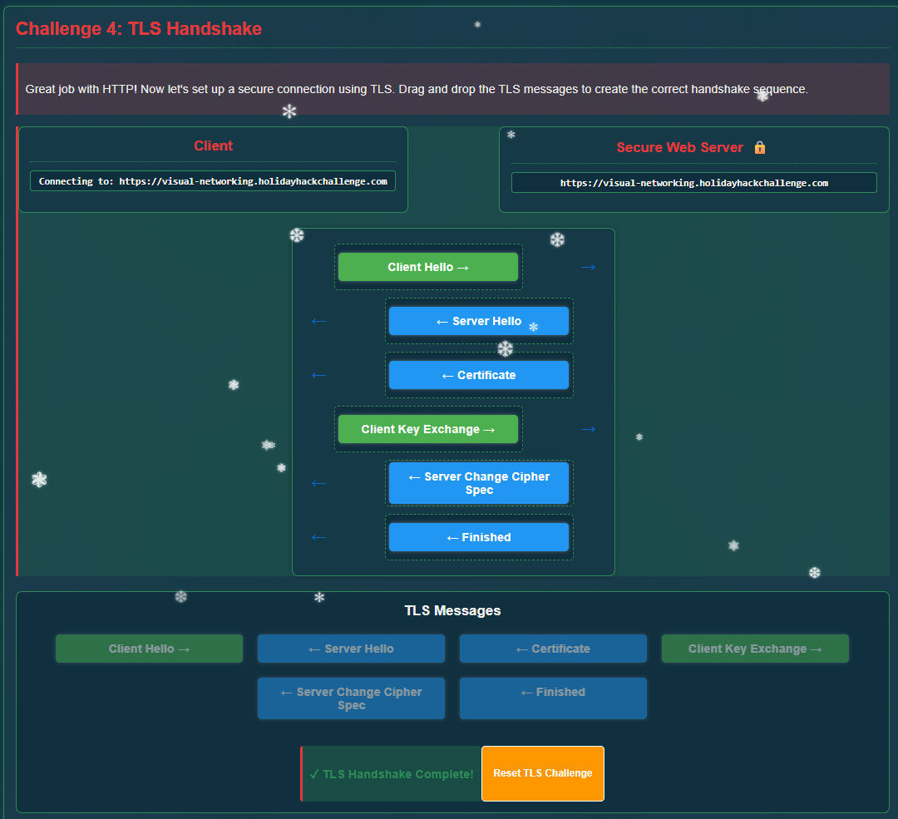
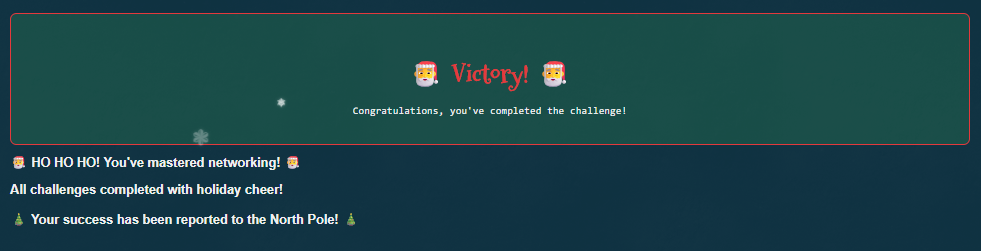

# Visual Networking Thinger

**Difficulty**: :fontawesome-solid-star::fontawesome-regular-star::fontawesome-regular-star::fontawesome-regular-star::fontawesome-regular-star: 
**Direct link**: [Visual Networking Thinger](https://visual-networking.holidayhackchallenge.com/)

## Objective

!!! question "Request"
    Skate over to Jared at the frozen pond for some network magic and learn the ropes by the hockey rink.

??? quote "Jared Folkins"
    Jared Folkins here! My favorite Christmas movie is White Christmas. You should find me on the socials and tell me what yours is. 
    You know, I think Santa is right! It truly is better to give than to receive. 
    I love singing Carols with my family! 🎵O holy night, the stars are brightly shining…🎵 

## Solution

### Challenge 1 : DNS lookup

- Client [DNS Request]
    - Port : 53
    - Domain name : visual-networking.holidayhackchallenge.com
    - Request Type : A
- DNS Server [DNS Response]
    - Response Value : 34.160.145.134
    - Response Type : A

### Challenge 2 : TCP 3-Way Handshake

Now that we have the IP address (34[.]160[.]145[.]134).

- Client sends SYN flag to the server with the above IP.
- Server responds with SYN-ACK
- Client sends ACK
    

### Challenge 3: HTTP GET Request

Now that we have TCP connection established, client can send a GET HTTP request.

- Client [HTTP Request]
    - HTTP Verb : GET
    - HTTP Version : HTTP/1.1
    - Host : visual-networking.holidayhackchallenge.com
    - User-Agent : SomeRandomUserAgent
- Web server [HTTP Response]
    
    

### Challenge 4: TLS Handshake

For the secure connection, client and server need a different handshake.

### Challenge 5: HTTPS GET Request

- Client [HTTP Request]
    - HTTP Verb : GET
    - HTTP Version : HTTP/1.1
    - Host : visual-networking.holidayhackchallenge.com
    - User-Agent : SomeRandomUserAgent
- Web server [HTTP Response]

Challenge is now completed.

!!! success "Answer"
    Completed in the game.

## Response

!!! quote "Jared Folkins"
    Wonderful! You've truly shown that giving your best effort brings the greatest reward - now that's the Christmas spirit!  
