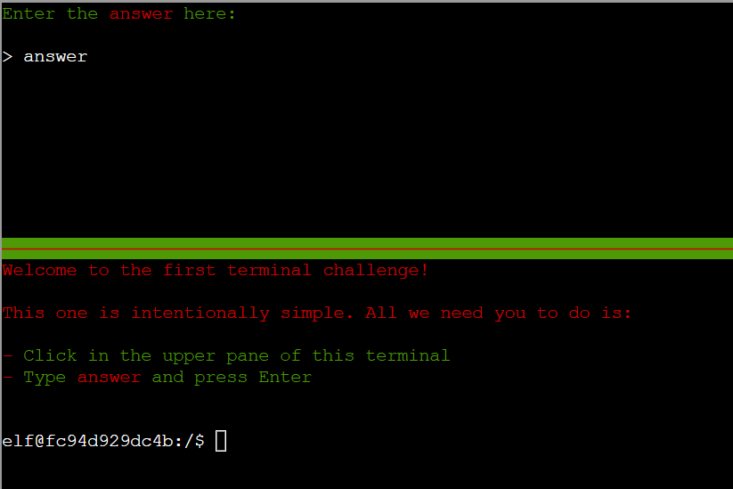

# Holiday Hack Orientation

**Difficulty**: :fontawesome-solid-star::fontawesome-regular-star::fontawesome-regular-star::fontawesome-regular-star::fontawesome-regular-star: 
**Area**: In the train  
**In-game avatar**: Lynn Schifano

## Objective

!!! question "Request"
    Meet Lynn Schifano on the train for a warm welcome and get ready for your journey around the Dosis Neighborhood.

??? quote "Lynn Schifano"
    Welcome to the 2025 SANS Holiday Hack Challenge! We're on a train heading… NOT to the North Pole, but instead to The Neighborhood. Your cybersecurity skills are needed there this year! I'm here to help orient you to this year's exciting challenge.  
    I'm the Chief of Staff at Counter Hack, making sure the right people are doing the right thing at the right place at the right time -- Herding cats, in other words. 
    I love sports, especially college basketball. My favorite teams are Monmouth University, Louisville, and Syracuse. I'm a Queens Girl living my best life at the beautiful Jersey Shore. 
    I'm a proud Mom of three and Grandma of one (so far!! 🙏). 

## Solution

Write "answer" in the upper pane of the terminal.

## Response
Below objectives get unlocked :

- Its All About Defang
- Neighborhood Watch Bypass
- Santa Gift-Tracking Service Port Mystery
- Visual Networking Thinger
- Visual Firewall Thinger
- Intro to Nmap
- Blob Storage Challenge in the Neighborhood
- Spare Key
- The Open Door
- Owner

!!! quote "Lynn Schifano"
    Great work! Please, hop off the train and explore the neighborhood.
